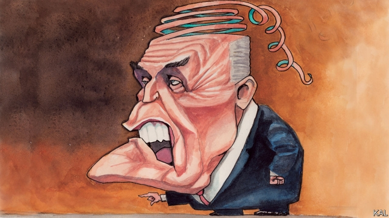

###### Lexington

# The unravelling of Rudy Giuliani 

 

> print-edition iconPrint edition | United States | Oct 17th 2019 

HAD LEXINGTON’S 2007 incarnation been informed that the next Republican president would be a pro-gay, pro-choice, thrice-wed New Yorker, the name of Donald Trump would not have leaped to his august mind. Rudy Giuliani led the Republican primary by a big margin throughout that year. There were, to be sure, doubts about whether the former New York mayor was too socially liberal for small-town conservatives. He had once shared a house with two gay people and a Shih Tzu and, what was worse, acted in a comic skit alongside Mr Trump, that symbol of louche metropolitanism. Moreover America was not given to electing “abrasive” New Yorkers, Lexington cautioned then. But, like many others, he suspected Mr Giuliani’s dynamism and the broad support he enjoyed for his calm leadership after 9/11 and record of crime-fighting could compensate for such handicaps. 

It has been pretty much downhill ever since for Mr Giuliani—culminating this week in what appears to be the worst crisis of his increasingly scandal-plagued career. In his role as the president’s old mucker and personal lawyer, he is alleged to have run a parallel foreign policy in Ukraine for the main purpose of spreading bogus allegations against Joe Biden, Mr Trump’s most feared Democratic rival. He is also reported to be under investigation—by a federal agency he once led—for breaking lobbying laws, apparently related to the same plot. Two of his business associates in Ukraine are under arrest. How much legal trouble he faces is unclear—though his decision to defy a congressional subpoena related to the Ukraine plot, for which Mr Trump is likely to be impeached, seems unlikely to help. 

Politically, he is already busted. His defiant—at times almost unhinged—support for Mr Trump over the past three years has made him loathed in his old New York base and, because no one loves a dissembling lawyer, won him few friends outside it. And much good has it done him. Asked whether Mr Giuliani was still his lawyer, the president said he didn’t know. Perhaps not even Mr Trump’s previous personal lawyer, who is serving a three-year jail sentence, has lost more from his association with the president than the once admired Mr Giuliani stands to. Where did he go so badly awry? 

One answer—popular in New York—is that his mayoral successes were significant but exaggerated, and weighed by character flaws that have worsened over time. New York’s drop in crime during his tenure turns out to have been much less to do with the changes to policing he oversaw than was once assumed. Moreover those reforms had many authors—including his African-American predecessor, David Dinkins, whom Mr Giuliani defeated in a campaign remembered for his racist dog-whistling (the contest was dubbed the “Race race”). Mr Giuliani’s social liberalism, mandatory in New York, now looks less central to his politics than his willingness to play the race card to win power and to bend the rules to keep it. He even tried that after 9/11—which he sought unsuccessfully to use as an excuse to extend his second term. On both crime-fighting and 9/11, it is argued, Mr Giuliani was essentially in the right place at the right time. 

Another (not necessarily contradictory) answer is that he was in the right place at the wrong time. In other words, before Barack Obama’s presidency and the reactionary backlash it triggered on the right, Republican voters were not yet ready for the blend of pugnacity and quiet bigotry Mr Giuliani offered. Or else why did they object to his residual New York liberalism but, a decade later, give Mr Trump’s a pass? Mr Giuliani once said that “the anti-immigrant movement in America is one of our most serious political problems.” In 2007 he ran much more on his record than demagoguery. But the fact that he could have done otherwise had he chosen to, his subsequent performance suggests, is itself an indicator of the nativist change that has swept the brash New Yorkers’ party. And no one appreciated that change better than Mr Giuliani. 

Grasping hold of Mr Trump’s coat-tails, he made a political return brimming with resentful craziness. He implied that Mr Obama hated America, that Hillary Clinton was grossly corrupt and told Americans they had one last chance to save themselves: “There’s no next election! This is it!” When Mr Trump’s lawyers later struggled to defend the president against Robert Mueller’s obstruction probe, Mr Trump knew just where to turn. Mr Giuliani has been ubiquitous on cable TV ever since, generally defending the indefensible. Though sometimes hazy on the details of Mr Trump’s scandals, he has compensated by lambasting the president’s enemies, exaggerating the powers of his office and, when all else fails, spouting nonsense. 

The haziness—which has led to Mr Giuliani confirming that Mr Trump did various things, such as paying off a porn star, that he had previously denied—may even be calculated. It has added to the air of surrealism, fuelled by endless distraction and absurdity, from which Mr Trump draws his impunity. Amid the mayhem, it becomes hard to know which scandals matter most—though it appears Mr Giuliani’s Ukraine plot against Mr Biden has met that mark. An ever-increasing scandal, it allegedly involved the president’s lawyer illegally trying to influence a foreign government to falsely accuse the former vice-president of illegally influencing the same foreign government. 

In truth it is hard to find any altogether convincing explanation for Mr Giuliani’s behaviour. He was once a serious politician prone to indiscipline; now he is wild. Yet a former colleague of his, who knows both men, suggests resentful envy of his old co-star Mr Trump—whom he must secretly disdain—may be eating him alive. If so, Mr Giuliani is going to really hate it when the president and his entire party flatly disown him. That looks like the inevitable next stage in his disgrace.■ 

