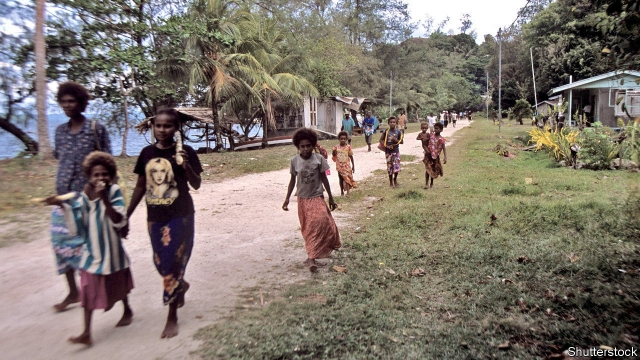
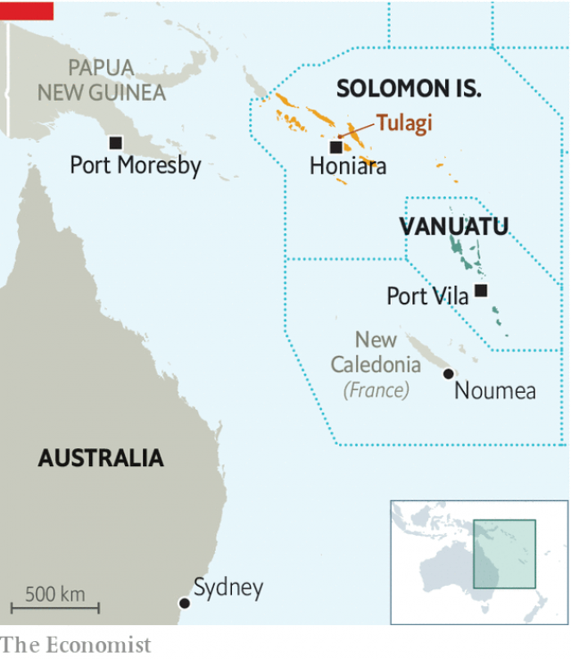

###### Island shopping

# A Chinese firm may or may not be leasing one of the Solomon Islands 

 

> print-edition iconPrint edition | Asia | Oct 26th 2019 

HEADLINE-GRABBING deals in which Chinese firms promise to build impressive infrastructure in some neglected corner of the world have a habit of unravelling—but usually not so quickly. Last month a local official in the Solomon Islands signed an agreement with the China Sam Enterprise Group, a Chinese conglomerate. It involved a 75-year lease for Tulagi, a small island that was the capital of the Solomon Islands in colonial times, along with the construction of an oil and gas terminal, a fishing harbour and a “special economic zone”. But after a headline in the New York Times declared this week, “China Is Leasing an Entire Pacific Island”, frantic back-pedalling ensued. The official who signed the agreement, Stanley Maniteva, appeared to disown it: “Leasing Tulagi will not be possible…Nothing will eventuate.” 

China Sam is not the only Chinese company hoping to take advantage of the national government’s decision last month to scrap diplomatic relations with Taiwan and establish them with China instead. Executives from the China Civil Engineering Construction Corporation, a big investor in neighbouring Vanuatu, lobbied for the change with an offer of $500,000 in loans and grants. China Railway International has promised to lend $825m to help resuscitate a defunct gold mine. The Chinese government says it will build a sports stadium and provide the cash to repay $1.2m owed to Taiwan. China even offered to make up for the donations Taiwan will no longer be giving to the Rural Constituency Development Fund, which MPs in the Solomons use to pay for pet projects in their constituencies. 

Despite the subsequent disavowals, the Tulagi scheme was not the misguided initiative of a wayward provincial premier. The prime minister, Manasseh Sogavare, visited Beijing in early October, where he signed up to the Belt and Road Initiative, China’s grand plan to improve the infrastructure of its trading partners. There he and his ministers met executives from China Sam and other big Chinese firms such as Huawei, a telecoms giant. 

 

Mr Sogavare’s decision to sever relations with Taiwan has provoked a split in his government. His predecessor as prime minister, Rick Houenipwela, was sacked from the cabinet last month for failing to back the switch, as were several other ministers who were sympathetic to Taiwan. Mr Sogavare is currently serving his fourth term as head of government. His previous term ended in a vote of no confidence in 2017 in response to allegations, which he denied, that he had received a kickback from Huawei for a contract to lay a high-speed internet cable from the Solomon Islands to Sydney. Mr Houenipwela replaced him. Soon thereafter, Australia announced plans to build its own undersea cable, trumping Huawei. Perhaps Australia will offer to lease an island next. ■ 

