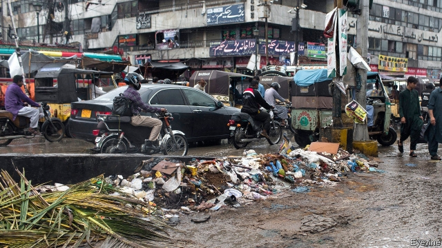

###### King of the heap

# As Pakistan’s biggest city crumbles, politicians bicker 

 

> print-edition iconPrint edition | Asia | Oct 26th 2019 

FIRST THE monsoon overwhelmed blocked and decrepit drains and left large parts of Karachi underwater. At least 17 people died, several electrocuted by loose wires from the shoddy power system. Then there were unusually severe swarms of flies, blackening all surfaces in markets and shops. Mounting piles of uncollected rubbish added to residents’ woes. One morning Clifton Beach, a tourist attraction known for camel rides, was strewn with medical waste and syringes. 

None of the afflictions of recent months is unprecedented, but the confluence of them all created an impression of “complete civic breakdown”, says Farzana Shaikh of Chatham House, a British think-tank. Karachi is home to 16m people, according to the latest census, although many suspect that the count missed millions more. It is not only Pakistan’s largest city, but also its principal seaport, its financial hub and the capital of Sindh, one of its four provinces. Wild, unplanned growth has overwhelmed almost every element of urban planning. Sewers, water treatment and rubbish collection are all hopelessly inadequate. 

Administrative and political divisions are at the root of the mismanagement. The politics of the province are dominated by the Pakistan Peoples Party (PPP), whose supporters are mainly Sindhi speakers, but the city is the base of a rival party, the Muttahida Qaumi Movement, backed chiefly by the descendants of Urdu-speaking migrants from India. What is more, whole neighbourhoods are under the administration of neither the province nor the city, but of the army, the state-owned railway company and the port authority. The confusion of responsibilities makes it almost impossible to co-ordinate any services, says Raza Ali, an urban planner. 

Crime, extortion and corruption make matters worse. Last month anti-graft investigators arrested the former director of the city’s parks over an alleged scam to sell government land. He was found with eight luxury cars, jewellery and weapons. 

No wonder, perhaps, that the national government has decided to wade in, creating a committee to suggest solutions to Karachi’s problems. Its chairman, Farogh Naseem, the law minister, has said one option would be to invoke an obscure article of the constitution intended to cope with emergencies, which allows the centre to give directions to provincial governments. The PPP interpreted the suggestion not as a form of assistance, but as a power grab. It quickly drew up a plan to resist any such move through street protests and legal challenges. The government may be backing away from such a confrontation: the committee has gone quiet. Meanwhile, the rubbish continues to moulder. ■ 

