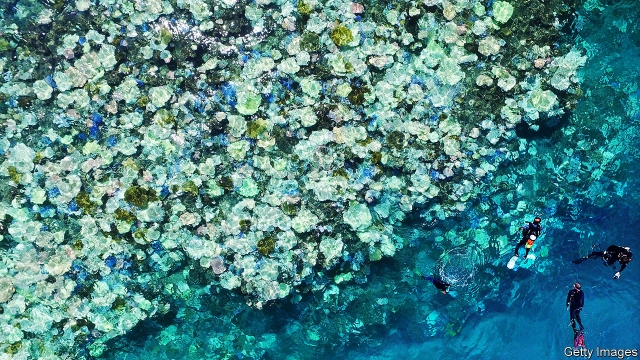
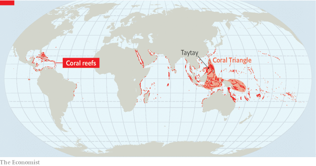

###### Polyp apocalypse

# Asia’s coral faces a deadly onslaught 

 

> print-edition iconPrint edition | Asia | Oct 26th 2019 

SMALL BOATS criss-cross Black Rock Reef on their way to nearby seaweed and pearl farms. Below, the blue lips of giant clams open and close amid a jungle of multicoloured coral. At the sound of a distant detonation—dynamite fishing, although illegal, is common in the area—a small shark swims hurriedly away. The reef lies nestled off the town of Taytay, on the island of Palawan in the Philippines. Its vivid blues, pinks and greens are a welcome sight given how many nearby corals died because of unusually warm water almost a decade ago—a blight that is becoming commonplace because of global warming. 

The outlook for coral is dire. The Intergovernmental Panel on Climate Change, a UN body, predicted last month that a rise in global temperatures of 1.5ºC relative to pre-industrial times would probably kill 70-90% of the world’s coral reefs. Given that the planet has already warmed by about 1ºC, the countdown for corals has begun. But the diversity of coral species and the variety of habitats in which they thrive mean that they will not disappear in a uniform way. Understanding why reefs like Black Rock survive and recover from overheating is essential to conservation efforts. 

Black Rock lies in the Coral Triangle, 6m square kilometres of water in the heart of South-East Asia that is home to perhaps half of the world’s coral reefs (see map). The Triangle’s waters teem with an abundance of life almost unmatched elsewhere on the planet. More than 130m people depend on it for their food and livelihood. The reefs support myriad marine species, and provide a spawning ground for the largest tuna fishery in the world. According to a study involving the United Nations Environment Programme, economic benefits from the Coral Triangle were worth $13.9bn in 2017. Tourism generated 45% of that, and commercial fishing 42%. The rest came from coastal development, which reefs help to protect by acting as buffers against rough seas. 

 

Coral consists of symbiotic communities of algae and tiny animals called polyps. The polyps give the coral its structure. This provides shelter to algae; they in turn generate sugars on which the polyps feed. When temperatures rise, the polyps expel the algae, causing coral to lose its colour and die—a process known as bleaching. Temperature is not the only critical variable: corals are also sensitive to factors such as light levels, dissolved chemicals and changing currents. 

These sensitivities explain why corals are so vulnerable. In addition to climate change, local stresses still abound. “It’s not about managing the reefs, it’s about managing the people,” says Peter Mumby of the University of Queensland in Australia. In the Philippines some 40m of them live within 30km of a coral reef. Overfishing disrupts reefs’ ecosystems. Coastal construction can lead to the dumping of sediment in the ocean, clouding waters and blocking needed light. Mavic Matillano, who works in the Philippines for WWF, a conservation group, worries particularly about how reefs are being affected by road-widening and other construction on Palawan. Run-off from fertilisers and untreated sewage are other nasty problems with which corals must contend. 

At the same time, the world’s oceans are warming. They have absorbed more than 90% of the extra heat produced by humans in recent decades. Between 1985 and 2006 the waters of the Coral Triangle warmed at a rate of 0.2ºC per decade. That might not sound like much, but as a rule of thumb reefs bleach when the temperature of the surrounding waters rises 1ºC above the historical norm for four or more weeks, turning colourful corals into ghostly forests. 

The most recent global spate of bleaching, in 2014-17, affected perhaps 70% of coral reefs, according to America’s National Oceanic and Atmospheric Administration. It was particularly severe because it coincided in part with El Niño, a periodic climate pattern that warms equatorial waters in the Pacific every few years. Even reefs that had not experienced any recent extensive bleaching, such as the northernmost areas of Australia’s Great Barrier Reef, suffered badly. Severe bleaching is now occurring too frequently for reefs to recover fully. “We don’t know how well the biology can continue to be culled and then bounce back,” explains Gregory Asner of Arizona State University. By the middle of the century bleaching may occur every year. 

Climate change threatens reefs in other ways, too. The oceans have absorbed about 30% of the increased flows of carbon dioxide into the atmosphere, becoming less alkaline as they do so. This sets in motion chemical reactions that make it harder for the corals to build their exoskeletons. More intense tropical storms, meanwhile, could see reefs more frequently smashed; rising sea levels could see them drowned. 

Scientists, politicians and activists are trying to tackle both the short-term and long-term threats which corals face. The thinking is that the local environment makes a difference: corals that face fewer local threats may have a better shot at surviving larger changes to their environment. It helps that the number of marine protected areas (MPAs) around the world is on the rise. Research suggests that coral cover increases in older, well-enforced MPAs in isolated areas. MPAs now encompass 8% of the ocean, up from less than 1% two decades ago. 

Much of the increase is a result of America, France and Britain safeguarding areas around their overseas territories. Countries such as the Cook Islands in the South Pacific Ocean have protected their entire national waters. The Coral Triangle Initiative, an alliance of the six countries in the area, has also promoted MPAs. Yet only a tiny share of its members’ waters is shielded. The cost and complexity of patrolling MPAs remain a huge challenge. 

In the Philippines a change to the law more than two decades ago transferred control of coastal waters up to 15km offshore to municipal governments. It gives local communities a greater say in how to manage marine resources. Ms Matillano says that talking to mayors and other local officials about the business case for protecting reefs works well, as does including locals in the teams which enforce such protection. She adds that some 155 MPAs exist off Palawan, though not all are effective. Wilfredo Licuanan of De La Salle University in Manila, who studies Palawan’s reefs, also estimates that only a tiny fraction of coastal towns hire a marine biologist for guidance. He gives talks in shopping malls and at public events to educate Filipinos about the plight of their corals. 

Meanwhile scientists are racing to discover why some types of coral have recovered from recent bleaching events better than others. The answers may involve adaptation (genetic processes) as well as acclimatisation (non-genetic ones). The intricate work requires data that can be difficult to obtain from areas which lack adequate monitoring. There are big knowledge gaps when it comes to the Coral Triangle, for example. 

Teams in America are looking into selectively breeding and conditioning corals, and expensive coral “gardening” occurs in places that can afford it. This involves transplanting corals to reefs in need, often by placing them on man-made underwater structures on which they can grow. In one area near Taytay, corals cling to sturdy metal frames, and a garden for giant clams has been established. 

Another way forward could be to identify the most resilient sorts of coral in spots that are most sheltered from changing ocean temperatures and other human harm. That could allow more careful targeting of resources. Work published last year in Conservation Letters by a team led by Hawthorne Beyer of the University of Queensland finds that reefs in parts of the Philippines and Indonesia and off eastern Australia, among other places, may face a less severe threat than those in Hawaii and off western Australia. That is a small spot of good news for Black Rock Reef. ■ 

