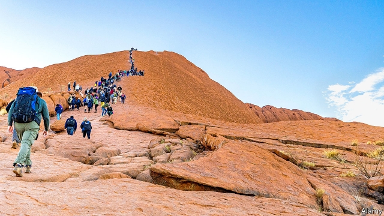

###### The seeing-red centre

# Australians resent a ban on climbing their country’s most famous rock 

 

> print-edition iconPrint edition | Asia | Oct 26th 2019 

IT VIES WITH Sydney Opera House as the most famous symbol of Australia. Yet to the original inhabitants of the surrounding area it is not just beautiful, but sacred, the scene of holy rituals. Signs erected by the Anangu people at the base of Uluru declare, “Under our traditional law, climbing is not permitted.” Yet climbing Ayers Rock, as most other Australians knew the vast red monolith until recently, has long been a favoured pastime of tourists. Some litter, defecate or strip while they scramble up. Fully 37 people have died trying to reach the summit in sweltering heat. The Anangu have had enough: they own the site and from October 26th will ban visitors from ascending. It is “not a theme park like Disneyland”, reasoned Sammy Wilson, one of its traditional owners, when the change was announced. 

Some Australians complain they are being robbed of a birthright. Pauline Hanson, leader of the populist One Nation party, has likened the ban to a shutdown of Bondi, Sydney’s most famous beach. She recently made a pilgrimage to climb the rock, but quickly became stuck and was forced to slide back down on her backside. She later admitted she could “see the sense in banning” the climb “due to safety reasons”. Those who view Uluru as a spiritual place smiled. “You’ve got to ask why it was that she couldn’t get up there,” says Tom Calma, the co-chair of Reconciliation Australia, a charity. 

Other, more sure-footed Australians have been flocking to Uluru in record numbers to climb it while they can. Some assert that the rock is a national icon which belongs to everyone. One campaigner appealed to the Human Rights Commission, an official body that investigates racism and other abuses, arguing that the rule discriminated against “millions” of Australians. It dismissed the complaint. 

To some Aboriginals, the rush to climb says something about the difficulties their people face. It is “emblematic” of the “wilful disregard of the wishes of traditional owners”, argues Mick Gooda, a former member of the Human Rights Commission. It is “baffling”, “disrespectful” and “poses a question about what the people making this climb think about Aboriginal culture,” says Linda Burney, the shadow minister for indigenous Australians. “We’d be up in arms” if tourists started scaling a cathedral, notes Andrew Peters, an indigenous academic at Swinburne University. 

But some are inclined to see the change as an occasion for hope. The Anangu resolved to ban the ascent only after the share of tourists choosing to make it despite the discouraging signs had fallen below 20%, from over 75% in the 1990s. Years of educating visitors about Aboriginal culture are bearing fruit, Mr Calma argues. “Whitefella government has been acting in a way that breaches our laws,” Mr Wilson says. It is a sign of change, Mr Calma says, that one such breach is coming to an end.■ 

