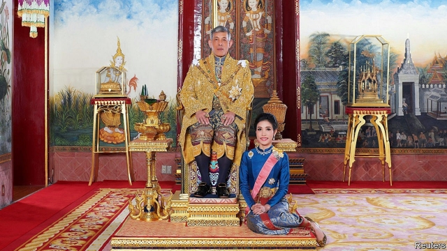

###### Beauty and the beast

# King Vajiralongkorn dismisses his official mistress 

 

> print-edition iconPrint edition | Asia | Oct 24th 2019 

INGRATITUDE, MISBEHAVIOUR and disloyalty. These were among the failings of Sineenat Wongvajirapakdi detailed in a royal statement on October 21st. Apparently the mistress of King Maha Vajiralongkorn wanted to “elevate herself to the same state as the queen”. The former army nurse also dared to issue commands and show disobedience to her superiors. She has been stripped of all titles and honours. 

At one level, Ms Sineenat’s sudden fall from grace is stunning. It was only on the king’s birthday in July that he made her Thailand’s first officially designated royal mistress in almost a century. At another level, it is typical: the king has frequent, dramatic romantic bust-ups, with dire consequences for the women concerned. 

The designation of an official “royal noble consort” shocked Thailand. The elaborate ceremony saw Ms Sineenat prostrate herself before the king and Queen Suthida Tidjai, a former flight-attendant whom he married in May. The silk and jewels on display were a far cry from the crop tops and fake tattoos that king and consort have been snapped wearing before. More official photographs of Ms Sineenat in camouflage and in cockpits appeared in August. The website hosting them crashed as curious Thais flocked to it. 

Queen Suthida is the king’s fourth wife. He divorced and humiliated his first, a cousin who bore him a daughter. He has disowned four of his five children with his second wife, an actress, who fled abroad. And he imprisoned the parents and brothers of his third wife after he divorced her. She herself has disappeared from sight. 

No one dares to criticise the king’s viciousness or caprice. In recent days he also fired six palace officials for “extremely evil” conduct. Successive Thai governments have long fostered public adulation of the monarchy—an easier task under the king’s mild-mannered father. Since King Vajiralongkorn came to the throne three years ago, he has exploited this reverence to demand sweeping formal powers. In 2017 he insisted the constitution should be changed to make it easier for him to live abroad (as he does, in Germany) without appointing a regent, even though Thai voters had already approved the text in a referendum. Last year he took personal ownership of the Crown Property Bureau, an agency which has managed royal land and investments for decades. Its holdings are thought to be worth more than $40bn. Earlier this month the government issued a decree transferring command of two army units directly to King Vajiralongkorn. 

Thailand’s harsh lèse-majesté law curbs discussion of these manoeuvres. The courts hand out long prison sentences for even vague criticism of the king or other royals. Yet this has not deterred recent grumbling on social media over the traffic caused by royal motorcades. Nor did it seem to scare those who wrote about Ms Sineenat’s downfall. The hashtag #SaveKoy began trending, Koy being a nickname for the disgraced mistress. Despite the fulminating royal statement, every Thai knows that no one can beat the king himself for ingratitude, misbehaviour and disloyalty. ■ 

