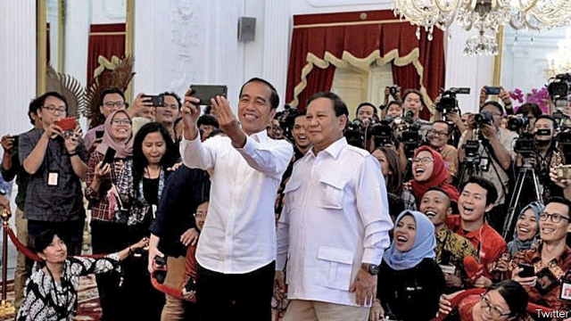

###### Governing unopposed

# Why Indonesia’s president has made his arch-rival a minister 

 

> print-edition iconPrint edition | Asia | Oct 26th 2019 

FOR SIX YEARS they have been bitter rivals. Joko Widodo, a former businessman and mayor popularly known as Jokowi, first defeated Prabowo Subianto, a former general, in a fiercely contested presidential election in 2014. Six months ago, in April, the incumbent Jokowi redoubled the humiliation, besting Mr Prabowo in a re-match election. Just as in 2014, the vanquished general refused to concede defeat, claiming Jokowi had cheated. His enraged supporters rioted in Jakarta in May. Nine people died. But over the ensuing months Mr Prabowo and Jokowi publicly reconciled with each other, in several carefully orchestrated meetings involving selfies. On October 23rd it became clear why Mr Prabowo, at least, was smiling. Jokowi, who had been sworn in for his second term days before, appointed his former foe minister of defence in his new cabinet. 

The reasons for Jokowi’s Cheshire-cat grins were less obvious. Mr Prabowo’s appointment is “part of a long tradition in Indonesian politics and society to integrate rather than marginalise one’s opponents,” says Stephen Sherlock of the University of New South Wales in Australia. When Jokowi’s predecessors assembled their “rainbow cabinets”, they included representatives from as many different political parties as they could manage. Any qualms political opponents may have about putative ideological differences are firmly quashed by the potential for patronage or self-enrichment a seat in the cabinet affords. Presidents, meanwhile, hope that by welcoming their erstwhile foes into the fold they will secure the loyalty of their parties in the legislature. “Jokowi is aiming to neutralise Mr Prabowo’s party, Gerindra, and prevent it from being a centre of opposition in the parliament and possibly on the streets,” says Mr Sherlock. Another member of Gerindra has been made minister of fisheries and marine affairs. 

Will Jokowi’s keep-your-friends-close-and-your-enemies-closer strategy work? Aaron Connelly, a research fellow at the International Institute for Strategic Studies in Singapore, is not convinced: “A mountain cannot have two tigers.” Jokowi doubtless hopes that Mr Prabowo will be reluctant to criticise a government of which he is a member, and will come to seem of no greater stature than the other cabinet ministers. Mr Connelly doubts he will take fright: “Mr Prabowo is a singular figure in Indonesian politics.” Anyway, ministers often publicly contradict the president. 

Even so, some politicians have expressed concern about the health of the opposition without Gerindra. The only big party left outside the government will be an Islamist outfit, the Prosperous Justice Party, with less than a tenth of the seats in parliament. When Mr Prabowo had first announced that he was in talks with Jokowi, Johnny Plate, secretary-general of NasDem, a party allied with Jokowi, announced his intention to switch sides for the sake of democracy: “If there’s no one criticising the government’s decisions, what will become of this country?” The next day, in an “unexpected turn of events”, according to the Jakarta Post, four cabinet posts were given to four NasDem politicians, among them Mr Plate. ■ 

