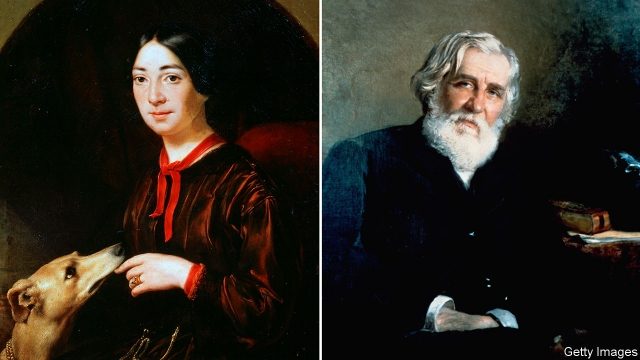

###### Ode to joy

# A single market in culture emerged in the 19th century 

 

> print-edition iconPrint edition | Books and arts | Oct 26th 2019 

The Europeans.authorBy Orlando Figes.Metropolitan Books; 592 pages; $35. Allen Lane; £30. 

FOR AN EXAMPLE of the cosmopolitan glamour and sheer brassiness of high European culture in the 19th century, look no further than the obsequies of Frédéric Chopin, which took place in a grand Paris church in 1849. Pauline Viardot (pictured left), a Spanish-born mezzo-soprano who had known the composer, sang Mozart’s “Requiem” to a packed congregation that included “the whole of artistic and aristocratic Paris”, as well as her lifelong admirer, the Russian author Ivan Turgenev (right). 

Turgenev enjoyed her rendering, but complained peevishly of a poor use of stops by the organist. As for Viardot, she was genuinely upset by the loss of a friend but insisted on collecting every centime of her 2,000-franc fee (nearly half the cost of the funeral). The daughter of an impresario, her attitude to money—and life in general—was hard-headed. This fashionable event provides one of many vignettes etched in masterly detail by Orlando Figes, a British historian, in “The Europeans”. 

Mr Figes is best known as a chronicler of Russia itself, and of the ways its cultural and political masters have juggled indigenous traditions with those from the West. In this latest work, the scene moves to the heart of Europe via the life and world of Turgenev, the most westernising of Russian prose-writers. Ambitiously, Mr Figes sets out to tell both a big story and a small one. The larger narrative is the emergence, thanks to railways, cheap printing and an ever-growing middle class, of a transnational artistic scene, in which musical works and their performers, as well as writers and painters, were in perpetual motion. The micro-saga is that of the Russian writer, his favourite singer and her husband Louis Viardot, who formed an unlikely trio. 

Viardot, a French opera manager, critic and scholar of Spanish and Russian, had married Pauline Garcia when he was 39 and she was 18. Soon he was negotiating appearances for her in places such as Berlin and Vienna, and eventually St Petersburg. There, in 1843, she enthralled the royal court, high society—and in particular, Turgenev, an impoverished blueblood and author. Throughout all these travels, the nascent railway system was a help, although the final part of the Viardots’ journey through Russia was made in a bumpy horse-drawn carriage. 

Thereafter Turgenev spent as much time as he could in their company, whether in the spa town of Baden-Baden or in the environs of Paris. The soprano had no strong feelings for either of the two men who adored her, but she was capable of passion, as became clear when a young composer called Charles Gounod enchanted her with his looks and talent; the other men had to stand aside and bite their lips. 

Mr Figes refrains from judgment about his protagonists and lets the densely woven detail speak for itself. Louis Viardot emerges as a quiet hero, Pauline Viardot as a ruthless but likeable pragmatist and Turgenev as an insufferable prig whom posterity (and perhaps Louis) could forgive only because of his excellent, observant prose. 

As a tale of an awkward but enduring relationship between three outstanding people, this book shines. But it also aspires to be a kind of anti-Brexit parable, tracing one of the most powerful developments in the 19th century, the creation of a single market in culture. Mr Figes certainly shows that entirely unexpected relationships, clashes and synergies can emerge when talented people from different corners of Europe have the money and the technological means to interact. But he acknowledges, too, that countervailing cultural forces were at work, such as the German nationalism of Wagner. (Pauline Viardot admired the German composer while Turgenev, despite his love of things Teutonic, felt instinctively hostile. Out of deference to the lady he worshipped he changed his mind, and then only with “a certain effort”.) 

Trends in the world of culture are never straightforwardly linear. As “The Europeans” shows, the shifting relationships between flawed, fickle human beings are messier still. ■ 

