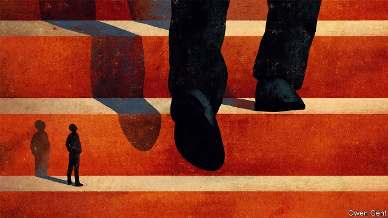

###### The broken ladder

# In the past, America was not as unequal as it has become 

 

> print-edition iconPrint edition | Books and arts | Oct 24th 2019 

The Triumph of Injustice. By Emmanuel Saez and Gabriel Zucman. W.W. Norton; 232 pages; $27.95 and £21.99. 

The Meritocracy Trap. By Daniel Markovits.Penguin Press; 448 pages; $30. Allen Lane; £25. 

Unbound. By Heather Boushey. Harvard University Press; 272 pages; $27.95 and £22.95. 

FOR MOST of its history, America has been a more egalitarian place than Europe—at least, so long as you exclude the abomination of slavery. White migrants to the New World found it less class-bound than the old. Inherited wealth cast a shorter shadow. In 1810, according to Thomas Piketty, a French economist, the richest 10% of Americans controlled less than 60% of national wealth, compared with more than 80% in Europe. When industrialisation threatened to establish an aristocracy like those across the Atlantic, the social backlash was prompt and decisive. Reforms extended the vote to women and protected workers’ rights, busted powerful monopolies and introduced an income tax. Franklin Roosevelt’s New Deal finished the work begun in the late 19th century. By the 1950s, the American economy was not only the most advanced in the world, but was once more a bastion of egalitarianism. 

The evolution of inequality since that time thus represents a significant departure from American history. The incomes of the rich have grown much faster than those of the poor. From 1979 to 2016, the income of the top 1% of Americans grew by a cumulative 225%, compared with just 41% for the middle-class. Wealth inequality, too, has risen. Over the same period, the share of the country’s wealth controlled by the top 0.1% more than doubled, to 20%. In continental Europe, meanwhile, the gap between rich and poor has widened only slightly. The share of total national income earned by the richest 1% of Europeans has increased by two percentage points over the past 40 years, compared with ten percentage points in America. 

Political momentum is building for a response; several Democratic candidates for the presidency promise to introduce new wealth taxes (see Briefing). Even now, though, the origins of the malaise are poorly understood. Analysis tends to focus on proximate causes, such as globalisation or the impact of technology on the job market. These matter, but have also affected other rich countries. The source of America’s troubles lies deeper. 

Part of the problem is that American policy has exacerbated the effect of economic pressures. In their new book, “The Triumph of Injustice”, Emmanuel Saez and Gabriel Zucman pin the blame for rising inequality squarely on the American tax system. The authors—both economists at the University of California, Berkeley—argue that taxation in America has become less progressive over the past four decades. In the 1970s the rich paid twice as much in tax, as a share of their income, as the working poor (taking into account all taxes, including those at the state and local level). After President Donald Trump’s tax reform in 2018, by contrast, the very rich paid a smaller share than many Americans in the bottom half of the income distribution. The 400 richest Americans paid an average tax rate of about 23% of income in 2018, according to the authors’ estimates. Low-income Americans paid roughly 25%, the authors say, although this excludes transfer payments made to the very poorest households: a misleading omission, some critics reckon. Personal taxation is only part of the story, as the authors cursorily allow. Even so, the decline in the tax burden on the very rich, at a time of extraordinary growth in their incomes, is startling. 

This analysis poses a question: why has American tax reform been so heedless of inequality? Messrs Saez and Zucman suggest a rationale. Economic injustice (as they see it) is a result of a simple cycle. The rich try to avoid tax, then win concessions from politicians who argue that attempts to get more from the wealthy are doomed to failure. This gambit foundered in the past, they say, because of a shared conviction of the value of collective, state-funded action. Erosion of that belief led to complacency in the face of avoidance and acceptance of widening chasms in wealth and power. The pair do not press their analysis further; economists, Mr Saez says, are “ill-equipped” to take on questions of values, important as they may seem. 

Others are willing to try. In “The Meritocracy Trap”, Daniel Markovits, a legal scholar at Yale, blames the loss of social solidarity, and much else besides, on the slow corruption of American meritocracy, which has ossified into a formidable caste system. As the economic premium on education rose, he explains, competition for places at elite institutions of higher education grew. That struggle has become an obstacle to success for all but the cognitive elite. The gap in academic achievement between the children of rich and poor families is now larger than that between black and white pupils in the era of segregation, Mr Markovits notes. 

In theory, this is a fixable problem, as “Unbound”, a new book by Heather Boushey, makes clear. Ms Boushey is the president and CEO of the Washington Centre for Equitable Growth, a left-leaning think-tank. Her book is a detailed account of the obstacles to a more egalitarian American future. Social cleavages described by Mr Markovits pop up repeatedly. The conditions into which children are born drastically influence their economic prospects as adults, Ms Boushey observes—from how likely they are to be arrested to the chance that they will be an inventor or entrepreneur. 

But those effects can be countered. Health at birth, for instance, has been shown to sway educational performance and employment prospects—suggesting that better access to pre- and post-natal health care could help. So could improved access to early childhood education. Studies of high-quality pre-kindergarten programmes find enduring benefits to recipients from poor backgrounds. High-income parents read to their children more and spend more time and money on intellectually enriching activities than do poorer parents. Higher wages at the bottom, as well as more predictable work schedules, could narrow the gap. Research finds that rates of upward mobility are higher in some places than others; zoning reforms or subsidies that encourage migration to thriving areas could loosen up America’s class-bound hierarchy. 

Ms Boushey frames her proposals as ways to reduce inequality while also aiding economic growth. For example, because highly unequal economies seem to rely more on credit booms to propel growth, redistributing income from rich to poor would make the economy less crisis-prone. Raising American test scores to the average across developed economies would boost output by an estimated $2.5trn—or 12% of 2017 GDP—over the next 35 years. 

This two-sided argument is persuasive, but is also an acknowledgment that the power to implement change rests with the winners. As Ms Boushey notes, the priorities of the rich receive more legislative attention than those of the poor. Political spending by the rich has risen alongside inequality, as has political polarisation; the resulting dysfunction suits the wealthy, given the popularity of redistributive tax and spending measures. 

Convincing the well-off of the benefits of a less lopsided society may be necessary to remedy it. And perhaps, by couching their manifestos as a means to boost growth, and by reminding the rich that Americans are in it together, thinkers like Ms Boushey could begin to re-establish a lost sense of solidarity. 

If Mr Markovits is right, however, that is a remote prospect. Subtly but corrosively, he thinks, the idea of meritocracy has validated inequality, because rich and poor alike “earn” their position. Success depends on educational achievement beyond the reach of many, but winners feel they deserve their spoils, while losers are asked to accept their fate. Restoring dignity to workers at the bottom may require the sort of organisation and activism that improved their lot a century ago. For some Americans, that upheaval could prove uncomfortable. ■ 

