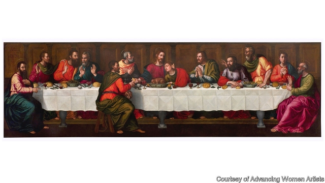

###### Hidden talent

# The first “Last Supper” painted by a woman goes on public display 

 

> print-edition iconPrint edition | Books and arts | Oct 24th 2019 

SHE SET the table with elegant cutlery, sparkling glasses and intricately decorated bowls. The white cloth, once freshly ironed, bears the trace of a concertina of folds. In Plautilla Nelli’s “Last Supper” (c.1560)—the earliest known version of the theme painted by a woman—Jesus and the 12 Apostles feast on lamb, lettuce, bread and wine. Under the table, the men’s toes peek out from beneath their robes. Above, the men respond to Jesus’s prediction that one among them will betray him. Judas sits alone on the opposite side to the group, his face stern and unmoving. 

Last week at the Museum of Santa Maria Novella, Florence, Nelli’s 21-foot-long painting was put on display to the public for the first time, more than 450 years after it was created. It has undergone four years of extensive restoration work. “I wanted to give her a voice,” said Jane Fortune, the founder of Advancing Women Artists (AWA), the American charity which led the effort to salvage Nelli’s masterwork. Fortune, who died in 2018, had estimated that there were more than 1,500 pieces of historic art by women in Tuscany; in 2009 she set up AWA to research into these neglected paintings, repair them and place them in museums. “True restoration is when the public can see a work and learn that it’s part of history,” Linda Falcone, AWA’s director, says. 

Born to a wealthy family in 1524, Nelli was sent to a convent at the age of 14. Rather than being sites of passive prayer, “convents were centres of creativity and power”, says Ms Falcone. Half of all literate women were sent to them, as many families could afford a dowry only for the eldest daughter. Nelli’s life within the cloistered walls of Santa Caterina di Cafaggio was productive. She taught herself and the other nuns to paint, and set up such a successful art workshop that the convent became financially self-sufficient, selling devotional pieces to noblemen. Giorgio Vasari, an art historian, wrote in 1550 that her works were so popular “it would be tedious to attempt to speak of them all”. 

Yet Nelli’s “Supper” was her most revolutionary undertaking. Only the best Renaissance artists dared capture the moment when Jesus warned his followers that his death was imminent. The large, dramatic scene demanded ambition, creative verve and technical precision. Painting was prescribed as a way for nuns to ward off sloth, but their scenes were expected to be modest, decorative pieces. By making this work, Nelli and the team of nuns that assisted her were presenting themselves as equal to the men who had tackled the subject. 

Though the painting has its flaws—shadows do not always fall where they should, the beards are unconvincing, proportions are occasionally askew—it is bold and evocative with its use of thick brushstrokes and jewel-like colours. Nelli also pays close attention to the human details on her holy subjects, such as the cuticles on fingernails and the curl of eyelashes. “There aren’t other devotional Last Suppers with such a strong sensual touch,” says Rossella Lari, the conservationist who led the restoration. 

For the past few decades Nelli’s pockmarked painting loomed over Santa Maria Novella’s friars in their private quarters. Though the monks were understandably disappointed to see it go, they have been given an exact reproduction; the restored original can now be viewed by Florence’s locals and the millions of tourists who visit the city each year. Nelli never painted a self-portrait, so it is hard to imagine the author of such a compelling piece. But with her “Last Supper”, she made sure that her name would be remembered. “Sister Nelli,” an inscription at the top of the painting reads; “Pray for the Paintress”.■ 

