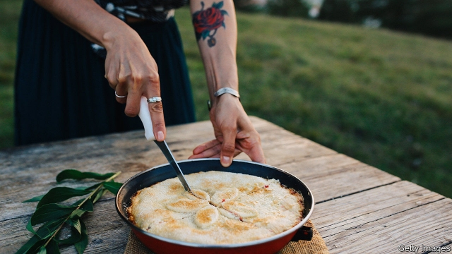

###### Mother courage

# “Ducks, Newburyport” is an ingenious feat of storytelling 

 

> print-edition iconPrint edition | Books and arts | Oct 26th 2019 

Ducks, Newburyport. By Lucy Ellmann.Biblioasis; 1,040 pages; $22.95. Galley Beggar Press; £14.99. 

THE NAMELESS heroine of Lucy Ellmann’s 1,000-page novel once had to endure a Wagner opera “so long it nearly killed me”. What would she, an over-worked, middle-aged mother-of-four who runs a baking business from her kitchen in Newcomerstown, Ohio (an actual place), make of the mammoth slab of print that she narrates, for the most part, in one unbroken sentence? 

In this domestic epic, which was shortlisted for the Booker prize, Ms Ellmann, an American-born novelist who lives in Scotland, seeks to make connections. She builds bridges and find patterns that link home and away, near and far, the state of the family and the fate of the planet. Snatches of old songs, show tunes and opera arias punctuate the mighty flow of this interior monologue. So do the classic Hollywood movies (mostly of the Katharine Hepburn, Bette Davis and James Stewart vintage) that fill the narrator’s thoughts, along with the plucky heroines of Jane Austen and Laura Ingalls Wilder. 

Thus the anxious soliloquy of an ordinary—but acute and well-informed—woman in contemporary America incrementally binds the human frame to the body politic, the neighbourhood rubbish to the pollution that has left the magnificent old Ohio river “full of mercury”. Ms Ellmann mourns ecosystems despoiled by modern humankind. The Native Americans of Ohio cherished their homelands for many millennia, but “the Europeans managed to just trash the place in a few hundred years”. Equally, “Ducks, Newburyport” itself forms a huge, sustainable ecosystem of storytelling. It is not so much a stream of consciousness as a vast delta of the mind, criss-crossed by tributaries and creeks. 

Humans may have robbed the planet of its abundance, but their inner life teems and blooms: “there must be seven and a half billion of these internal monologues going on”. Ms Ellmann offers just one, over a single day. Her father, Richard Ellmann, wrote the definitive biography of James Joyce, and she nods to “Ulysses” and its everyday hero, Leopold Bloom. The narrator’s much-loved but absent husband (an expat Scot who teaches engineering in Atlanta and Philadelphia) is called Leo. 

Readers need not scoff this giant pie in one gulp. Sampled at regular intervals, it tastes sweeter. The sheer ingenuity of Ms Ellmann’s wordplay, the fabulous profusion of her recipes, catalogues and inventories, from a freezer’s contents to confectionery brands, imbue every passage with fun as well as a sardonic poetry. Few novels have ever packed in so much culinary advice: the pies and cakes aside, see her chicken stock and beef chilli. 

This onrush of introspection obliquely tells a sad family story. The sickness and early death of the narrator’s adored mother “wrecked my life”. Readers get to know devoted, dependable Leo and the four kids, “sulky Stace” (her first-born, with a previous husband), “pedantic Ben, obsessive Gillian, and pell-mell Jake”. They share the pensive protagonist’s self-doubt, shyness, memories of illness and her unwarranted belief in “the fact that” (a favourite phrase) “I can’t love or be loved”. They feel her fear of the violence all around her, from a disturbed deliveryman to weapon-toting Ohio males, schoolyard massacres, historic atrocities and the factory-farm annihilation of chickens. “Nobody seems to notice, cooking or motherhood,” she frets. 

Conventionally punctuated, a briefer second story interrupts the first. It tells of a stray mountain lioness and her cubs who encounter the “graceless and brutal” human men who “never got enough of killing”. Slowly, these twin narratives of heroic maternity on hostile terrain converge. The novel’s odd title alludes to an act of rescue that made possible the narrator’s entire existence. Mothers, human or leonine, always remain “at the centre of the vortex”, while “after the apocalypse people will still need pie”. In the blighted future, the all-feeling baker hopes that “a few good movies will be made” and “a few good books written”. But very few better than this. ■ 

