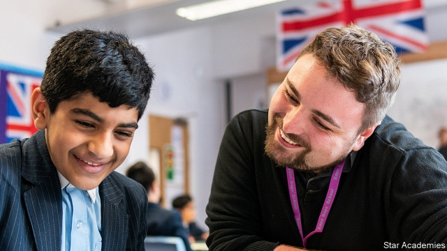

###### Star performers

# A formerly Islamic school chain tops the English government’s tables 

 

> print-edition iconPrint edition | Britain | Oct 26th 2019 

A  FEW YEARS ago, on a rainy October evening, Asiyah Ravat staked out the father of a pupil who had gone off the rails. He was not at home when she visited. “So I just said, ‘We’re not going anywhere, we’re in the car,” recalls Mrs Ravat, the head at Eden Boys’ School, an Islamic state secondary in the suburbs of Birmingham. The meeting helped, and there was no more trouble. Last year the pupil achieved ten grade 9s, the highest score available, in his GCSEs. “I don’t see these boys as pupils,” says Mrs Ravat, “I see them as sons.” 

The school is part of Star Academies, a group of schools that help pupils make astonishing academic progress. According to the government’s key measure, which looks at development from age 11 to 16, pupils at Eden Boys’ make the second-most progress in the country. In results released on October 17th, only pupils at Tauheedul Islam Girls’ High School, also of Star Academies, made more progress. In third place was Eden Girls’ School Coventry, another member. Star schools also came 12th and 14th, and the chain comfortably tops tables comparing it to others (though few of its 28 schools have been open long enough to take GCSEs, meaning it is still early for such broad comparisons). 

Many of the highest-performing schools on the measure have a traditional ethos, and this is true of Star Academies. “Although I don’t select the children, I say to parents, ‘I want to run a grammar school’,” explains Mrs Ravat. Only two boys have ever been kicked out, but rules are strict—pupils must walk on the left-hand side of the corridor and line up in silence before lessons. As she tours the school, Mrs Ravat pauses to place a ruler in front of a pupil who has not underlined his title. “We’ve got a presentation policy,” she shrugs. “They’ve got to adhere to it.” 

Star promises a “high-powered, knowledge-based academic curriculum”. Top sets at Eden Boys’ have as many as 30 children, whereas bottom ones can be as small as ten, so strugglers get most attention. Extra classes are put on after school and at weekends for those who need them. Annual Oxbridge visits raise the sights of pupils who come from an insular community (a surprising number fail to recognise a picture of the Bullring, a shopping centre in town, notes one teacher). Many grow up speaking Gujarati, Punjabi or Urdu—something which boosts the group’s results, since children without English as a first language tend to make more progress. 

Non-white children also tend to do better in progress measures, notes Jon Andrews of the Education Policy Institute, a think-tank, making Star Academies’ next move intriguing. Last year the organisation changed its name (from the Tauheedul Education Trust) to reflect the fact that it has taken on nine non-religious, underperforming schools in parts of the country including Blackpool and Morecombe, both run-down coastal towns. Although many of the trust’s existing schools have no white British pupils, at some of the new ones nine in ten pupils are, and poor white pupils get some of the worst results in the country. The new schools are mixed-sex—as will be some other new non-faith schools the trust is soon to open. 

Despite Star’s academic record, there was opposition to the takeover from parents in Blackpool, who started a petition objecting to it because of the organisation’s Islamic roots. In 2014 an undercover documentary showed a teaching assistant at one of the group’s primary schools describing music and clapping as “satanic”. But an immediate follow-up investigation by Ofsted, the schools inspectorate, found no evidence of broader hardline views or extremism. And the Department for Education has encouraged the chain’s subsequent expansion. 

The trust’s mission is to tackle social disadvantage, “which goes beyond faith,” says Kieran Larkin, the director of education. In truth, the bigger challenge may be introducing the chain’s culture into existing establishments. All academies opened by Star are rated “outstanding” by Ofsted. The new ones were doing so badly that they have been taken from the previous leadership. Hamid Patel, Star’s chief executive, is undeterred: “People have made excuses about these children—and written off their communities for too long,” he explains. “That has to change.” ■ 

