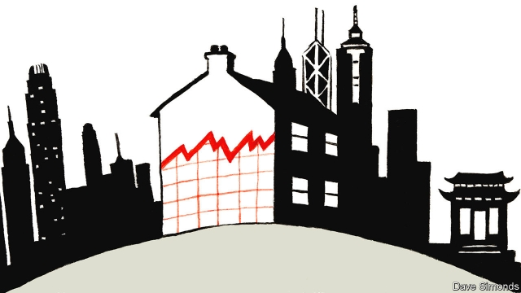
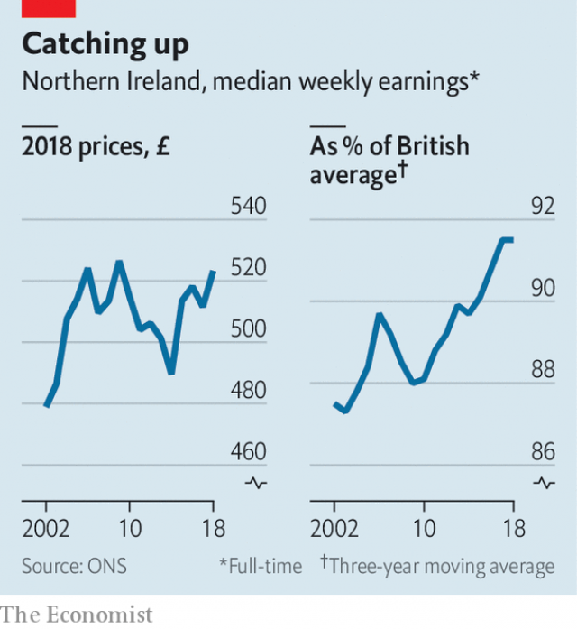

###### Ulster’s unique position

# Boris Johnson is trying to turn Northern Ireland into Hong Kong 

 

> print-edition iconPrint edition | Britain | Oct 26th 2019 

IN THE EARLY 1980s British officials worried about how Hong Kong’s inhabitants would be treated once the city-state was back under Chinese control. Civil servants entertained a tongue-in-cheek plan to move them to Northern Ireland, providing a “possibly happy outcome to the uncertainties”. The scheme never materialised. But although Northern Ireland did not take Hong Kong’s people, it might import its economic model. 

Boris Johnson’s Brexit withdrawal agreement, finalised on October 17th, would in effect turn Northern Ireland into an entrepot—an arrangement not dissimilar from the “one country, two systems” relationship between China and Hong Kong. Northern Ireland would be in a de facto customs union with the EU, following many of its regulations on food and manufactured goods—thus removing the need for a hard border with Ireland. No matter what long-term arrangement Britain eventually makes, Northern Ireland would enjoy fairly free trade in goods with the bloc, while remaining part of the UK. It would benefit from future trade deals signed by Britain and possibly by the EU. Dominic Raab, the foreign secretary, argues that it is a “cracking deal”. 

If Mr Raab is right, it would be a fillip for an economy already enjoying a strong spell (see chart). Pulled along by recovery in Ireland, in the past decade wages in Northern Ireland have risen more than in any other British region. Though it remains less wealthy, the province’s poverty rate is no longer higher than the British average. Unemployment is lower. 

 

The deal might encourage some firms to relocate to Northern Ireland. It would have a unique status: manufacturers could export to European and British markets with zero tariffs and few regulatory barriers, argues Sam Lowe of the Centre for European Reform, a think-tank. A research paper published in March assessed the impact of a Brexit deal similar to the one just agreed. Relative to the “no-Brexit” counterfactual, foreign investment into Ulster by manufacturing firms rose slightly. 

Northern Ireland might gain, relative to the rest of Britain. But that is not the same as saying that it would be better off after Brexit, says Alex Stojanovic of the Institute for Government, another think-tank. The agreement excludes services, which account for more than half of the Northern Irish economy. Belfast’s lawyers and architects will do as well or as badly as those elsewhere in Britain, depending on the eventual trade deal with the EU. 

Another catch is that the agreement would hazard unfettered trade between Northern Ireland and Great Britain. Trade experts worry that firms in the EU, or in countries with which the EU has a trade agreement, could use Northern Ireland as a back door to the British market. On October 21st Stephen Barclay, the Brexit secretary, suggested that Northern Irish exporters would have to fill in paperwork in order to sell to the rest of Britain. An impact assessment finds that “practical information will need to be provided electronically on movement of goods West-East”. 

That would raise costs for Northern Irish firms—by how much, nobody knows. So would the tariffs that Northern Irish firms would need to pay on British imports (the fact that they could claim rebates if the imports were destined for the local market is cold comfort). Stephen Kelly of Manufacturing NI, a trade body, says that the British government should compensate Northern Irish firms for these extra costs. As so often with Brexit, the future seems bright only if you do not look too closely. ■ 

