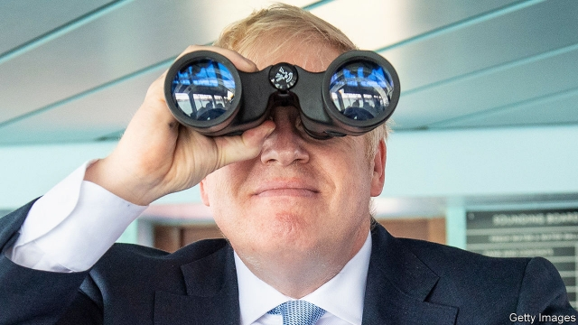

###### Distressing deadlines

# Boris Johnson’s Brexit deal moves a step nearer to approval 

 

> print-edition iconPrint edition | Britain | Oct 26th 2019 

ANOTHER WEEK, another missed Brexit deadline. Yet Boris Johnson came tantalisingly close. On October 17th the prime minister confounded his critics by wringing a new withdrawal agreement out of his fellow EU leaders in Brussels. Two days later, in a rare Saturday sitting of the Commons, he failed to win parliamentary endorsement for the deal only because MPs, who were nervous that he might still take Britain out of the EU with no deal at all on October 31st, voted instead to put off formal approval until the necessary legislation had been passed. 

Intent on leaving at the end of the month, Mr Johnson published the 115-page bill to give effect to the deal on October 21st, with a timetable motion suggesting that Parliament should pass it through all its stages in only a week. The next day he won approval for the bill at second reading. But his ludicrously short timetable was rejected by MPs (previous EU treaties have taken weeks or even months to be ratified). Although many MPs made clear that they had voted for the second reading only so as to propose substantial amendments to the bill, Mr Johnson claimed they had “passed” the deal and accused the Labour opposition leader, Jeremy Corbyn, of just trying to delay Brexit. Rather than accept a pause, he petulantly threatened to pull the bill and demand an early election instead. 

Yet delay is coming. As required by the Benn act passed by Parliament last month, Mr Johnson had already written to the EU to ask for a three-month extension of the Brexit deadline, from October 31st to January 31st. He accompanied this letter with a second in which he suggested to other EU leaders that any extension would be damaging. Ignoring this, Brussels was preparing this week to accept the prime minister’s formal request for more time, though it may suggest a shorter period than three months. Mr Johnson is thus certain to break his many loud promises to get Brexit done on October 31st, do or die. 

Amid the shenanigans there was only limited debate about the content of Mr Johnson’s new deal. What drew most attention was its replacement for the backstop to avert a hard border in Ireland in all circumstances by keeping the entire United Kingdom in a customs union with the EU. The new deal ditches this in favour of a Northern Ireland-only “frontstop” which, in effect, will keep the province alone in a customs union, and also aligned with most EU rules. Because mainland Britain may diverge, this will require customs as well as regulatory checks in the Irish Sea. This week Mr Johnson insisted, implausibly, that these checks would only be light. He also claimed, incorrectly, that the entire scheme would evaporate as soon as Britain signed a free-trade deal with the EU. 

Not surprisingly, the new Brexit deal has incensed the prime minister’s erstwhile allies, the Northern Irish Democratic Unionist Party (DUP). The party noted that Mr Johnson had assured them that no British government would ever accept border controls in the Irish Sea. Nor was it mollified by his attempt to give them some say over the deal. Far from giving the DUP a veto, as Mr Johnson had proposed, the agreement requires an absolute majority of the Northern Ireland assembly to opt out. It can do this only every four years and would have to agree to some replacement. 

The new withdrawal agreement also drops Mrs May’s plans to remain aligned with Brussels on many single-market regulations as well as customs. Instead, Mr Johnson’s vaguer promises to maintain a level playing-field for most such rules have been put into the non-binding political declaration that accompanies the withdrawal agreement. As Charles Grant of the Centre for European Reform, a think-tank, says, this means that the EU, nervous of being undercut, will offer Britain only a relatively thin free-trade deal. That implies a harder Brexit with more trade barriers than Mrs May’s deal, raising the costs to the economy of leaving the EU. 

Sajid Javid, the chancellor, refuses to publish an economic-impact assessment of the new Brexit deal, saying simply that it is self-evidently good for the country. But the UK in a Changing Europe, an academic think-tank, has produced one of its own. Allowing for knock-on productivity effects, it finds that, after ten years, Mr Johnson’s deal will reduce incomes by 6.4% compared with what they would otherwise have been, equivalent to some £2,000 ($2,600) per person. That figure is £500 more than the estimated cost of Mrs May’s deal, and only £500 less than the income loss per person from leaving the EU with no deal at all. 

What will happen next? Mr Johnson seems to have rowed back from his threats to drop the withdrawal agreement bill entirely. If a revised timetable can be approved, detailed scrutiny may even begin next week. But although they cannot change the treaty itself, MPs are likely to amend the bill before it passes. An amendment to add a confirmatory referendum seems unlikely to succeed. But one requiring the government to work towards a customs union might pass despite Mr Johnson’s opposition. So could an amendment giving MPs the power to demand an extension of the transition period, which expires in December 2020 but can be extended to 2022. MPs fear that, if Mr Johnson refuses to invoke this extension, a no-deal Brexit may loom again should a free-trade deal not be struck in time—which it probably will not be. 

Mr Johnson still wants an early election, not least because the Tories are ahead in the polls. Some of his advisers talk of holding one as soon as December. But the Fixed-term Parliaments Act means that the prime minister needs the support of two-thirds of MPs to call an election. In September Jeremy Corbyn, the Labour leader, promised to agree to one as soon as the threat of a no-deal Brexit was lifted. His advisers are torn. Some fret that Labour will do badly in an early election. Others think it might do even worse if Mr Johnson manages to get his Brexit deal through. 

One way or another, an election is likely in the next few months. And then Mr Johnson’s final falsehood will be exposed: that his deal means Brexit is done and dusted. In truth, the withdrawal agreement is but the beginning. Hard negotiations on transition, trade, security and more will take up most of the next few years. As Denis MacShane, a former Labour Europe minister, entitles his new book on the subject, what really lies ahead is “Brexiternity”.■ 

