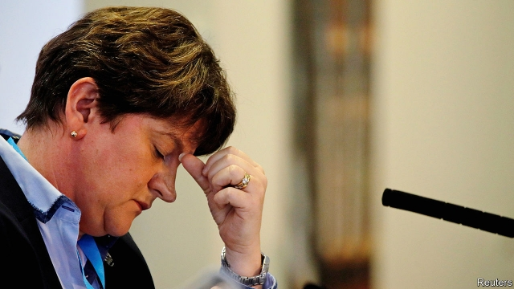

###### The DUP out in the cold

# Boris Johnson’s shabby treatment of Ulster unionists is foolish 

 

> print-edition iconPrint edition | Britain | Oct 26th 2019 

FOR A FEW minutes, it seemed like old times. On October 21st the Democratic Unionist Party walked back into the Northern Ireland Assembly, which had been closed for three years. The party, which insists on Northern Ireland remaining part of the United Kingdom and is socially conservative, was trying to block the legalisation of abortion and gay marriage—both of which had been imposed on Ulster by Westminster. But other assembly members did not turn up at the session, or left quickly, so the DUP’s bid failed. It is not the most humiliating thing that has happened to the party this month. 

The DUP enjoyed two years in the sun. In June 2017 Theresa May, then the Conservative Party’s leader, lost her majority in the House of Commons and turned to the DUP’s ten MPs to make up the numbers. A party that most Britons probably thought of as cranky and obsessive (if they thought about it at all) was suddenly powerful. Conservatives praised the union and promised more cash for Northern Ireland. The DUP was just as keen on Boris Johnson, Mrs May’s successor, who assured the party that no British prime minister could countenance a separation between Northern Ireland and mainland Britain. 

A party founded by a Protestant preacher ought to have remembered the Biblical injunction not to put your faith in princes. Mr Johnson has betrayed the DUP by striking a deal with the European Union that would bind Northern Ireland closer to Ireland than to Britain for trade purposes, in practice if not in law. The party has learned, painfully, that English Conservative politicians care more about leaving the EU than about the union with Northern Ireland. “We’ve been DUPed again”, screamed the Northern Irish edition of the Daily Mirror. 

The party took some revenge by voting against Mr Johnson’s deal on October 22nd, and against an accelerated timetable for considering it. The DUP has warned Mr Johnson that he should expect more such payback. That prospect might give unionist politicians some grim satisfaction. But it does not solve the party’s problems. Nor does it begin to empty the well of grievance among ordinary unionists. 

Its misadventure in Westminster is not the DUP’s only misjudgment of recent times. A disastrous scheme that subsidised fuel for agricultural boilers, in which Arlene Foster, the DUP’s leader, and other party figures were involved, wasted hundreds of millions of pounds. The report of a public inquiry into the debacle, due in December, is expected to heavily criticise DUP leaders. Ms Foster might not survive it. 

Mr Johnson’s deal is even more painful. Although it might profit Northern Ireland economically (see article), it has revived the ancient dread that the province is sliding out of the United Kingdom. Sinn Fein, which wants a united Ireland, pointedly did not criticise the deal much. The Johnson affair has also revealed how few firm friends the DUP has. The British government, the EU and the Irish government all seem to be against it. The party has even been abandoned by the “Spartans” of the Conservative Party, who once followed its lead on Brexit. 

The DUP will probably remain the largest unionist party in Northern Ireland. Its rivals for that status are much smaller and weaker. Besides, unionist voters tend to circle the wagons during a crisis. But the feeling of betrayal among unionists is worrying. And those who prize peace in Northern Ireland should fret about how that feeling might be exploited by the remnants of the loyalist paramilitary groups that still roam the back streets of Belfast, dealing in drugs and terrorising local people. 

In the past, loyalist protests over what began as minor disputes, including over the flying of flags over public buildings, have been seized on by paramilitary chiefs. They have encouraged youths to riot, thus blooding them for future paramilitary careers. Jim Wilson, a community worker in the loyalist stronghold of east Belfast, estimates that some 340 youths acquired criminal records during the flag protests of 2012-13. “Now people are very angry about Brexit,” he says.■ 

