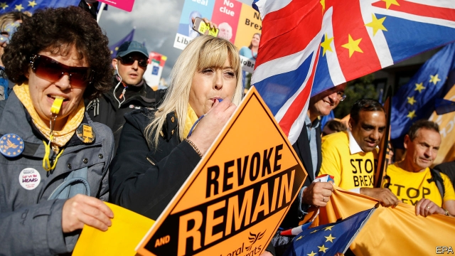

###### Yellow fever

# Finchley shows how Brexit could transform the Lib Dems’ chances 

 

> print-edition iconPrint edition | Britain | Oct 26th 2019 

IN HER 33 years as its MP, Margaret Thatcher grew fond of Finchley, a green and pleasant pocket of north London. She particularly admired its Jewish population, which then—as now—comprised about a fifth of the electorate. “My, they were good citizens,” she marvelled, “not just talking, but doing and giving.” The adoration was mutual. Locals rewarded her with more than half their votes at each election she fought as Tory leader. In most other post-war elections, Tories won the seat, which was renamed Finchley and Golders Green when its boundaries were redrawn in 1997. Labour held it for 13 years, under Tony Blair and Gordon Brown. The Liberal Democrats have never come close. 

They now hope to break the drought. Despite picking up only 7% of the vote at the last election, the Lib Dems are fielding one of their most high-profile candidates, the former Labour MP Luciana Berger. A survey by a reputable pollster (albeit commissioned by the Lib Dems) predicts she will notch up 33%, enough to topple the incumbent Tory, Mike Freer. Labour, which has yet to pick its candidate, is on 21%. About half of those who backed Labour in 2017 say they will vote for Ms Berger. 

One reason for this turnaround is unique to the candidate and the seat. Ms Berger quit Labour in February (initially for Change UK) in part because of anti-Semitism. She says she could not stand for election in a party run by Jeremy Corbyn, a “morally reprehensible” leader she has accused of standing by while such sentiment took root. Finchley is far from Ms Berger’s current seat, in Liverpool, but is an obvious choice since it is already her London home and houses much of her family. It also has more Jewish residents than any other constituency. One Lib Dem strategist says the choice is a good example of the party’s knack for picking the right candidate for the right seat. 

It is not hard to find constituents who praise Ms Berger’s stand against Mr Corbyn. In the Salt Beef Bar just off the busy North Circular Road, there is a fast trade in that Jewish staple and bowls of steaming barley soup. On one table a copy of the Jewish News reports that Louise Ellman, another Labour MP, has quit the party over anti-Semitism. The next page’s headline booms: “Berger looks golden”. One synagogue worshipper describes her as a “refugee from anti-Semitism”. Some call her “heimish”, or “one of us”, a reference as much to her local roots as to her faith. 

Plenty of Jews will vote for Mr Freer, a diligent local MP. In any case, as Ms Berger points out, most voters even in Finchley are not Jewish. The second and more significant reason for the Lib Dems�� optimism is Brexit. More than two-thirds of the seat’s voters backed Remain in the referendum. Ms Berger reckons many will be won over by her new party’s pledge to revoke the mechanism that triggered the Brexit negotiations. The same logic explains why Chuka Umunna, a fellow Lib Dem defector from Labour and Change UK, is standing in the Cities of London and Westminster seat. 

Mr Freer voted Remain but now believes it is his democratic duty to implement Brexit. Internal polling put the Lib Dems ahead even before Ms Berger was picked to fight the seat, claims a party official, suggesting that Brexit is the most important reason for the swing. Party membership in Barnet had already more than doubled since the referendum, to around 500. 

An earlier election would be better for the Lib Dems’ foghorn-like “stop Brexit” message than a later one, especially if Parliament passes a deal in the meantime. But even if that happens, it will only trigger a new debate over the country’s future relationship with Europe. As one Labour wonk admits, Brexit is now “an identity issue as much as a trade-relationship issue”. Lib Dems believe Brexit is not in the country’s interests. For now, it is in theirs.■ 

