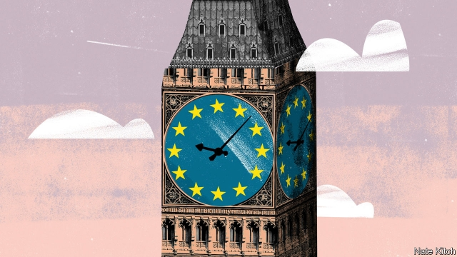

###### Bagehot

# Leaving the European Union is making Britain less British 

 

> print-edition iconPrint edition | Britain | Oct 26th 2019 

BEFORE THE referendum in 2016 European Union flags were as rare as golden eagles in Britain. Today they are as common as sparrows. Parliament Square is permanently festooned with them. Activist Remainers flaunt flag-themed berets and T-shirts. On October 19th a million-strong army of People’s Vote supporters marched on Westminster beneath a sea of gold and blue standards. 

This points to one of the oddest paradoxes in this odd period in British politics. It took a vote to leave the EU to shock millions of Britons into realising how much they liked it. Britain had always been an outlier in believing that the EU ought to be little more than a convenient trading arrangement. A couple of Eurobarometer polls in 2015 found that the country came 28th out of 28 in terms of people’s sense of European identity and 26th in terms of trust in European institutions. Yet today a significant section of the population thinks that being European is essential to its identity. 

This is part of a bigger paradox: the more Britain struggles to leave the EU, the more it embraces European-style politics. Since the dawn of the democratic era Britain has practised two- or two-and-a-bit-party politics compared with the continent’s multi-party system. That is changing, accelerated by Brexit. The Scottish National Party controls Scotland. The ruling Conservative Party is 45 MPs short of a majority. The European Research Group of hardline Brexiteers acts as a party within the Tory party. The Liberal Democrats could make big gains in the forthcoming general election, especially if Brexit seems reversible. 

For the past three years British politics has hung on problems that are familiar to continental politicians, such as the difficulty of assembling coalitions with minority parties and the power of disgruntled factions to exercise a veto. It has also endured the disadvantages of continental politics without the advantages. 

The case for the British two-party system is that it produces “crunchy” results even at the price of leaving a large section of the population feeling disenfranchised. Lately it has lost the redeeming feature of crunchiness. Theresa May had to rely on the votes of ten DUP politicians to keep her government afloat. Boris Johnson, having lost 23 Tory MPs, is living in parliamentary purgatory. 

Creeping Europeanisation can also be detected in the rise of the far right. The British two-party system was masterful at marginalising extreme figures such as Oswald Mosley and Enoch Powell. A more fragmented system is now making room for them in Britain just as it made room for Marine Le Pen in France, Matteo Salvini in Italy and Viktor Orban in Hungary. Nigel Farage’s Brexit Party, and before that his UK Independence Party, have terrified mainstream politicians by winning seats on local councils and in the European Parliament. 

Even as it becomes more European, British politics is also becoming more American. It is beginning to polarise around issues of culture and identity in much the same way as American politics has polarised. Politics is no longer about who gets what (which is always a matter of compromise) but about profound questions of identity (which is not). British politics is also becoming more presidential. Jeremy Corbyn remains on top of the Labour Party despite the hostility of his fellow MPs. Tories elected Mr Johnson as their leader not because he dutifully climbed the ranks but because of his star power. 

Britain has relied on an unwritten (or at least uncodified) constitution, in sharp contrast to the United States and Europe. But leaving the EU has raised constitutional questions that demand more than improvised answers. It has also raised the possibility that Britons will lose the panoply of rights guaranteed by the EU. Britain has done a good job of preventing the courts from interfering in politics. Again, Brexit is changing that. The Supreme Court’s decision to overrule Mr Johnson’s proroguing of Parliament could be the beginning of a new period of judicial activism. 

High on the list of British oddities is that it is a composite of four nations—England, Scotland, Wales and Northern Ireland. Holding this group together was always difficult given the different sizes of the parts (England is ten times as populous as Scotland) and the history of internal colonisation. It has been made vastly more difficult by Brexit because Scotland and Northern Ireland voted to remain. Brexit increases the chance that Scotland will claim independence and, in the longer term, that Northern Ireland will join the Irish Republic. It also increases the pressure for American- or German-style federalism. The only way to prevent England from being seen to ride roughshod over the smaller nations of the United Kingdom may be to create regional assemblies or more powerful metropolitan governments. 

A future Conservative government might be able to reverse the drift away from exceptionalism. If Mr Johnson can win a working majority, he will no longer depend on maverick factions and therefore will be less likely to end up in the Supreme Court. If he can bind Scotland and Northern Ireland to England by big spending on infrastructure, as he plans, he might be able to head off the forces of nationalism. If he can bring off Brexit, he may be able to asphyxiate both the Brexit Party and the Liberal Democrats. 

That is a lot of “ifs”. Though it has been reinforced by Brexit, the de-exceptionalisation of British politics began well before 2016 with New Labour’s embrace of both constitutional reform and a presidential style of government. It also feeds on powerful forces that have nothing to do with Brexit, such as the collapse of deference and the rise of celebrity culture. Moreover, the next election could produce another hung parliament, which will make pressure for voting reform and constitutional reform irresistible. Whatever happens in the Commons in the next few weeks, the dream of some Brexiteers, of restoring Britain to what it was before it entered the EU, is for the birds.■ 

