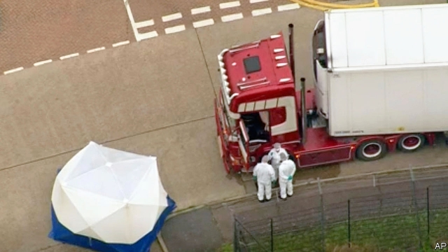

###### Journey’s end

# The death of 39 people shows the human cost of hostile policies 

 

> print-edition iconPrint edition | Britain | Oct 26th 2019 

IT IS UNCLEAR how many migrants are in Britain illegally. It could be around 650,000—give or take a couple of hundred thousand. Nor is it known how many enter the country without permission every year. Maybe 40,000; maybe substantially more or less. Undetected entries are by definition impossible to measure. 

What is known is that people will take enormous risks to enter Britain. This was made tragically clear again on October 23rd, when Essex police announced the discovery of 39 bodies inside a refrigerated lorry that was registered in Bulgaria. The driver, a 25-year-old man from Northern Ireland, has been arrested. 

It is also clear that tightening security on one route tends to divert people to other ones. Lorries coming into the port of Dover from Calais may be searched by canine units, X-ray machines, carbon-dioxide sniffers and heartbeat monitors. In 2016 the National Crime Agency warned that people-smugglers were diverting operations to less busy ports, such as Purfleet, where this lorry seems to have arrived from Zeebrugge in Belgium. Its journey ended at a nearby industrial estate. 

As The Economist went to press, it was reported that the migrants discovered in Essex were Chinese. If so, it would be the second such tragedy. In 2000, 58 Chinese migrants died in a lorry that was found in Dover. In 2014, 35 Afghan Sikhs were found in a shipping container in Tilbury, not far from Purfleet. Most survived. 

Though reliable numbers are scarce, researchers reckon that most irregular migrants enter Britain on legitimate tourist visas, then stick around. Many others use forged documents. Those arriving on boats across the English Channel, or hiding in the backs of lorries, are often the sort of people who would find it hard to obtain a visa. “The British government has a deliberate policy of making it difficult to reach the UK to claim asylum. So people from countries that have a higher rate of asylum will find it harder to get tourist visas,” says Madeleine Sumption of Oxford University. 

Tragedies on this scale have occurred in other countries. In 2008 the air-conditioning in a seafood container lorry failed in Thailand, killing 54 out of 121 migrants from Myanmar. A few years later 43 of 113 migrants bound for South Africa suffocated in a lorry. In 2015 Austrian police discovered an abandoned lorry with 71 refugees who had suffocated in the refrigerated container. All were from Iraq, Iran, Syria and Afghanistan. Nine people died of overheating in a sweltering truck in Texas in 2017. All of these calamities involved refrigerated containers. It is harder to detect people in such vehicles than in soft-sided ones, says David Wood, a former boss of immigration enforcement at the Home Office. 

Politicians promise to crack down on the gangs that smuggle people; advocacy groups argue for changes to migration rules. There has been no serious talk of changing the design of the lorries themselves. In the mid-20th century American lawmakers started requiring fridge-makers to use magnetic strips instead of latches after reports of children climbing into disused fridges and suffocating inside. Making it easier to get out of lorries is politically simpler than making it easier to get into countries. It would also save lives. ■ 

