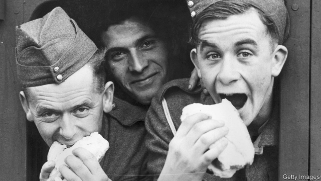

###### Food in the army

# The way to a soldier’s heart is through his stomach 

 

> print-edition iconPrint edition | Britain | Oct 26th 2019 

AT LARKHILL GARRISON in Wiltshire, British troops are engaged in a running battle—with their caterers. Meals at the base, served up by a French contractor, Sodexo, are so unpopular that soldiers have taken to buying George Foreman grills from a nearby Tesco supermarket. Yet once outed by their battalion quartermaster sergeant, often accompanied by Sodexo employees, these guerrilla chefs risk having their grills confiscated or disabled and being punished with show parade at night. “The army trusts me with a machinegun or a fucking tank, but they won’t let me cook my own food,” says one former squaddie, who served with 32 Regiment Royal Artillery for five years. 

Britain’s armed forces are struggling to keep the ranks filled. In July the services counted on 191,600 personnel, down from more than 220,000 in 2012. Three-fifths of those who left in the previous 12 months did so before their contracts had expired. Surveys of service personnel show that morale peaked in 2009, when 58% of “other ranks” (that is, not officers) were satisfied with service life. This year only 43% said the same. 

The chief reason for returning to civilian life is the difficulty of combining soldiering with family obligations. Many leavers also point to the availability of jobs outside the service—which was less of a lure ten years ago, in the aftermath of the financial crisis. But working conditions are a problem, too. In the past five years dissatisfaction with housing has risen. And only 29% are satisfied with the standard of catering, with non-officers especially grumpy. 

The first skirmish came three years ago, when soldiers launched a vicious attack on the food on social media. “Because it’s the military they basically think we can’t touch them,” says one, “so it’s not like a normal restaurant where you can complain.” In the same year Sodexo strengthened its monopoly on food at Larkhill by replacing Katie’s Kitchen, a food van driven for 27 years by a local woman, Linda Clark, with its own van. “She had a knackered old camper van and we’d be working in the garages on tanks and she’d come round and sell you a bacon butty,” the 32 Regiment soldier reminisces. Even after a petition amassed 7,000 signatures, Katie’s Kitchen did not come back. Soldiers complain about prices, too. 

Sodexo provides catering and cleaning services at 31 army and air force bases in the south of England, and at six bases in Cyprus and the Falklands. “Retaining people used to a radically changing social environment is challenging,” says Mark Baker, a Sodexo director who says the grills were confiscated to ensure fire safety. He is now helping draw up plans with the army to create more relaxation areas inside barracks. As he points out, defence does not have a bottomless budget. But you can buy a lot of burgers for the price of a tank.■ 

