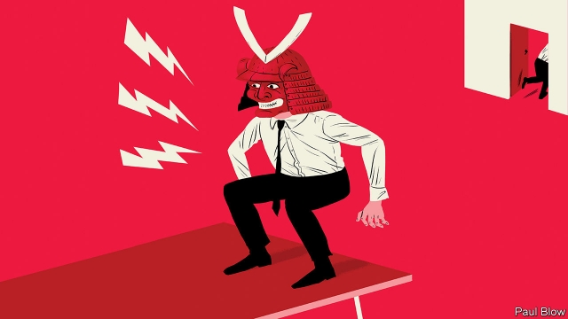

###### Khan-do attitude

# Creating the right culture in a business 

 

> print-edition iconPrint edition | Business | Oct 24th 2019 

IT SEEMS OBVIOUS that, for a company to succeed, it needs the right products. But many people believe the right culture is just as important. Creating that culture has been the holy grail for managers ever since Tom Peters and Robert Waterman focused on the issue in their book “In Search of Excellence”, published back in 1982. While the idea has never disappeared completely, it has come back into fashion today. 

A prime example is a new book called “What You Do Is Who You Are: How to Create Your Business Culture” by Ben Horowitz, of the venture-capital firm Andreessen Horowitz (playfully known, because of the length of its name, as a16z). Mr Horowitz uses some unexpected examples as his case studies—Genghis Khan, Japanese samurai, Toussaint Louverture (who led a slave revolt in Haiti) and a reformed gang leader called Shaka Senghor. 

It is easy to sense some wish fulfilment in these archetypes: the Silicon Valley tycoon, armed only with an iPhone, seeing himself as the modern equivalent of a historical warrior. That sense is heightened when Mr Horowitz talks of the contrast between “wartime” and “peacetime” chief executives, an analogy seemingly drawn from “The Godfather”, a movie about the mafia. 

Thankfully, the book is not the orgy of macho chest-thumping that these examples might suggest. Mr Horowitz draws some thoughtful lessons from each of his case studies. Take Genghis Khan. He is best known for his rapid conquests and bloody massacres but the leadership lesson that the author draws relates to Genghis’s meritocratic approach. He was willing to promote people from conquered tribes and allowed religious freedom in his empire. The only condition was allegiance to his rule. 

Toussaint Louverture was notable for his clear ethical code and his willingness to forgive his enemies; he even let slave owners on Haiti keep their land, provided they agreed to reward their workers properly. Shaka Senghor also imposed a strict code of behaviour on his prison gang. 

The underlying principle is that culture cannot just be a pious-sounding mission statement in the annual report. It has to be expressed in the form of actions on a daily basis. Indeed, the culture must be applied consistently. As Mr Horowitz writes “You can’t pat yourself on the back for treating your employees ethically if you’re simultaneously lying to your customers because your employees will pick up on the discrepancy and start lying to each other”. The goal is to embed the culture so deeply that employees will behave in the right way even when no one is looking. 

Leaders set the tone. If they lie, shout or swear, then others will do the same. The corollary is that, if they want to encourage good behaviour, they have to get involved. 

Companies may want a diverse staff but all too often, Mr Horowitz says, they try to achieve this by appointing a “head of diversity” or hiring consultants. At Andreessen Horowitz they insist that managers consult more widely by asking, for example, African-Americans what talents they would look for in a new candidate. The firm’s staff is now 55% female and 22% African-American. 

But of course, some cultures can have bad effects. At Uber, a ride-hailing giant, the group’s values included such messages as “champion’s mindset” and “always be hustlin’”. The effect was to create a highly competitive culture that eventually had malign consequences in a series of scandals, leading to the departure of Travis Kalanick, Uber’s founder. Mr Horowitz argues that the board should have realised that the company’s aggressive culture would eventually lead it into difficulty. 

The examples chosen by the author are certainly colourful but they seem just as likely to have inspired Mr Kalanick as they might a modern, culturally sensitive chief executive. Running a business is not like conducting a war where casualties suffered on the road to victory are often regarded as little more than collateral damage. 

It is also worth remembering that Genghis Khan’s empire disintegrated within a generation of his death and that the Japanese economic miracle occurred only after the country had thrown off the rule of the samurai class. 

Great leaders in history have not all been men of violence; some of them, indeed, have been women. Managers looking to set the right corporate culture might want to choose their role models from a more diverse group.■ 

