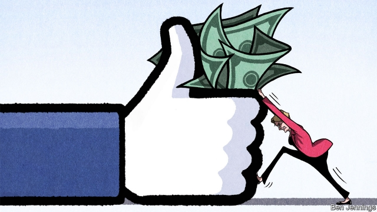
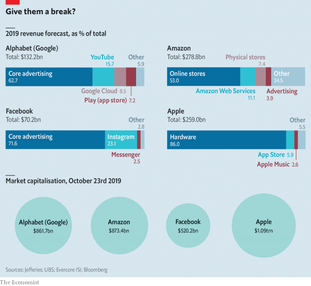

###### Breaking up is hard to do

# Dismembering Big Tech 

 

> print-edition iconPrint edition | Business | Oct 24th 2019 

“FATHER LENNON, have you some money? Buy Standard Oil.” That’s what John D. Rockefeller is said to have told his golf partner, a priest, when he heard the news in 1911 that the Supreme Court had ruled his oil company was to be broken up into 34 smaller firms. It was good advice. Within a few years the value of those firms rose threefold. The net worth of Rockefeller, who owned more than 25% of each, grew from about $300m in 1911 to $900m in 1913, around $23bn in current dollars. 

A break-up of today’s tech titans—Google, Amazon, Facebook and Apple—could also unlock vast value, say some with an eye on the industry. If the most radical plan, proposed by Elizabeth Warren, a leading Democratic contender for America’s presidency, were fully implemented, by some calculations the parts spun off alone could be worth over $2trn—roughly half the value of the four complete firms today. 

Ms Warren’s two-pronged scheme was presented in March, but it is now coming under closer scrutiny as her campaign for the Democratic presidential nomination gathers steam. The first part is relatively straightforward. She intends to unwind tech mergers deemed “anticompetitive” because they were undertaken to neutralise potential competitors. This is mainly aimed at Facebook, which in 2012 bought Instagram, a picture-heavy social network, for $1bn and in 2014 paid $19bn for WhatsApp, an instant-messaging service. Both of these, industry insiders argue, could have become serious rivals to Facebook. But Ms Warren also aims to undo other deals, such as DoubleClick, an advertising exchange bought by Google, and Whole Foods, a grocery chain acquired by Amazon. 

The second prong requires more explanation. The tech titans are mostly two-headed beasts. They not only operate a market but compete in it too. Amazon owns the world’s biggest e-commerce marketplace and also sells products on it under its private labels. Apple hosts the app store on the iPhone but also offers its own apps. This creates incentives for these firms to promote their wares unfairly, for instance by showing them at the top of the result pages of their search engines. 

Ms Warren wants operators of any online marketplace which generates annual global revenues of more than $25bn to be declared “platform utilities” and prohibited from both owning a platform and doing business on it. At a minimum this would mean, for instance, that Amazon would have to spin off its private brands, in particular Amazon Basics. Apple would have to shed such apps as Mail and Maps. 

Determining the effect of break-ups is tricky, though an analysis of the revenues of various parts of the tech titans’ businesses gives a sense of their worth (see chart). Equity analysts who engage in “sum-of-the parts” (SOTP) analysis also try to estimate the value of bits of a business using similar firms as a yardstick. Their over-excited assessments of how much these might be worth sometimes look like flights of fancy. But the approach may work reasonably well for business units that have closely comparable peers, such as Instagram. In June Bloomberg Intelligence reckoned that Instagram would fetch $100bn (although some in Silicon Valley put the number much higher, at around $200bn, because of its fast growth). Brent Thill of Jefferies, a bank, values Amazon’s online retail business (including Amazon Basics, but without its marketplace) at nearly $200bn and the firm’s physical stores (mostly Whole Foods) at up to $6bn. 

 

If good comparisons and financial data are absent, such estimates are more art than science, says Brian Wieser of Group M, the world’s largest advertising buyer. That makes it even harder to put a number on Google’s advertising business as a whole (Jefferies’ estimate is $539bn). Ms Warren wants to split it into an ad marketplace and services that operate in it. But valuing its constituent parts is guesswork. The firm is not forthcoming with numbers. 

These are not the only problems. WhatsApp, despite the whopping price Facebook paid for it, does not make much money, which makes assessing its worth hard. Trying to estimate a price for Apple’s and Google’s apps would be hopeless. 

The fuzziness of Ms Warren’s plan also makes estimating a total break-up value difficult. If Facebook has to part with WhatsApp, why should it keep Messenger, its other instant-messaging service? Or why should Apple keep iMessage? Both may be regarded as services on top of a platform utility. It is similarly unclear what would happen to the app stores of Apple and Google or the cloud-computing arms of Amazon and Google (and Microsoft’s, for that matter, a rival to Amazon). A spin-off of Amazon Web Services, for example, would create the world’s second-most-valuable corporate IT firm. It would be worth $438bn, says Morgan Stanley, a bank—about four times more than IBM. 

Even though most analysts assume that the separate parts are worth more than the whole, could the opposite be true? Break-ups could destroy value. Synergies would evaporate, points out Amit Daryanani of Evercore ISI, a financial firm. Apple may no longer be able to offer a tightly integrated package of hardware, software and services, which is its main competitive advantage. If Amazon were shorn of its cloud-computing arm, it would lose its most profitable business, making whatever is left a less attractive investment. It is also unclear how markets would react if divestitures were to weaken network effects, the economic forces that let big firms get bigger and are pervasive in the digital world. 

Those who think they can benefit from break-ups ought not to be too hopeful. Political and legal barriers abound. Even if Ms Warren wins next year’s election, the Senate would probably remain under Republican control and might be unwilling to endorse a radical break-up. The other path, through regulatory agencies, seems equally rocky. Ms Warren intends to appoint regulators “committed to reversing illegal and anticompetitive tech mergers”. But they would probably have to make their cases in court. Both federal appeals-court judges and the conservative majority on the Supreme Court are antitrust sceptics. 

Second, practical difficulties will act as a further drag. In other industries “line-of-business” prohibitions, of the sort Ms Warren wants to impose on Amazon and Apple, have been used to avoid abuse of a dominant position. American railways were banned from carrying commodities they produced themselves and banks from engaging in commerce. In the digital world, these borders are more arbitrary and fluid. 

Separating platforms from services which run on them sounds elegant. But how would one divvy up all the data the tech giants have collected? What is part of the platform and what is not? What happens if the lines between them move? Instant-messaging could be described as a feature of a social-networking platform but also a separate service. The case against Microsoft was triggered when it bundled its Windows operating system with its web browser, which were then separate pieces of software. Today, browsers are usually considered part of an operating system. 

Third, the fear of unintended consequences will act as a brake on break-ups. Ms Warren’s plan was in part inspired by Lina Khan, a legal scholar, who in 2017 published an influential paper entitled “Amazon’s Antitrust Paradox” and now advises the antitrust subcommittee of the House of Representatives in its investigation of Big Tech. But in a more recent paper she lists several drawbacks to heavy regulation. Quickly evolving technology can make break-ups obsolete. Because they introduce friction, they could lead to higher prices. If they are limited in what they can do, platforms may cut investment, thus slowing innovation. Although she identifies these drawbacks she says they are “not a compelling argument for inaction”. 

What is more, break-ups alone will not suffice to tame big tech. Harold Feld at Public Knowledge, a left-leaning think-tank, notes the “starfish problem”. Some starfish have incredible powers of regeneration: tear them up and the pieces quickly grow into complete new creatures. Similarly, one part of a tech giant could become dominant again because of network effects. Break-ups, he argues, need to be complemented by regulation that weakens this effect, for instance with requirements that a user of one instant-messaging service can exchange texts with another. 

Given all these hurdles, will break-ups ever happen? Sector-wide divestitures seem unlikely, but even Makan Delrahim, head of the Department of Justice’s antitrust division, said on October 22nd that they are “perfectly on the table”. Amazon looks vulnerable. It is disrupting many industries and creating many enemies. A line-of-business prohibition seems a relatively easy sell politically. The most likely victim is Facebook. Privacy scandals and its role in distributing misinformation have made the firm a target for both Democrats and Republicans. 

The case against Facebook is relatively easy to make. Scott Hemphill and Tim Wu, two legal scholars based in New York, have already started advancing it. Backed up by Chris Hughes, a co-founder of Facebook now turned critic of the firm, they have been giving presentations to regulators explaining that “available evidence indicates that as of 2010, Facebook launched a programme of serial defensive acquisitions in order to maintain its dominance.” 

Legal arguments notwithstanding, it will be hard to unscramble the eggs. WhatsApp is still a separate entity but Instagram is not. It uses the same advertising platform as Facebook’s social network. And the firm is busy tying its biggest services together even more tightly by merging their address books. Facebook subscribers will at some point be able to send messages on WhatsApp. The goal, the firm says, is to make life easier for users. Critics argue that the aim is to make divestiture more difficult. To avoid “irreparable harm”, Messrs Hemphill and Wu call on regulators to ask for a preliminary injunction that would put an end to the integration work. 

Mark Zuckerberg, Facebook’s boss, knows that he has a target on his back. If Ms Warren were elected president, he recently told staff, “then I would bet that we will have a legal challenge.” He would also bet that he would win, he added. Mr Zuckerberg may want to read up on the history of Standard Oil. Rockefeller thought so too—until it was too late.■ 

