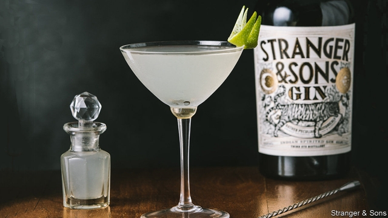

###### A new spirit

# Indian gin measures up 

 

> print-edition iconPrint edition | Business | Oct 26th 2019 

GIN AND TONIC originated in India as a more palatable way for Victorian colonialists to down the bitter quinine that protected them against malaria. The recent spurt in popularity of gin around the world has produced a long list of popular brands that tout Indian inspiration yet Bombay Sapphire, Sikkim, Jodhpur, Opihr and Gin Wala are distilled in Britain. Despite India’s role in popularising gin it has taken many years for home-grown firms to join the party. 

Stranger & Sons, set up in Goa a year ago, is one of a few domestic upmarket brands that are appearing in Indian bars. Not only can they trade on history but the local availability of “botanicals”, plants and spices that impart flavour, is another boon. Demand for Stranger & Sons’ products in India seems to match a worldwide thirst. Global sales of premium bottles are growing at around 20% annually, says IWSR Drinks Market Analysis, a research firm, two-and-a-half times the rate of overall spirit sales. Initial production at Stranger & Sons of 1,800 bottles a month will grow to 21,000 by the end of the year. 

The firm is battling against the odds. Selling a high-cost product where poverty abounds is one difficulty. So is setting up an alcohol business in a country where four states are entirely dry and taxes are high. Overall gin sales in India are forecast to decline 5% annually over the next five years. But most of that is of the rot-gut variety, costing under $2.50 a bottle. Yet even at the end of the market occupied by Stranger & Sons, which charges around $40 a bottle, India is in 55th place of the global-sales ranking, below even Malaysia, a mainly Islamic country with tight controls on alcohol. 

All of this meant that when the three young Mumbai-based entrepreneurs behind the new product began raising money they had to search for unusually adventurous backers. Perhaps the experience of studying abroad of two of the founders, who saw at first hand the growing popularity of premium gin, made for a convincing pitch. Other fancy domestic gin brands, such as Greater Than, are also battling for space behind Indian bars. Born in India, the G&T is capturing the imagination and so filling the glasses of ever more of the country’s drinkers.■ 

