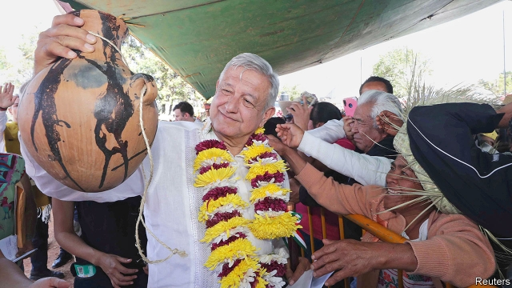
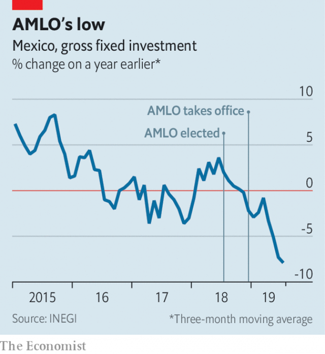

###### Feeling the heat

# Mexican business struggles to adapt to a new regime 

 

> print-edition iconPrint edition | Business | Oct 26th 2019 

THE THICK, humid air of Cancún caused many attending this year’s Mexico Business Summit, which began on October 20th, to swap their suits for guayaberas, the fancy shirts often adopted by populist politicians. The country’s business climate has them sweating nonetheless. The president, who usually shows up, didn’t make it this year. Andrés Manuel López Obrador (known as AMLO) was busy touring villages in Oaxaca, an impoverished southern state. His absence is symbolic of the uncertainty of the private sector under his tenure. 

Entrepreneurs have struggled to understand AMLO since he became president a year ago. He lost no sleep cancelling construction of a $13bn airport in Mexico City beloved by the private sector. Because business has been cosy with past governments, he blames it for his country’s failings. His remedy is statist medicine. 

Critical rhetoric and sudden decision-making has sown mistrust. In July the president asked to renegotiate a gas-pipeline contract signed with a Canadian firm by his predecessor, Enrique Peña Nieto. The oil sector has again been cordoned off from private investment, undoing Mr Peña’s reforms. That has made businesses wary. Gross fixed investment dropped by 8% in the year after AMLO’s election last July, the steepest fall in several years (see chart). 

 

The president has also failed to improve Mexico’s faltering economy, which barely escaped recession this year. Firms depending on the domestic market have been hardest hit. The share price of Cemex, a cement company, has fallen by a fifth this year amid a wobble in construction. Tourism chiefs and exporters to America are less vulnerable. And the odd winner emerges. During a panel at the summit, one woman whispers that sales at her cosmetics firm are growing faster due to “more liquid money in the lower classes”, thanks to AMLO’s spending on the poor. 

Amid the bad news, bigwigs are queuing up to declare common cause with the president. Carlos Slim, Mexico’s richest man, says he “100%” shares AMLO’s goals of eradicating poverty, crime and corruption. “We lost our vision for many years,” says Carlos Salazar Lomelín, boss of the Businessmen’s Co-ordinating Council (CCE), a lobby group. “Our well-being was very good and we stopped looking at society.” This cooing is a strategy to crack the president’s sphere of influence. 

Mr Salazar and AMLO talk weekly. The CCE has helped resolve the pipeline dispute, organises regular energy talks between the government and business (raising hopes that private investment will again be allowed), and is working with the government on an infrastructure bill. These charm offensives keep bad laws from becoming worse ones, insiders say. Bosses fear not that Mexico will turn into Venezuela, says Alberto Bello, the editor of Expansion, a business magazine. Rather, they worry it may become like Argentina, where the relationship is so toxic that the government often does not speak to the private sector when making policy. 

Adapting to a new regime is far from the only problem. At the summit everyone complains that security is worsening fast, swapping tales of warehouse robberies and kidnappings. One foreign financier laments the glacial pace of activity in Mexico’s courts and government buildings. Some of these are long-standing gripes. But many doubt they will be resolved while bosses strut around in populist clothing.■ 

