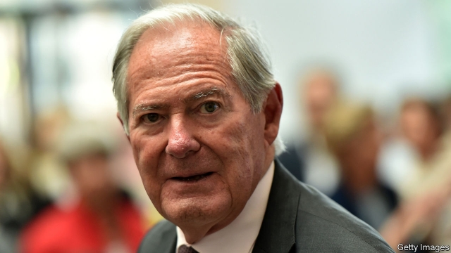

###### Generations at war

# Roland Berger discovers his father’s dark secret 

 

> print-edition iconPrint edition | Business | Oct 26th 2019 

IT HAS HAPPENED before and will almost certainly happen again. Offspring of Germans who were adults during the 12 years of Nazi rule shied away from asking too many questions about their elders’ relationship with the regime. Many parents did not want to talk about it. And when they did so, most children went along with whatever version of the family’s past was presented to them. Sometimes that was not the whole truth. Few, however, have told their father’s story of defiance as frequently and publicly as Roland Berger, a celebrated management consultant. It was thus a shock for Mr Berger when a newspaper investigation revealed that his father, Georg, was a profiteer from the Nazi regime rather than the committed Christian hounded by the Gestapo as he had always claimed. 

The account given in interviews and speeches by Mr Berger, who set up Germany’s largest consultancy and advised the government of Helmut Kohl on the privatisation of companies in eastern Germany, was one of an inspirational transformation of a former member of the Nazi party. When Georg witnessed the horrors of Kristallnacht in 1938, he tore up his party-membership card and became an opponent of the regime. He was even sent briefly to Dachau, a concentration camp. 

The reality, as revealed on October 17th by Handelsblatt, a German newspaper, was the story of a careerist with a penchant for the good life. Berger senior joined the Nazi party in 1931 and not, as he claimed, in 1933, after Hitler came to power, for reasons of political expediency. He paid his membership fees until 1944. Such was his allegiance that he was promoted to become a ministerial adviser in 1937 and later sent to Vienna to run Ankerbrot, Austria’s largest bakery. In Austria’s capital Berger lived in an elegant villa confiscated from a Jewish family. He then clashed with the Nazis but not because of his scruples. He fell foul because he hoarded groceries illegally and renovated the Viennese villa at lavish cost. Handelsblatt found no records of his imprisonment in Dachau. 

The younger Mr Berger, who is 81, admits that he unintentionally deceived himself by readily believing the stories his parents and relatives related about his father’s past. He now vows to find out the truth and has commissioned two respected historians, Michael Wolffsohn and Sönke Neitzel, to research his family’s history. 

The revelations are the latest in a series of discoveries of entanglements with the Nazis of the forebears of owners of large German businesses. (Mr Berger’s father was not involved in the founding of his consultancy firm.) Earlier this year historians examining the history of the Reimanns, a super-rich clan that owns Krispy Kreme, Panera Bread and other consumer-goods brands, revealed that the family patriarch at the time, Albert, as well as his son, were early and enthusiastic supporters of Adolf Hitler. 

Werner Bahlsen, the head of a biscuit empire, said in May the family will hire a well-known historian to examine their Nazi past after Verena, his 26-year-old daughter, caused a stir when she blurted in response to a question about Bahlsen’s exploitation of forced workers that they were treated well. The Quandts (BMW), Krupps (steel), the owners of Bertelsmann (publishing) and others have grappled with similarly tainted legacies. 

Two decades ago 6,500 German companies including Siemens, Deutsche Bank and Volkswagen, created a foundation that, along with the German state, raised more than €5bn ($5.5bn) for survivors of Nazi atrocities and slave labour. Mr Berger’s firm did not participate but 11 years ago he set up a foundation endowed with €50m to help disadvantaged youth. The foundation also hands out an award for human dignity every year. Though initially insisting this year’s awards ceremony would go ahead, the Roland Berger Foundation announced on October 21st that it would be postponed until next year. This year’s recipients, a Polish human-rights activist and a German anti-racism initiative, both said they would decline the prize. ■ 

