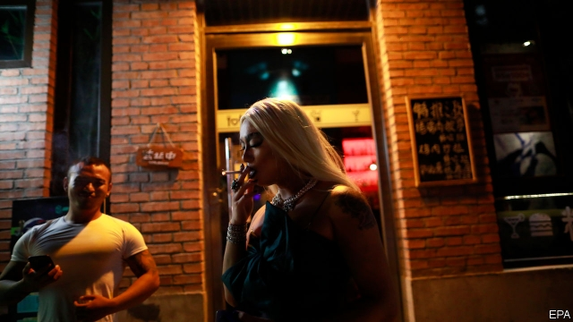

###### Destination’s journey

# For a conservative city, Beijing has a remarkable gay nightlife 

 

> print-edition iconPrint edition | China | Oct 26th 2019 

BY DAY EDMUND YANG is an accountant at a multinational firm. At night he can sometimes be found quietly sipping a cocktail at Destination, his club-cum-cultural centre. On China’s most popular navigation app, Baidu Maps, the venue is listed as a “comrade bar”. That does not mean it is a watering hole for Marxists. Comrade is Chinese slang for gay. 

Since Mr Yang opened the club in 2004, just three years after China ceased to classify homosexuality as a mental disorder, the venue has become a beacon for gay Chinese across the country. Destination was one of the first places to aim explicitly to attract gay customers. Today there are several such venues in Beijing as well as in other big cities. But Destination is unusual for being open every day. It also stands out for its longevity and enormous size. Time Out Beijing, a listings magazine, calls it the “granddaddy of Beijing’s gay clubs”. 

Entertainment businesses in Beijing are often ephemeral, so it is all the more surprising that one catering for such a marginalised clientele has lasted this long. Homosexuality is still viewed with suspicion, or even contempt, by many Chinese. Even in relatively cosmopolitan Beijing, gay people rarely come out to family, friends or colleagues. On a recent weekday one of Destination’s customers is a doctor from coastal Shandong province who says his family does not know he is gay. He says he is looking for a handsome young partner. 

Originally the club was a ground-floor room with a disc-jockey’s booth in a building near the Worker’s Stadium in north-eastern Beijing, a once-quiet residential area that is now full of bars with exotic names such as Golden Age, Heaven’s Supermarket and Superlife Lounge. Destination has since taken over the three storeys above. On the first is a hallway with several adjoining rooms, each of which can fit 30 people. Customers chat on their plush couches. The second has an art gallery with rotating exhibits, curated by a French expatriate. A recent show, of works by gay Chinese artists, was called “Love is Blue.” The colour has gay associations in China—the world’s largest gay networking app, founded by a Chinese former policeman, with its headquarters in Beijing, is called Blued. On the top floor are rooms for yoga, piano and choir practice; and a small one offering free, anonymous tests for HIV. 

It may be that the authorities see a propaganda use for the club. In 2008, when China was trying to show off the capital’s attractions in the build-up to its hosting of the Olympic games that year, Xinhua, a state-run news agency, published an approving report on Destination. “I think our club will showcase Beijing as an open city,” it quoted Mr Yang as saying. Tellingly, however, Xinhua did not issue the report in Chinese. During the games the authorities banned dancing at Destination. 

Originally Mr Yang, a native of Hong Kong, saw the club as a place to indulge his love of pop music. As the only foreign pupil at boarding school in England, he had been “picked on, 24/7”. Such music was an escape. He has since amassed thousands of records and CDs. His partner jokes about coping with this “trash collection” when Mr Yang dies. But Mr Yang envisages a bigger legacy, that “some day we can look back, when gay marriage is legalised and society more accepting, and realise that Destination made its own small contribution.” ■ 

