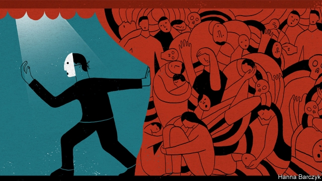

###### Chaguan

# Some thank Zhou Enlai for saving China from Mao’s excesses 

 

> print-edition iconPrint edition | China | Oct 26th 2019 

CHINA’S GRANDEST music academy this month unveiled a full-length, Western-style opera about Zhou Enlai. The puzzle is that it took this long. Opera is arguably the only art form big enough to capture the contradictions of this brilliant moral failure of a man, Mao Zedong’s prime minister for over a quarter century. 

When Zhou died in 1976 he was beloved by Chinese who did not know him well. Vast throngs of Beijingers filled Tiananmen Square in the spring of that year to mourn him, risking arrests and police beatings to remember a leader they credited with moderating the worst excesses of that fanatical era. Their lamentations were also a coded attack on ultra-leftist zealots who were circling the ailing Mao, now that Zhou was gone. Some praise was merited. Papers published after his death show Zhou reporting rural starvation to the chairman—though without identifying the famine’s cause, namely Mao’s own policies. Documents show Zhou working to rehabilitate purged scientists and officials, if only because China’s economy needed competent managers. To this day, locals across China will point to a beloved temple and thank the former prime minister, often without hard evidence, for issuing orders that shielded the site from Red Guards. China’s music world owes Zhou a debt for encouraging propaganda works of some artistic merit, such as the revolutionary opera “The East is Red”, and for protecting performers from vicious cultural commissars. 

Those who served alongside Zhou viewed him with mixed emotions. Veterans of China’s civil war remembered how he coldly ordered the killing not just of traitors, but also of their extended families. After the founding of the People’s Republic, colleagues watched this loyal courtier pay a high price to stay by Mao’s side, betraying lifelong comrades when called upon to denounce them, and his own conscience when offering grovelling self-criticisms. Defenders argue that he did what he could, nudging Mao’s instincts in more constructive directions without confronting him. 

Alas, “Zhou Enlai” the opera, which premiered on October 15th in the former Red Army base of Yan’an, fails to capture the sweep of that life. This shrill, empty work—which Chaguan watched on October 20th at a gala performance in Nanjing, the capital of Jiangsu province—says more about the state of public art in today’s China. Composed by a professor at the Central Conservatory of Music and sponsored by Jiangsu, where Zhou was born, the opera turns its tragic hero into a cypher—a primly perfect model worker, albeit one whose work is running the government. To signal that Zhou loved the people, he is shown working late while his aides fret about his health, and refusing a bowl of gruel because there are Chinese without enough to eat. Zhou the diplomat instantly impresses the visiting American president, Richard Nixon, who gasps in an aside: “This is a difficult opponent. He is so firm in his positions yet so polite, and he clearly knows a lot about America.” A scene is devoted to Zhou’s oratory at the Bandung Conference of non-aligned nations in 1955. When African and Asian envoys doubt China’s sincerity, the Zhou of the opera recalls past humiliations inflicted by colonial powers on their two continents. Deeply moved, the gorgeously robed ministers bow and clasp his hand. 

These cartoonish scenes involve both omissions—the horrors of the Great Leap Forward and Cultural Revolution are not mentioned and Mao is never seen—and distortions of the historical record. The real Zhou at the real Bandung Conference committed China to non-interference in other countries’ internal affairs and cast America’s nuclear arsenal as the greatest threat to world peace. The stage version struts and brags about the military firepower of a rising China, in language that would not look out of place in an online nationalist chat-room. “You know what people say, diplomacy only works within the range of your missiles,” the operatic Zhou blusters. After his triumph at Bandung he assures his wife that China will be bullied no longer, saying: “I’m thankful that today we’re no longer fish meat on somebody’s chopping block.” 

Audience reactions show a generational divide. Though all spectators described an idealised Zhou, sketched out in the broad strokes of party propaganda, older Chinese at least nodded to the idea that the former prime minister suffered for the sake of the revolution, while trying to mitigate Mao’s worst mistakes. “He swallowed humiliations and bore a heavy burden,” murmured one old man, explaining his admiration for Zhou as he left the performance. In contrast, younger spectators reflected the tinny, chin-jutting nationalism that suffuses life in today’s China, hailing Zhou as a symbol of Chinese national strength vanquishing foreign humiliation—as if this subtle, disappointing man were an aircraft-carrier or high-speed train. A group of university students, one of whom had a bit part in the opera, furrowed their brows when asked about his significance. “He’s all about giving to the people. Even after he got sick and fell to the ground, he’d stand back up and work some more,” ventured one. Another hailed Zhou for promoting China’s rise: “He’s the one that reintroduced China to the world. Letting people know that our lives are getting better and our nation is stronger.” Interviews inside the theatre were cut short by officials who shooed Chaguan away, calling an opera about a state leader a sensitive matter not fit for foreign reporters. 

A grand finale makes explicit the link between the opera and present-day propaganda. As a chorus sings lines from a poem by the teenage Zhou about studying abroad for the good of China, a large video screen flickers to life. Images of a modern Chinese space rocket and submarine fill the screen, then footage of troops, tanks and nuclear missiles from this month’s national-day parade in Beijing. Crude and bossily patronising, the opera is of a piece with much official discourse in today’s China. Zhou Enlai the diplomat and opera-lover might have shuddered. As a party loyalist, he would have stood at the front, applauding. ■ 

