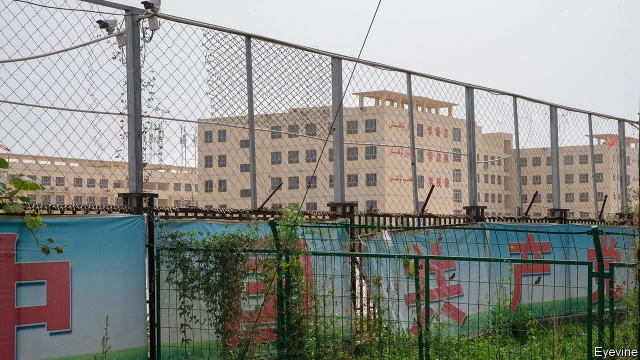
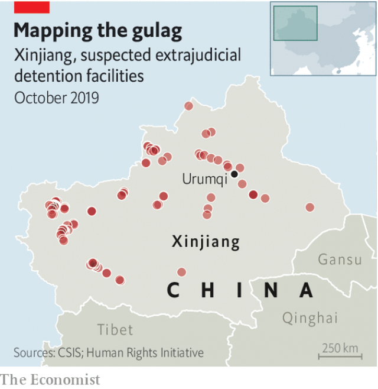

###### Cutting the line

# To suppress news of Xinjiang’s gulag, China threatens Uighurs abroad 

 

> print-edition iconPrint edition | China | Oct 24th 2019 

ON A SINGLE day in January 2018 in the far-western region of Xinjiang, 25 members of Gulchehra Hoja’s family, including her parents in their 70s, received calls summoning them to police stations in Urumqi, the provincial capital, and in Ili, 500km away near China’s western border. When they arrived they were told they were being detained because of their kinship with Ms Hoja, a reporter for Radio Free Asia (RFA), a broadcaster funded by the American government. RFA had recently reported on the mass internment of Uighurs, a Muslim ethnic group that makes up nearly half of Xinjiang’s 22m people. Ms Hoja’s father could not answer the summons because he was in hospital. Instead, police sent guards to stop him escaping. 

The message to RFA was clear, and it was not the first one. A year earlier—just before China began rounding up hundreds of thousands of Uighurs, often for no other reason than their devotion to Islam—Ms Hoja’s colleague, Kurban Niyaz, another Uighur exile in America, received a photo from his younger sister on WeChat, a Chinese social-media app. It showed two Chinese police officers sitting on her sofa (one of them smiled for the camera). They had ordered her to send him the photo, Mr Kurban says, to remind him that “the people’s cops are just next to my family members”. 

The Communist Party’s efforts to suppress Uighurs have extended far beyond China’s borders. Uighur exiles and former detainees in Europe, America and elsewhere have been warned, sometimes through relatives, not to speak about Xinjiang’s new gulag. Those who have done so have faced repercussions. On October 13th state media in China circulated a video of a Uighur man rejecting as “an outright lie” an account by Mike Pompeo, America’s secretary of state, that the man’s sister, Zumrat Dawut, had been detained, beaten and forcibly sterilised. In the video Ms Dawut’s brother appears to be reading a statement. “I’m making this video clip just to tell the truth to the world,” he says to the camera. 

Few exiles have felt intimidation more acutely than the 12 Uighurs in America who produce RFA’s Uighur-language news. That is because the station is the only one outside China that broadcasts in this Turkic tongue, and it pulls no punches. RFA reports relentlessly on Xinjiang’s human-rights horrors. Uighur staff say their relatives have been interrogated or detained just for having a family member who works for RFA. At least six of them have a combined total of more than 40 relatives who are in the new detention facilities (officially known as vocational-training centres—one is pictured) or in prison, or have gone missing. That includes more than 20 of Ms Hoja’s relatives, who are still being held 21 months after they were taken. The police have asked them what they told RFA, which China calls an “enemy radio station”. Her relatives were not sources for her stories, she says. 

It is easy to see why Chinese officials would view RFA so darkly, even if it were not funded by America. Its staff doggedly pursue sources in Xinjiang, sometimes making hundreds of calls daily, to glean titbits of information about the regime’s treatment of Uighurs. The service beams its Uighur-language reports for two hours each day via shortwave radio and satellite. China jams RFA’s transmissions and blocks its website, but in a survey of Uighurs in Turkey who had recently left their homeland, about one-fifth had listened to or read RFA news at least once a week while in Xinjiang. RFA’s stories have helped bring global attention to the new detention centres, details of which have been difficult for journalists to uncover because of an intense security clampdown in Xinjiang. The publicity has aggravated tensions between China and America. The Trump administration this month declared sanctions against Chinese officials and businesses implicated in repressing Uighurs. 

 

It was more than a year after RFA first reported on the facilities that the government finally acknowledged their existence in October 2018. It continued to deny that Uighurs were being forced into them to undergo weeks, months or even longer periods of indoctrination in the party’s virtues and the dangers of “extremism” (a term applied even to the wearing of Islamic dress). Since then officials have arranged Potemkin tours for some foreign media and diplomats. The visits have fooled few. In August Olsi Jazexhi, an Albanian scholar who had previously been sceptical of reports such as RFA’s, emerged from a detention-camp tour to attest (to RFA) that, from what he saw, people were being imprisoned for the crime of being Muslim and Uighur. Adrian Zenz, a German scholar, notes that even the government’s own literature says the centres are meant to “wash clean the brains” of the people they house. 

It is not only China’s government that criticises RFA’s reporting on Xinjiang. Some people who sympathise with the Uighur cause say its stories are sometimes thinly sourced and melodramatic. Others say the station’s support from the American government, to the tune of $44m a year, including $2m for the Uighur-language service, suggests that RFA is a propaganda tool. The broadcaster, founded in the 1990s, says it has editorial independence. But it belongs to a constellation of government-sponsored stations, other members of which had their heyday in the cold war, including Voice of America and Radio Free Europe/Radio Liberty. 

There is certainly a cold-war feel to working for RFA’s Uighur service. Many of the people the journalists try to speak to in Xinjiang are too afraid to answer. Staff suspect the Chinese authorities use voice-recognition technology to identify them and block their phone conversations—lines to Xinjiang often drop after a minute of conversation. “The intimidation, the incarceration of our loved ones is very constant,” says Mamatjan Juma, the service’s deputy director. His three brothers are all in custody, two of them since May 2017. Sometimes the pressure is too much—just hearing a song that he used to listen to with his brothers can cause floods of tears. “It affects you, but you have to get up every day and come to work, because if you don’t write, if you don’t report on these issues, nobody would. We don’t have a choice.” ■ 

