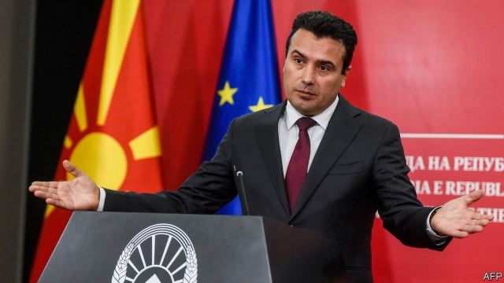
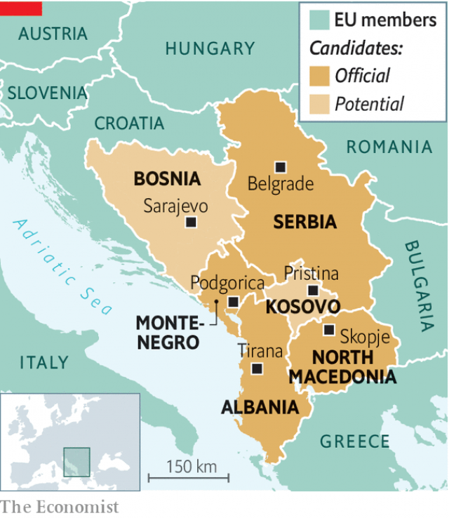

###### A kick in the teeth

# At French insistence, the Macedonians are left out in the cold 

 

> print-edition iconPrint edition | Europe | Oct 26th 2019 

NOT EVEN the bleariest-eyed of early-morning travellers can fail to notice the memorial at Sarajevo airport. It recalls eight French soldiers who died during the Bosnian war. When the war ended, in 1995, the American-designed peace deal was signed in Paris. Ever since then, European policy has been clear: to avoid the mistakes of the past, the western Balkan states must be anchored in the EU. But at a summit on October 18th, to the horror of Balkan leaders and most of his EU colleagues, Emmanuel Macron, France’s president, seemed to kick the legs out from under that policy. 

Mr Macron argued that the EU’s enlargement strategy was “bizarre”, and that the EU needed reform before enlargement. France blocked the opening of accession negotiations for North Macedonia; along with Denmark and the Netherlands, it did so for Albania, too. Overshadowed by Brexit, the veto was barely reported in France, but it sent shock-waves through the Balkans. Serbia and Montenegro are already negotiating membership, and Kosovo and Bosnia would like to start as well. Although Mr Macron says that EU enlargement is not dead, he is unclear about what should happen next. 

Mr Macron is surely right that the EU’s enlargement policy needs reform, but for now it ensures that the six aspirants plod along, slowly adopting EU-compliant legislation. It could easily be a decade before any of them is ready to join, and the process gives the EU leverage. An EU-mandated mission is overseeing the vetting of Albania’s judiciary for corruption, for instance. In May policemen from EU countries deployed to Albania to help stem the flow of migrants north from Greece. North Macedonia has done even more. For years its progress towards membership was blocked by a dispute over its name with Greece. This year it changed it. “We pushed them to do it and then we showed them the finger,” says one diplomat reflecting widespread anger among France’s partners. 

 

The consequences of the change in policy have already been nasty. North Macedonia’s government collapsed following the veto. An election could see the return of nationalists who opposed the deal with Greece over the new name; the new prime minister of Greece never liked it. 

Is Mr Macron a Balkan-blocker because he does not want to give ammunition to France’s anti-immigrant and anti-Muslim far right? Probably not, says Loïc Trégourès, a Balkan specialist at Lille’s Catholic University. France has no special political interest in the region, he says, but it has become collateral damage in Mr Macron’s disputes with Angela Merkel, the German chancellor, who has rebuffed his ideas of EU reform. “If Germany wants its sphere of influence,” Mr Trégourès says, “they must give something back.” 

As the EU retreats, others advance. North Macedonia, Serbia and Albania pledged on October 10th to work towards a free-movement zone. On October 25th Serbia is expected to sign a free-trade agreement with the Russia-dominated Eurasian Economic Union. Russia is giving arms to Serbia. China and Turkey are expanding their influence. Blocking the Balkans is “a grave historic mistake,” said Jean-Claude Juncker, the European Commission president. “If we want to be respected, we have to keep our promises.”■ 

