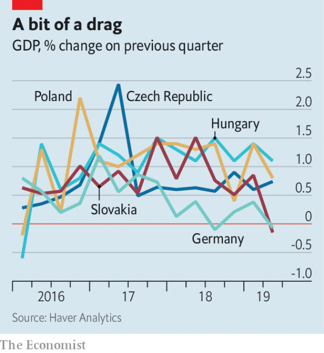

###### The Visegrad Four

# Can the good run of central Europe’s economies last? 

 

> print-edition iconPrint edition | Europe | Oct 26th 2019 

FIFTEEN YEARS after they joined the EU, the four “Visegrad” states of central Europe (the V4) can be prouder of their economic achievements than of their patchy record on political reform. The Czech Republic, Hungary, Poland and Slovakia have increased their levels of GDP per head dramatically, and are converging with their mighty neighbour Germany. The Czechs are the richest, with a GDP per head that is 73% of Germany’s, followed by Slovakia with 63% and Hungary and Poland with around 57% each—and the gap continues to close, as their growth outpaces that of the behemoth (see chart). 

Four main external forces have driven the remarkable successes of the four extremely open V4 economies. The first is their access to generous subsidies from the EU, which make up a sizeable chunk of their respective national incomes. Second is the munificent flow of remittances from millions of expat V4 citizens who now live and work in the EU, especially in Germany, Austria or Britain. A benevolent recent economic environment has also helped, especially the success of the German economy, by far their most important trading partner and the biggest or second-biggest investor in each country. And lastly, the four all started from a low base, enabling them to serve as cheap workshops for more developed economies. The danger is that all four of these factors are now petering out. 

A great boon of EU membership is the V4’s access to substantial “cohesion” funds, which are financing colossal upgrades of public infrastructure in the region. Hungary in particular has loaded up on EU cash, pocketing €3bn ($3.3bn) a year, some 2.5% of its GDP. The bonanza will not last. The V4 stand to lose up to 25% of their EU funds in the next seven-year budget starting in 2021 (see article). The union is peeved by the populist governments in the region, and funds will be redirected away from the comparatively booming central Europeans. Moreover, the EU is losing one of its biggest net contributors because of Brexit. 

 

The most popular destination of emigrants from Hungary, Poland and the Czech Republic has generally been Germany in recent years (for Slovaks, it is the Czech Republic). Eleven percent of Poles and 9% of Czech citizens live abroad. But remittances from the diaspora may now face decline. Germany’s economic golden age seems to be coming to an end amid uncertainty over global trade. In the second quarter of this year its economy contracted by 0.1%, and is unlikely to have fared much better in the third quarter. In August its central bank warned that the German economy could slip into recession (usually defined as two consecutive quarters of negative growth). Businesses are losing heart. The Munich-based Ifo institute revealed that business confidence fell during August to its lowest level since November 2012. 

Germany’s economic woes will hit the V4 countries directly too, and harder than other EU countries. Slovakia and Hungary are the most dependent on German trade, and investment in their factories. A single plant in the north-west Hungarian city of Gyor belonging to Audi, a German carmaker, accounts for 9% of Hungarian exports. Alarm bells started ringing when Handelsblatt, a German daily, reported recently that two other big carmakers, BMW and Daimler, are putting investments in Hungary on ice. BMW has since confirmed that it remains committed to building a new factory in Debrecen, in eastern Hungary, but Daimler has postponed plans to expand its compact-car plant in Kecskemet in the centre of the country. Exports of goods and services amount to 97% of Slovakia’s GDP, 86% of that of Hungary, 78% of the Czech Republic’s and 55% of Poland’s. A good chunk of all these goes to Germany. 

Finally, the catch-up effect may also be withering. Poor countries tend to grow faster than rich ones, largely because imitation is easier than invention. Yet once they reach a certain stage of economic development, they tend to get stuck—in the notorious “middle-income trap”. This may become the fate of some of the V4 economies. They sorely lack innovative companies; Hungary and Poland in particular spend only 1% of their GDP on research and development, much less than the EU average. Richard Grieveson at the Vienna Institute for International Economic Studies (WIIW) is pessimistic about all of the V4 economies’ ability to escape the middle-income trap. It is, admittedly, hard to do. According to the World Bank, among 101 middle-income economies in 1960 only 13 had become high-income ones by 2008. 

But perhaps the biggest catch-up-related headache for theV4 economies is labour shortages. These have a positive effect as they are driving up wages, which in turn raises consumption; but they may also lead foreign investors to outsource to other countries where labour remains cheap. In January the 13,000 workers at Audi’s Gyor plant received an 18% pay rise, thought to be the highest raise ever negotiated by Hungarian unions. Most countries in the region will reach a tipping-point at which the lack of workers will start to limit economic growth within the next five years, according to a recent study by the WIIW. It could happen within the next two years in Poland and the Czech Republic. Some industries, such as construction, might have already reached it. 

Visegrad policymakers have come up with several policies to address the labour shortage. One is to increase fertility rates with financial incentives, a policy pursued at great cost but with little effect in Poland and Hungary. Another is to make it easier for women to participate in the workforce, by offering them free or highly subsidised child care. Poland and Slovakia are trying that one, though with only limited success. Immigration would be the quickest way of easing the problem; but the nativist governments that run the V4 countries are wary of that. Indeed, Poland’s Ukrainian workers, who find it hard to get citizenship, are increasingly turning their eyes to Germany, which is more welcoming. For the V4, the next 15 years could be a lot tougher than the last 15. ■ 

