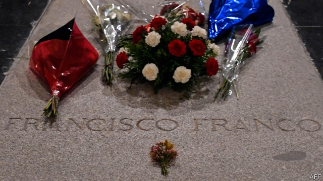

###### Digging up a dictator

# Franco’s exhumation is both historical duty and electoral stunt 

 

> print-edition iconPrint edition | Europe | Oct 24th 2019 

Editor’s note (24th October): This article was updated after Franco’s coffin was moved. 

AFTER DYING in his bed in 1975 General Francisco Franco, Spain’s dictator for 36 years, was buried in haste at the Valley of the Fallen, the grandiose monument on a mountainside outside Madrid that he built to celebrate his victory in the Spanish civil war. But his presence there, in one of only two named tombs amid 34,000 anonymous war dead, is now widely seen as an aberration. On October 24th, in an operation organised by Pedro Sánchez, the Socialist prime minister, and attended by 22 of the dictators’ descendants, Franco’s coffin was dug up. In scenes broadcast live on television it was then carried by the family, first to a hearse and then a helicopter, which took it for reburial at a quiet public cemetery at El Pardo, on the outskirts of the capital where his wife is buried. 

Mr Sánchez was carrying out a resolution of the Spanish parliament and a promise he made on becoming prime minister last year. It took more than a year to overcome legal objections from Franco’s family—who wanted to rebury him, prominently, in the crypt of Madrid’s cathedral—and the threatened disobedience of the Benedictine prior who administers the basilica and monastery at the Valley. The Vatican slapped down the prior; last month the Supreme Court ruled unanimously that the government could rebury Franco at El Pardo. 

“No enemy of democracy deserves a place of worship nor institutional respect,” Mr Sánchez said of the court ruling. “It’s a great victory for Spanish democracy”. More Spaniards agree with him than disagree. But the delay means the exhumation comes barely a fortnight before a general election, the fourth in as many years. The Socialists hope it will rally their faithful. Only Vox, a far-right party, actively opposes what it calls a “profanation” of Franco’s tomb. The conservative opposition, which descends from moderate former franquistas who embraced democracy, would rather discuss the future. 

The Socialists want to turn the Valley into “a museum of memory”. There is a risk in that of history once again being written by one side. Perhaps the best thing would be to deconsecrate the site and create a museum that explains what happened at the Valley itself. Franco’s dictatorship relied partly on forced labour to build it. Originally intended only to honour its own side, the dictatorship ended up filling its crypts, too, with dead from the vanquished Republic, extracted secretly from mass graves. Its architecture is forbidding, that of a militant Christianity. Its basilica is dug deep into the mountainside, and lined with statues of avenging archangels. It is topped by a cross half as high again as the Statue of Liberty. 

Modern Spain is not in thrall to Franco’s ghost. Most Spaniards have no memory of the dictator. Only an aging minority still regularly attend mass. But the lack of unanimity over the exhumation shows that the country has yet to agree on the past. Perhaps it never will. 

