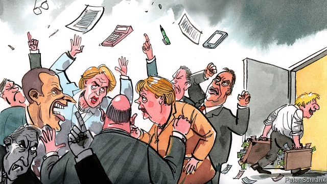

###### Charlemagne

# Neither dignified nor efficient 

 

> print-edition iconPrint edition | Europe | Oct 26th 2019 

WALTER BAGEHOT wrote that a constitution needed both “dignified” (ceremonial and reverential) and “efficient” (straightforward and rule-based) parts. The Victorian writer and editor of The Economist would have discerned little of either in the European Union’s seven-yearly “multi-annual financial framework” (MFF). That process is hardly dignified: nothing can be farther from the grand world of European symbols and high-minded post-nationalism than the unseemly squabble over resources between member states. Nor is it terribly efficient. Rather than asking first what the money should be spent on, the process begins with battles over the size of the budget and retrofits onto it policy priorities for the best part of the next decade. 

Yet the negotiation does have a sort of constitutional importance to the EU. The negotiations every seven years are a ritual, the sight of leaders trooping in and out of airless rooms in Brussels as integral to the union’s ceremonial calendar as the Queen’s Speech is to Britain or the State of the Union to America. It is where the emotional and the practical parts of the institution meet, where the line between national interest and identity mingles with the more bloodless, but not entirely ideals-free, realm of European co-operation. It shapes the club’s activities, acts as a clearing-house for political differences and is thus a map of them. As dreary as it can seem, it reveals something of the EU’s soul. 

What, then, does the latest round show? Negotiations for the next period, from 2021 to 2027, have been grinding on for 20 months. A European Council summit earlier this month saw national leaders dig in their heels and defer the matter to their next meeting in December, but the final deal may only emerge in the second half of next year. Several problems are holding up progress. 

The first is the overall size of the budget. The current one is set at 1.02% of the union’s GDP, OR just over one trillion euros ($1.11tr), including €165.8bn for this year. Germany and others in a frugal block of northern contributor states want its successor to go no higher than 1%. The European Commission, backed by recipient countries in the EU’s south and east, has proposed around 1.1% and the European Parliament, the most federalist of the institutions, wants 1.3%. A much smaller increase is likely. 

The second is who should pay what into it. The northerners are particularly hawkish as Britain’s exit leaves an annual gap of around €10bn to be plugged, probably primarily from their pockets. They are fighting to maintain the system of rebates returning some money to high net contributors who do not get as much back in things like agricultural and regional development funds; France, by contrast, argues that Britain’s departure and the need for a more ambitious EU mean the rebate system should be ditched. The commission has also floated a union-wide tax on plastics (others suggest one on financial transactions) by which the EU could raise part of its income directly. 

Then there is the battle over what the money should go on. The long-term trend of the MFF has seen spending on the Common Agricultural Policy of farm subsidies fall from over half of the total in the early 1990s to under a quarter today, spending on regional development rise with the accession of poorer southern and eastern states and then fall as they started to catch up with the rest, and spending on competitiveness (research and development, measures to knit together the single market) and foreign and security policy increase as those priorities have arisen. This “modernisation” of the budget, as it is known in Brussels-speak, will continue into the next period, but member states disagree on the extent, with easterners and southerners in particular defending old priorities like agriculture and regional aid and northerners pushing to redirect more of that spending into science and environmental measures. The east-west cleavage is also heightened by the suggestion that some payments be made conditional on member states’ adherence to rule-of-law standards; a threat especially to Poland and Hungary, net recipients whose turn towards authoritarianism in recent years has angered their European colleagues. 

All of which reveals an EU between two worlds. On the one side, yesterday’s union, a smaller and more homogeneous club whose task was the technocratic knitting-together of the continent through rules and subsidies after the traumas of the mid and late 20th century. On the other side, today’s and tomorrow’s union, a larger, more diverse and more political bloc facing greater pressures from the outside requiring common action, and that therefore is at once more fractious and more ambitious. The achingly slow talks on the next MFF might be considered the painful transition between the old world and the new one. 

Something will have to change. The EU’s budgetary rituals need more dignity. They need to do more to command the loyalty of ordinary citizens above and beyond the narrow-minded calculation of national net contributions and receipts. The language and processes of the budget should become less technocratic and concentrate more on the shared interests and preferences of the voters whose governments pay the bill. Consultative assemblies of European citizens might be involved in the decision-making process, for example. 

And the MFF needs to be more efficient. A multi-year diplomatic negotiation covering seven years, a period over which no-one can say with precision what is needed, and in which national pride takes precedence over actual needs, is no way for a modern institution to work. New mechanisms for adjusting and updating the budget more frequently are needed; perhaps through some forum of national ministers and members of the European Parliament, or through direct EU taxes giving the union greater flexibility. The EU is not a state and does not need the paraphernalia of one. But a dose of Bagehot’s timeless formula would do it good. ■ 

