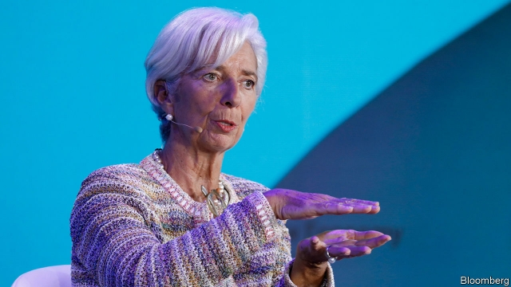

###### A spiky relationship

# Germans have mixed feelings about Christine Lagarde 

 

> print-edition iconPrint edition | Finance and economics | Oct 26th 2019 

AT THE END of September Sabine Lautenschläger, the most senior German official at the European Central Bank (ECB), unexpectedly resigned from the bank’s executive board, years before her term was due to end. She gave no reason for her departure, but is known to have opposed the bank’s decision, announced last month, to resume its bond-buying programme until inflation neared its target of close to, but below, 2%. If that opposition was why she stepped down, it would make her the third German official to quit over bond purchases. In 2011 both Axel Weber, then head of the Bundesbank, and Jürgen Stark, a member of the ECB’s executive board, left over an earlier asset-purchase scheme. 

The controversy over the ECB’s latest round of stimulus, which also cut interest rates to -0.5%, has heated up. Current and former central bankers in both Germany and other northern countries have attacked the decision to resume bond-buying. Bild, Germany’s biggest-selling tabloid, has accused Mario Draghi, the ECB’s boss, of sucking people’s savings dry. Mr Draghi’s term ends on October 31st. Christine Lagarde, the former boss of the IMF, replaces him. 

Perhaps signalling a desire to cool things down, Germany’s government announced on October 23rd that Isabel Schnabel, a member of its council of economic advisers, would replace Ms Lautenschläger. Ms Schnabel, who is also a professor at the University of Bonn, appears more pragmatic than those who have thrown in the towel. She has repeatedly warned politicians and bankers of the dangers of telling the public that the ECB is stealing their savings. In an interview with Handelsblatt, a German daily, she pointed to Brexit as evidence of the risks of making the European Union (EU) a scapegoat. 

Ms Lagarde will probably be glad to have a more conciliatory German at the ECB. All together the central banks of countries accounting for more than half of the euro zone’s economic output opposed the bank’s stimulus package. (Few economists, though, were expecting any change to policy at its meeting on October 24th, after The Economist went to press). Banks hate negative interest rates because they feel they cannot pass them on to customers, meaning their net interest margins are squeezed. Christian Sewing, the boss of Deutsche Bank, Germany’s biggest lender, says that Strafzinsen (punitive interest rates) will eventually destroy the financial system. Ms Lagarde faces the unenviable task of winning these critics over. 

Some German bank-watchers would probably have preferred that Jens Weidmann, the hawkish boss of the Bundesbank, was picked to succeed Mr Draghi. A few worry that, as a former French finance minister, Ms Lagarde might further politicise matters by pursuing policies that are redistributive across borders, rather than sticking to the ECB’s price-stability mandate. But some hawks hold out hope that Ms Lagarde might change the bank’s policy. Some see her promise to review the bank’s strategy as an opening to rethink its commitment to stimulus. And as she is not a trained economist, they reckon she might prove more pliable than Mr Draghi. 

In her 78-page-strong responses to questions from the EU parliament, she wrote that she wanted to restore trust in the ECB by communicating more with the public, and by listening to the young and civil-society organisations. A headline in Bild asked whether life for German savers might improve after she takes the helm. 

Ms Lagarde might do well, though, to remember Mr Draghi’s experience with the German press. When the Italian took charge eight years ago, Bild pronounced him a “proper Prussian” and gave him a spiked Prussian helmet. Only a year later, after Mr Draghi had allayed fears of a euro-zone breakup by saying he would do “whatever it takes” to preserve the single currency, Bild asked for its helmet back, commanding: “No more German money for bankrupt states, Herr Draghi.” He has had a tricky relationship with the euro zone’s biggest member ever since. ■ 

