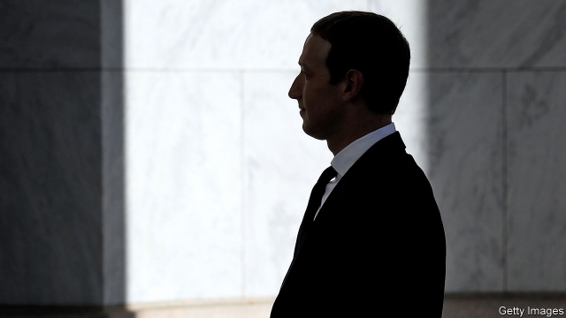

###### The Zuck Buck ruck

# Is Libra doomed? 

 

> print-edition iconPrint edition | Finance and economics | Oct 24th 2019 

ON JUNE 18TH Facebook announced Libra, a new global payments system and currency, to be launched in 2020. Dubbed the “Zuck Buck” by Brad Sherman, an American congressman, the plan was to employ a mix of entrepreneurial daring and the technology underlying cryptocurrencies to shake up the world’s financial systems. Money would move at the speed of a smartphone-swipe, even across borders. Libra would lubricate life in the rich world and revolutionise it in poor countries, where basic financial services are dear and often scarce. After all, as the firm points out, 1.7bn people have no access to a bank account. Besides further expanding Facebook’s empire, Libra would bring them into the financial fold. 

In the subsequent four months, Libra has had a bruising time. Many of its partner firms have got cold feet. Politicians and regulators around the world have made disapproving noises. On October 23rd Mark Zuckerberg, Facebook’s boss, spent a lonely few hours in Washington, DC, fielding mostly hostile questions from American politicians on the House of Representatives Financial Services Committee. 

One problem, as Mr Zuckerberg admitted, is Facebook itself. Maxine Waters, the Californian Democrat who chairs the committee, began proceedings with a litany of its misdeeds, pointing out that it is subject to antitrust investigations in 47 states (see article), that Russia has used it to meddle in American elections, and that it has been fined $5bn for deceiving consumers. Nydia Velázquez, a Democrat from New York, accused Mr Zuckerberg of lying to European regulators over the firm’s merging of user data from WhatsApp, a messaging service bought by Facebook in 2014, with those from the rest of the company. Why, the congresswoman wondered, should a firm like that be trusted with something as important as a currency? 

Mr Zuckerberg pointed out that Libra would be administered not by Facebook, but by the Libra Association, an independent body that includes other companies and is based in Switzerland. But the association is already not what it was. Of the 28 original members, a quarter have left. PayPal, an online-payments firm, departed on October 4th. A week later eBay, Mastercard, Mercado Pago, Stripe and Visa—another group of payment firms—jumped ship, as did Booking Holdings, a travel company. PayU, a Dutch firm, is the only payments firm still in the association. Other remainers include two ride-hailing firms (Uber and Lyft), a pair of telecoms companies (Iliad and Vodafone), a gaggle of venture capitalists and a handful of charities. The association’s head of product, Simon Morris, left in August. 

Other questions concerned users’ privacy and Libra’s potential attractiveness to money-launderers. Mr Zuckerberg promised that Libra would not launch until it had permission from America’s alphabet soup of financial regulators. But for a currency with global ambitions, placating the Americans will not suffice. France, Germany and Italy have already said they may block Libra; ministers in India, which has more than half a billion internet users, have been unenthusiastic too. Facebook has said that, unlike most cryptocurrencies, Libra will be backed by a basket of assets, including currencies and government bonds. A report by the G7, a rich-country club, nevertheless said that Libra, if widely adopted, could pose a risk to the global financial system and should not go ahead until it could be proved safe. That Libra has been described as a cryptocurrency (exactly how it would work remains unclear) will not have helped: regulators are well aware of cryptocurrencies’ reputation for scams and shady dealing. 

Still, positive thinking is the order of the day, at least in public. Mr Zuckerberg talked at length about the value of innovation, and Libra’s potential to spread freedom and democracy around the world. After the defections from the Libra Association earlier in the month David Marcus, the Facebook employee leading the initiative, tweeted that “in a way, it’s liberating”. Perhaps. But Facebook may hope there is not too much more liberation to come. ■ 

