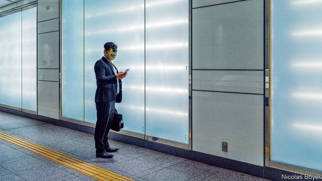

###### Capital control

# Japan’s new investment rules risk scaring off foreign investors 

 

> print-edition iconPrint edition | Finance and economics | Oct 26th 2019 

“BUY MY ABENOMICS!”, Shinzo Abe, Japan’s prime minister, pleaded to the New York Stock Exchange in 2013. As he lowered the drawbridge to foreign investors, that pitch seemed to work. Today overseas owners hold 30% of Japan’s TOPIX index of stocks and account for about 70% of the daily turnover on the Tokyo Stock Exchange (TSE). But new rules threaten to reverse these trends.  

A proposed change to the Foreign Exchange and Foreign Trade Act, unveiled on October 8th, will lower the minimum stake foreigners can buy in many listed Japanese companies without prior government approval, from 10% to 1%. Other changes include requiring foreign directors to seek official permission before they sit on the boards of Japanese firms.  

The finance ministry says it wants to protect sensitive sectors such as energy and weapons manufacturing. But analysts warned that the rules could choke off investment. Akira Kiyota, the head of the TSE told the Financial Times they were “absolutely idiotic”. Under fire, the finance ministry clarified on October 18th that foreign “portfolio investors” (such as banks, insurance firms and asset managers) would not need to seek prior approval, as long as they could prove they had no intention “to influence management”. The tweaked legislation was approved by the cabinet and is expected to be passed in parliament by early December. 

But concerns linger. One is the law’s broad scope. In addition to nuclear power and aeronautics, its purview includes agriculture, transport, shipping, software and internet services. Nor is it clear what counts as infringement. Would a letter from a foreign investor to the board of a Japanese firm, say, be considered an attempt to influence management? The upshot is that investing becomes more convoluted and time-consuming. One analysis concludes that the new rules mean an eight-fold increase in applications to the government. 

Officials say they are just playing catch-up. The European Union tightened its screening of inward investment in April. America has expanded its regime, and even prodded Japan to reduce Chinese access to sensitive technology. But a foreign banker in Tokyo says the real target is activist investors. “The wording in Japanese is very specific about targeting investors who want a say on boards.” 

Activists have long fought for Japanese companies to sell non-core assets and stop hoarding cash. In recent years they have clashed with some of the nation’s corporate giants. They have been leaning on Nissan to sack its managers and draw a line under the era of Carlos Ghosn, the carmaker’s former boss. Earlier in the year a New York investment fund tried to force Kyushu Railway, a regional transport firm, to boost stingy returns to shareholders. 

Ironically, Mr Abe can take some credit for this flurry of activism. By badgering bosses to change crusty boardroom practices, he has emboldened investors. The number of big listed firms with two or more external directors, for instance, has tripled since a corporate-governance code was introduced in 2015. 

But many foreign investors already seem to be questioning the sincerity of the government’s reforms. Last year they dumped ¥5trn ($48bn) of Japanese stocks. Overseas investors once bought Abenomics. Now they want to sell. ■ 

