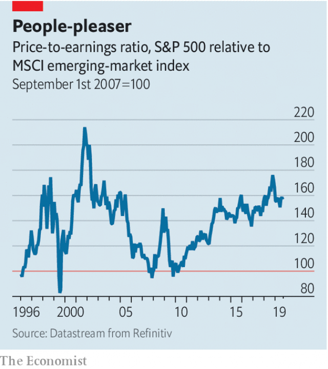

###### Buttonwood

# The deep appeal of emerging markets is their lack of surface appeal 

 

> print-edition iconPrint edition | Finance and economics | Oct 26th 2019 

BILL HICKS, a much-mourned comedian, would pause in the middle of his act as if a thought had just occurred to him. He would ask that anyone in the audience who worked in advertising or marketing kill themselves. This was the only path to redemption now left open. No one took up his invitation. I know what the marketing people are thinking, he would then say. The anti-marketing dollar, that’s a good market. Look at our research! Bill is smart to tap into it. 

Such next-level thinking comes to mind whenever the case for emerging markets is considered. For professional investors, diverting capital from America’s stockmarket to other less-blessed places seems like an invitation to career suicide. The dollar’s continued strength is kryptonite to emerging markets. They feel the damage from the trade war most keenly. Sure, emerging markets look cheap. But there is no law saying they cannot become even cheaper. 

Cheapness aside, though, there is another, less appreciated, side to emerging markets. As capital rushes into an ever narrower set of favoured rich-country assets, there is growing anxiety that it might all suddenly unwind. At least emerging markets are an uncrowded trade. This is a paradox that tricksy marketing types should appreciate: the unloved asset class, that’s a good market. You might be wise to tap into it. 

But why are emerging markets out of favour in the first place? The perennial fear is they are crisis-prone. Look at Argentina. It has moved with breathtaking speed from default to emerging-market darling and then—unhindered by a $57bn IMF support package—back to the brink of default. But fear of crises is not the only reason for caution. Indices of emerging-market stocks, such as MSCI’s benchmark, lean heavily towards Factory Asia, and thus to China’s supply chain. This puts investors on the front line of the trade war. Even away from the trenches, there is plenty to fret about. India has failed to fix its broken banks. The fractious politics of the ANC in South Africa get in the way of much-needed reforms. Russia lacks a convincing economic-growth story. The list goes on. 

Emerging-market crises follow a pattern. Foreign investors head for the exit, and there are not enough domestic buyers to replace them. Some factors can make this kind of liquidity-driven crisis more likely: a bloated current-account deficit; an overvalued currency; lots of short-term debt; or runaway inflation. But these days, such vulnerabilities have become rare. 

The bigger emerging markets tend to have freely floating currencies. This militates against the build-up of external debts and internal pressures. Their independent central banks aim for low inflation. Most of the 25 emerging markets listed on the indicators page of The Economist have inflation below 4%. It is in the double digits in only two—Argentina and Pakistan. Low and stable inflation has allowed the local market for government bonds to deepen. Debt burdens financed at short maturities make countries more crisis-prone. Long-term debt makes them more stable. According to the IMF, the average emerging market has public debt of 54% of GDP, around half the rich-country norm. The average maturity of debt is similar, at around seven years. 

All this has made emerging markets much less brittle. Yet assets trade at a discount. The price-to-earnings ratio for the MSCI index of emerging-market stocks is below its average since the mid-1990s. It looks even better value when compared to that in the rich world. The S&P 500 share-price index has only rarely been dearer relative to emerging-market stocks than it is now (see chart). 

 

You should expect out-of-favour markets to be cheap. But they also have a less appreciated appeal. They tend to be uncrowded, and so less at risk of a sudden surfeit of sellers over buyers. If liquidity risk has fallen in emerging markets, it has probably risen in developed ones. The worry is that investors are chasing the same assets: the safest government bonds; investment-grade corporate bonds; technology stocks; and dollar assets in general. The more investors cram into these markets, the greater the risk of a rush to the exit. 

An allocation to unloved assets insures against such herding. It is hard to drum up much enthusiasm for the leadership or growth trajectories of China, India, Russia and the rest. There are few if any captivating stories of reform and renewal. But the appeal of emerging markets is in their very lack of superficial appeal. Some bright marketing spark should put that on a billboard. 

