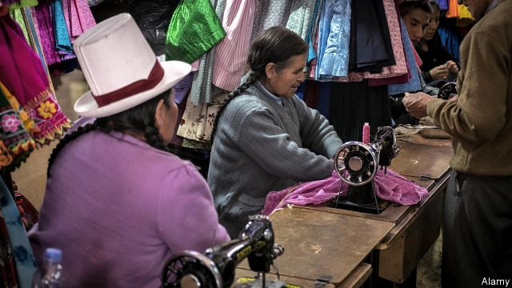
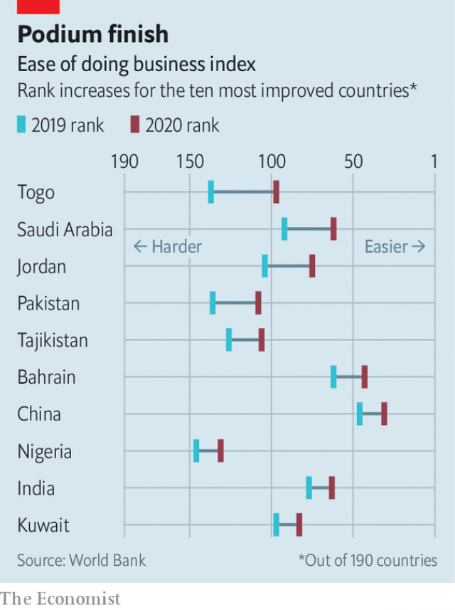

###### First across the tape

# The remarkable influence of the World Bank’s business rankings 

 

> print-edition iconPrint edition | Finance and economics | Oct 26th 2019 

A  CLOTHING WORKSHOP, with just two sewing machines, established long ago on the outskirts of Lima, Peru’s capital city, may be one of the world’s most influential companies, even though it never started operating—and was never intended to do so. The business was conceived as an experiment by Hernando de Soto, a Peruvian economist, who commissioned a team to go through the motions of setting up the firm. Their aim was to find out how long it would take to comply with all the laws and regulations required to start a business. The answer was 289 painstaking days. 

The answer now is a mere 26 days, according to the World Bank’s latest report on the ease of doing business around the world. Inspired in part by de Soto’s example, the bank each year asks thousands of lawyers, accountants and other experts how easy it would be for a company to obtain an electricity connection, transfer the title of a warehouse, enforce a debt contract, pay its taxes and so on. Based on the answers, the bank then ranks countries, from New Zealand at the top to Somalia at the bottom. 

The report has its critics. Since it ignores infrastructure, price stability, workforce skills and the reliability of suppliers, among other things, it is not really a summary measure of the ease of doing business in a country. It is instead a snapshot of the cost of complying with formal regulations for companies that are not small enough to dodge the law or big enough to bend it. In one edition, the report described itself as a “cholesterol test”. But it is sometimes interpreted as a full medical. 

 

It has nonetheless become hugely influential. Costing less than 0.25% of the bank’s operating budget, it has caught the attention of some of the world’s most powerful people. Narendra Modi, the prime minister of India, has resolved to lift his country into the ranks of the top 50 by 2020. It climbed to 63rd place this year, from 142nd when he took office. The country’s success may have helped galvanise a similar effort in China (which improved this year to 31st place) and in Pakistan, which was also heralded this year as one of the ten most reformed economies. 

But the biggest improvement in score was awarded to Saudi Arabia. Once ranked tenth, it had slipped to 94th place by 2016. This year it bounced back to 62nd. It is now the cheapest (and third-easiest) place to transfer a property title to a buyer. Firms can get an electricity connection in 35 days, little more than half the time it took in 2018. The government has also set up an online one-stop shop, where an entrepreneur can jump through many of the hoops required to start a business, instead of traipsing around multiple ministries and offices, for commerce, labour, social insurance, tax and Zakat (a religious tithe). 

The kingdom’s reform efforts were overseen by a dedicated committee, bringing up to 50 government bodies together, that met every Wednesday at 1pm. The committee also included business folk who explained how regulations feel to the regulated. The structure left the bureaucracy with nowhere to hide. “You have to come and either say you’ve done it; or if you didn’t do it what’s stopped you,” says Dr Eiman Al-Mutairi, head of the country’s National Competitiveness Centre. Any roadblock that lasted more than a week was referred up to Mohammad bin Salman, the kingdom’s crown prince. 

Not all reforms have won favour with business. Companies no longer need a government stamp on their registration certificates, for example. But many firms want one anyway, because it looks good on their papers. It’s not easy to cut red tape when firms treat it like a ribbon and bow. ■ 

