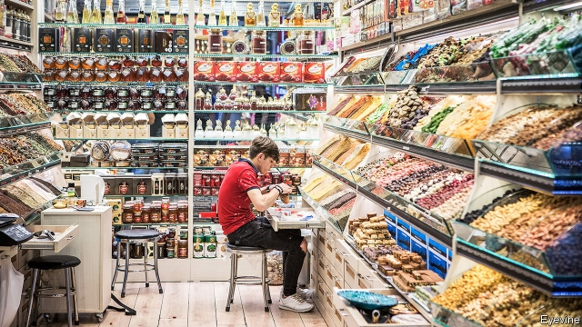

###### Time’s up

# Trade finance is nearing a much-needed shakeup 

 

> print-edition iconPrint edition | Finance and economics | Oct 26th 2019 

EVERY DAY of the week thousands of visitors flow through Istanbul’s fragrant Spice Bazaar. They are a varied collection, local shoppers mingling with camera-wielding tourists. So are the products on offer. While many delicacies on display are Turkish-grown, one trader gets his berries from Iran, his walnuts from Chile and almonds from California. Another, asked if she went all the way to China to buy her jasmine tea, says wryly: “Of course not. Importers ship it here.” 

Most commodities traded round the world still travel on merchant vessels. From Istanbul’s hills you can see them placidly converging on Ambarli, Turkey’s largest port. Less visible is the liquidity that makes those journeys possible. Four-fifths of global trade transactions, worth $15trn a year, rely on specialised loans or guarantees. This hidden world of trade finance is huge but poorly understood. It has long needed a shake-up, and a nascent revolution promises to unlock trillions in fresh capital. But trade wars are putting that Big Bang in peril. 

Trade finance is one of the oldest jobs in banking. Millennia ago merchants in present-day Turkey exchanged cloth or copper for engraved tablets promising a later payment in silver. Trade credit today may be more sophisticated, but it still tackles the same problem: that exporters prefer being paid at the time of sale (so they can finance more production), whereas importers would rather settle up after receiving the goods (so they can first raise the cash by reselling them). Each side rarely trusts the other to keep its end of the bargain. 

Trade finance places banks in the middle. Typically, the importer’s bank, once presented with a shipping bill or other proof, issues a “letter of credit” to the exporter guaranteeing payment. This allows the exporter to obtain credit from a bank, and then to repay the lender when the ultimate customer pays up. The loans are short-term, usually less than four months. And they are safe. Annual default rates on letters of credit averaged 0.08% of transactions in 2008-17, compared with 1.6% for corporate lending. When loans do sour, recovery is quick. 

The work is as unspeakably tedious—thousands of small, similar deals—as it is steady. Annual returns on trade-finance instruments have an average volatility of less than 0.30%, compared with 4.44% for investment-grade bonds. Four-fifths of global transactions are processed by just ten banks, mostly in London, New York or Singapore. Borrowers rarely switch providers. Graduates would rather work on initial public offerings or multi-billion mergers. Business cards change, but not the cast. “It’s very incestuous,” says a senior banker. 

All this explains why an industry that is global by definition is parochial and antiquated. From banks and insurers to warehouses and customs, processing trade credit requires the exchange of 36 original documents and 240 copies, on average; each of the 27 parties involved spends hours if not days fact-finding and form-filling. Less than a quarter of banks use electronic documentation. It is not, as Andrew Colgan of Mizuho, a bank, notes, “a screen-based market”. Standards and terminologies vary across the industry, and even within banks. 

Since the financial crisis, regulators have made banks set aside more capital against risky or exotic lending. As a result trade finance is punished, because it often serves small firms in poor countries. Watchdogs also want lenders to stop dodgy flows of cash, and the cost of scrutinising customers makes small trade-finance deals unprofitable. So most lenders compete for big clients, says Joon Kim of BNY Mellon, a bank. Low interest rates have also crushed margins, which have shrunk by a third since 2014. 

In response, banks have retreated. The top ten earned 19% of their transaction-banking revenue from trade finance last year, down from 27% in 2010, according to Coalition, a data provider. The Asian Development Bank (ADB) reckons $1.5trn of financing proposals were rejected in 2018. “Country risk” was cited as a reason by 52% of banks. Nearly half of applications by small firms got nowhere. As supply chains move from China to poorer countries, rejections could rise to $2.5trn by 2025, says the World Economic Forum. That hurts even big multinationals: many rely on the niche suppliers shunned by banks. 

Luckily transformation is coming—on three fronts. First, thanks to the internet and easier international travel, buyers and suppliers know more about each other, which boosts trust. Many blue-chip importers are also keen to lengthen payment terms beyond what exporters can bear. This has fed the rise of “supply-chain finance” (SCF). It usually involves cutting out several steps in the chain, with exporters filing their invoices directly with the importer’s bank, which pays them promptly minus a fee. Suppliers need not waste time and money amassing documents. They benefit from their patrons’ stronger credit rating (as it is the buyer who eventually pays the bank). Last year banks earned $21bn from SCF, a 12% rise over 2017. It now represents 18% of trade-finance deals. 

Second, banks are starting to sell tranches of the loans they originate to third parties, while also acquiring slices of debt from others. That helps to diversify portfolios and increase lending capacity. Surath Sengupta of HSBC, a bank, says it will sell over $30bn-worth of trade assets in 2019, up from $2bn three years ago. 

Banks still account for over 95% of buyers in this secondary market. But institutional investors are starting to be lured in—thanks to technology, the revolution’s third prong. With its many transactions, trade finance is an ideal training ground for machine learning. Platforms like Tradeteq, a startup, allow banks to repackage short-dated invoices into rolling debt products. Algorithms crunch data to predict credit risks, so investors know what they buy. 

More transparency and liquidity could lead data providers like Bloomberg to recognise trade finance as an asset class, bringing it onto the radar of big money managers. Fasanara Capital, a hedge fund with €750m ($835m) of assets under management, has already invested in over 16,000 trade deals. Stenn International, another firm, aims to quadruple its trade-finance assets to $2bn within 18 months. 

Yet danger looms. Impeded by protectionism and an economic slowdown, the IMF predicts global trade will grow by just 1.1% in 2019, down from 3.6% in 2018. So far that has put only a minor dent in financiers’ revenues, in part because supply chains are being reshuffled, bringing global banks new business. But smaller lenders are more exposed. And competition for a shrinking volume of deals could push all lenders to lower interest rates. 

That pool may shrink further as the credit standing of borrowers worsens. This year corporate defaults are expected to rise. Meanwhile trade-credit insurance claims are picking up, says Alexis Garatti of Euler Hermes, a firm that insures payments to exporters. This will probably mean rising premiums and more lenders fleeing to the safest borrowers, hurting margins further. “We should expect a mild version of a credit crunch,” says Francesco Filia of Fasanara. 

The trade war between America and China threatens to erase other gains. Rising uncertainty in 2019, for instance, has led both traders and lenders to demand more paperwork. That feeds a resurgence in letters of credit, at the expense of supply-chain finance. The shift could accelerate as the trade war leads importers to source their wares from riskier markets, says Sukand Ramachandran of BCG, a consultancy. 

Technological progress, at least, cannot be undone. But it can harden emerging divides. The birth of a single global standard—the 20ft container—revolutionised shipping. But partly because of tariffs, partly because fleeting consumer tastes require shorter supply chains, commerce is splintering into regional blocs. If digital standards also develop in silos, rather than as part of a global effort, that may prove impossible to reverse. Trade finance may yet see its container moment float away. ■ 

