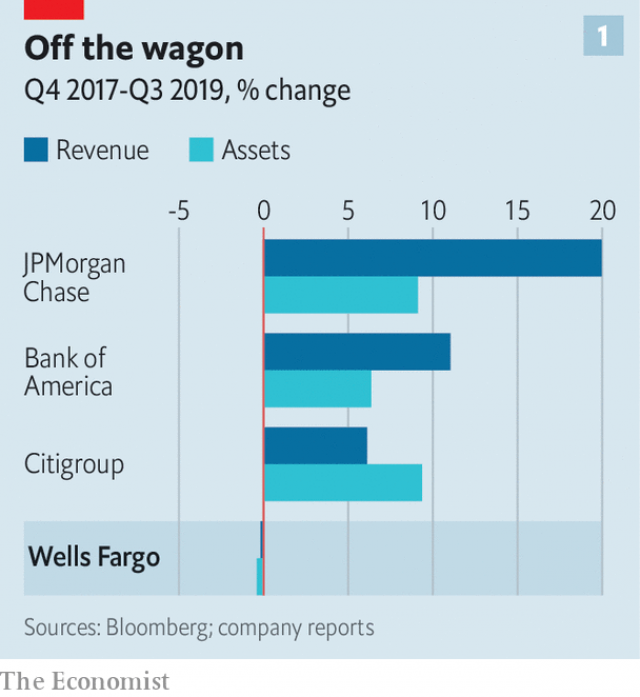
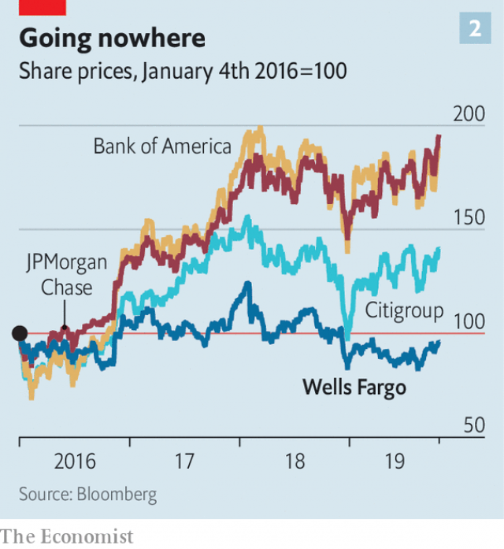

###### Far to go

# What kind of bank will Wells Fargo be? 

 

> print-edition iconPrint edition | Finance and economics | Oct 26th 2019 

WELLS FARGO has reinvented itself before. In a vault beneath the bank’s headquarters in San Francisco is an archive of papers and objects from the 1860s, when the company’s stagecoaches criss-crossed America delivering packages. Advertising posters tout the security of their wagons, thanks to the sharp-shooting skills of the marksmen that accompanied them. As first the railroads, then the telegram and later a government-run delivery service threatened the survival of the firm its bosses adapted, using customers’ trust in their brand to expand their banking business. 

Charlie Scharf, who took over as the bank’s chief executive on October 21st, must transform Wells once again. He comes from BNY Mellon, a smaller bank based in New York. It is rare for a giant lender to pick an outsider to run it. The bosses of America’s other largest banks—JPMorgan Chase, Bank of America, Citigroup, Morgan Stanley and Goldman Sachs—are seasoned insiders. 

But these are unusual times for Wells. The bank has spent three years trying to cleanse itself of scandal. In 2016 it was revealed that millions of spoof accounts had been opened by more than 5,000 employees. Further infractions involving home and auto loans have since come to light. Regulators have slapped penalties on the bank, the most onerous of which was capping its assets at $1.95trn, their level in 2017. Perry Pelos, Wells’s head of commercial banking, says the cap has not crimped growth so far because the bank has scaled back unprofitable lines of business. But, he admits, it will eventually begin to bite. 

Mr Scharf has much to do. Investors say working with regulators to lift the consent order is their priority. But the harder task is working out what comes after that. 

In 2016 America’s largest banks could mostly be split into two groups. The full-service banks—Bank of America (BoA), JPMorgan and Citigroup—did everything, from underwriting initial public offerings to lending to corporate and retail clients. The specialists, Goldman Sachs and Morgan Stanley, offered investment banking and wealth- or asset-management services. Wells, with its giant retail bank and limited exposure to risky investment banking, was the odd one out. That helped it sail through the financial crisis and become the world’s most valuable bank. 

 

But Wells has been firefighting since. Meanwhile JPMorgan, its biggest rival, has bounded ahead. Its balance-sheet has grown by nearly 10% since the end of 2017 (see chart 1), while Wells has gone nowhere. As big banks are barred by regulators from acquiring smaller ones, growth has been organic. JPMorgan expanded its branch network, gaining market share in places that Wells has traditionally dominated, such as Denver in Colorado. It has become a “tech giant”, says Betsy Graseck, a bank analyst at Morgan Stanley; last year it spent $11bn on technology. Investors approve. Its share price has doubled since 2016, while that of Wells has floundered (see chart 2). 

 

BoA’s assets, deposits and market capitalisation have also leapfrogged those of Wells. It too is scaling up, but by expanding into areas of previous weakness, such as by lending to mid-size companies. It has also cut its cost-to-income ratio from a decent 51% to just 45% over the past year. 

Specialist investment banks are also treading onto Wells’s turf. In 2016 Goldman Sachs launched Marcus, a consumer arm that has gathered $46bn-worth of deposits. The bank has partnered with Apple to launch a credit card. It is also drumming up commercial custom. “Goldman is used to doing business with the C-suite,” says Ms Graseck, “now they also want to do business with the treasurer.” Morgan Stanley, meanwhile, has doubled down on wealth management. In February the bank paid $900m for Solium, a firm that manages share-vesting programmes at technology companies. These customers are less wealthy than its usual well-heeled clientele, indicating that it too is expanding its customer base. 

All this means a more fluid competitive landscape. Mr Scharf will soon need to decide what kind of bank Wells should be. His rivals’ strategies show that he has several options. Wells could try to go global, like Citi. It could shoot for a wealthier clientele, like Morgan Stanley, or bulk up in investment banking, like JPMorgan. But the most obvious approach for Mr Scharf is to double down and aspire to make Wells a leading tech-focused consumer bank. 

He has form: at both the firms he has led before, BNY Mellon and Visa, a payments giant, he invested heavily in technology and cut costs. Shortly after his appointment was announced, an analyst asked Mr Scharf whether compliance, efficiency or digitisation would be the priority. He said that all were, and that solving them together was a “virtuous circle”. Wells is already dominant in many parts of the country, especially the west coast. And while other banks are bolstering their technology, it has led the pack. It pushed for the creation of Zelle, a payments system that competes with Venmo, a popular platform. Wells’s banking app is one of the best rated by users, with only JPMorgan and Capital One doing better. 

Other new ideas are bubbling. Wells wants to “tokenise” digital credit-cards so that there is a different number for each transaction, making them more secure. In a “digital lab” former tech workers research other futuristic prototypes. Shari Van Cleave, who runs the lab, says technology can help give customers more control. 

The catch is that for Wells to become America’s leading tech-savvy bank for consumers would require it to have a high degree of trust from customers and regulators. Instead a deficit of both is Mr Scharf’s toxic inheritance. Wells’s bosses have changed its direction before. Mr Scharf must decide where the wagon goes next. ■ 

