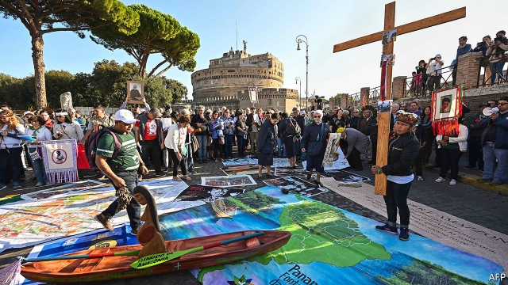
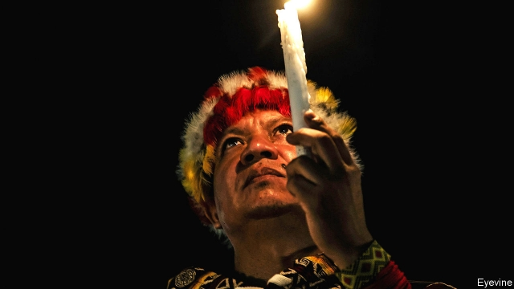

###### The beautiful south

# Power in the Catholic church is shifting south and exposing divisions 

 

> print-edition iconPrint edition | International | Oct 26th 2019 

AS THE SUN sets over Nazareth, a village on the banks of the Amazon river in the Colombian rainforest, a Jesuit priest peers out at a small congregation, made up of members of the indigenous Tikuna people. They are sitting on rickety benches around the edges of a cement church. “Why is everyone so far away?” asks Father Valério Paulo Sartor, stepping down from the altar to say mass from the aisle. “If you won’t come to me, I’ll come to you.” 

Some 6,000 miles away in Rome, bishops, indigenous leaders and NGO representatives from the Amazon basin, together with Vatican prelates, are discussing how the Catholic church can do just that. In a three-week synod that ends on October 27th, they hope to find new ways for the church to work with local communities to tackle the crises facing the region—and Catholicism—in a part of the world where the church is overstretched, understaffed, yet still remarkably influential. 

The synod represents the biggest step yet towards recognising something many Catholics in the West, especially church leaders, have been reluctant to acknowledge: just as economic and diplomatic power in the secular world is slipping away from the North Atlantic region, a similar process is taking place in Catholicism. In the secular world, the shift is to Asia. Within the Catholic church it is towards not only Asia, but Africa and Latin America, too. That is forcing the church to consider how far it is willing to adapt to the practices and beliefs of cultures with their own spiritual traditions. The synod has added to fears of a new schism within the church. 

Catholicism’s three biggest national churches are those of Brazil, Mexico and the Philippines. It has become a religion largely of the poor world, but with a leadership that is still predominantly rooted in the rich one. Around 40% of baptised Catholics are from North America, Europe, Australasia and Japan, yet those regions provide the church with 57% of its cardinals. Italy, with 4% of the world’s Catholic population, is the birthplace of almost one in five of the “princes of the church”. 

Pope Francis, who is the first Latin American pontiff, has tried to rebalance things. He joked on the night of his election in 2013 that his fellow cardinals had gone “almost to the ends of the Earth” to find him. He has continued their quest. More than half the cardinals he has created come from the developing world. His long-awaited reform of the administration of the Catholic church may take the process further by reducing the scope of the Vatican and transferring some of its departments—and power—to other parts of the world. 

That shift has been exacerbated by the growing threat posed by climate change. The pope has long argued that care for the environment is inseparable from the fight against global inequality. He called the synod, the first to be dedicated to a single region, partly because of the Amazon’s crucial role as a buffer against climate change. Its basin contains 40% of Earth’s rainforests and serves as a carbon sink, mitigating warming. But rising deforestation, on the pretext of development, threatens the sustainability of the ecosystem. The insouciance of regional governments, especially Brazil’s, puts them on a collision course with the church. 

Leaders from half a dozen ethnic groups gathered recently in Atalaia do Norte, a town outside an indigenous territory the size of Austria, to discuss a rise in invasions by illegal miners and loggers emboldened by Brazil’s far-right president, Jair Bolsonaro. His government has shrugged off deforestation, vowed to legalise mining on indigenous lands, and hollowed out the environment ministry and the indigenous agency, FUNAI. The murder in September of a contractor from FUNAI who worked in that territory, Vale do Javari—and the subsequent exodus of other workers after they were threatened—left the tribes feeling even more vulnerable. 

Despite the church’s chequered history in the region (it is credited with educating millions of poor children but blamed for its complicity with colonialism and the economic exploitation that followed), many indigenous people see the institution as their most promising ally. “In the past, the church made us lose our culture, but there’s a new spirit in the head of the pope,” says Absalon, a middle-aged curaca (chief) from a Uitoto village near Nazareth. 

The Indigenist Missionary Council (CIMI), a human-rights organisation established by the Catholic church in Brazil in 1972 and run mostly by lay-workers, helps indigenous tribes secure land rights and put pressure on governments to uphold them. In a vast region where the state’s presence is limited, CIMI also tells the authorities about abuses against indigenous people. “The church is often the bridge between the tribes and the government,” says Felício Pontes, a public prosecutor who worked for two decades in the Amazon. “It saves us time and money.” 

But the Catholic church is not an NGO; it wants to save souls as well as trees. Its efforts to do so raise an issue that resonates far beyond Latin America and the Catholic church. “The indigenous representatives [in the synod] are saying: ‘If you don’t recognise some part of indigenous spirituality, you will lose us’,” says Josianne Gauthier, a guest at the synod and the secretary-general of CIDSE, an international alliance of Catholic charities. 

How far, though, can a religion based on dogma go in respecting other belief systems before it irreparably compromises its own? The dilemma posed by inculturation—the adaptation of a religion to alien cultures—has been central to the synod’s deliberations. It parallels the secular debate in countries that have experienced mass immigration over the relative merits of multiculturalism and assimilation. 

Christians have been borrowing from other religions since the days when the pagan feast of Saturnalia transmogrified into Christmas and the Gaelic festival of Samhain became All Saints’ Day. In the sermons he delivers in Nazareth, Father Valério adapts a few of the details. The figs become local acai berries and Mary and Joseph travel, not by donkey, but in a canoe. 

Few Catholics dispute the need for compromise if their faith is to prevail in a part of the world where it is increasingly being challenged by other brands of Christianity, particularly the evangelical kind. But many would be shocked to hear Adolfo Zon Pereira, the bishop of the Alto Solimões region of the Brazilian Amazon, say: “We don’t talk about conversion any more.” Dialogue with locals, he argues, should be “intercultural and inter-religious” in order to protect “our shared house”. 

To the retired pastor of Marajó, another Amazonian diocese, this verges on sacrilege. Bishop José Luís Azcona Hermoso believes that the synod has been irretrievably corrupted by an “obsession to understand the Amazon from the [perspective of] indigenous people”, who make up only a small fraction of its residents. 

On October 4th, two days before the synod opened, Pope Francis and other Vatican dignitaries attended a ceremony in the Vatican gardens that gave substance to the worst fears of those who believe that the pope’s tolerant liberalism risks carrying him to the brink of heresy, or even beyond. “A group of people, including Amazonians in ritual dress, as well as people in lay clothes and a Franciscan brother, knelt and bowed in a circle around images of two pregnant women who appeared to be semi-clothed,” according to the Catholic News Agency. A woman later presented one of the statues, apparently representing the Andean fertility goddess, Pachamama, to Pope Francis, who blessed it. 

The event, with its suggestion of pagan worship, set off a social-media firestorm of indignation. A “blasphemous abomination” is how one conservative website described it. On October 21st a video was uploaded to YouTube showing the removal of wooden figures similar to those used in the Vatican ceremony from a Rome church. They were then cast into the Tiber. 

 

Exasperation with the reforming pope has been gathering momentum among a minority of traditional Catholics. Even some of his cardinals believe he is distorting the church’s teaching. Talk of a schism within the church is growing. Last month Pope Francis said he was not afraid of such a rift, but prayed that it would not happen. 

The discussion at the synod of whether to recommend in the Amazon region the ordination of women as deacons or that of married men as priests will do little to heal such divisions. Both questions have arisen as a result of local issues, in particular, a scarcity of manpower. Most missionaries in the Amazon are lay-workers or women. Father Valério makes it to Nazareth, less than an hour up the Amazon from where he lives, only every couple of months. Some isolated places see a priest just once a year. 

The pope is not bound to respect the synod’s advice. But a strong consensus against either measure would make it harder for him to steamroll them through. As a first step towards drawing up the synod’s final report, 12 working groups were formed. Six have endorsed the ordination of viri probati (a church phrase meaning “men of proven virtue”), who in many cases would be tribal elders, and four that of women as deacons. But the others either appealed for further debate or made no mention of the issue. 

Approving either measure would prove divisive. The ordination of women as deacons would enable them to carry out a wide range of ecclesiastical activities, from delivering sermons to officiating at some baptisms and funerals. Supporters argue that women played a prominent role in the early church. Conservatives remain energetically resistant to the idea. 

Traditionalists fear that ordaining married men as priests in the Amazon could gradually lead to wider, if not complete, acceptance of the practice. On October 18th Archbishop Rino Fisichella, a senior church bureaucrat, disclosed that his working group had recommended the creation of a new, Amazonian rite. Such a move should ensure that the practice of ordaining married priests was “quarantined” within the region, making sure that it could not easily be spread to the rest of the church. But opponents still fret that this could be the thin end of the wedge. 

Such debates echo only faintly in the Amazon basin, where the concerns of most missionaries are largely practical. Father Valério spends far more time on boats criss-crossing the region to check up on the well-being of residents—only some of whom are Catholic—than he does baptising babies or giving communion. His work will continue whatever Rome decides. But the current in the synod appears to be flowing in the direction of change. ■ 

