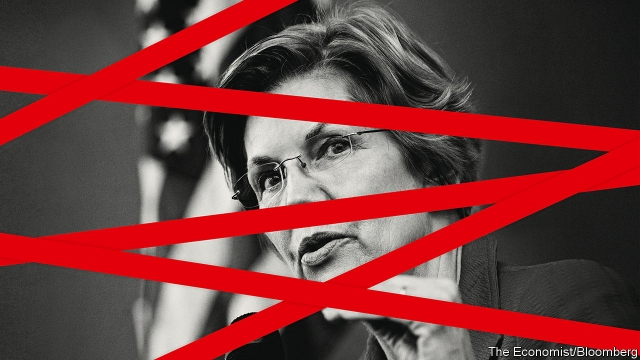

###### A woman with a plan

# Elizabeth Warren wants to remake American capitalism 

 

> print-edition iconPrint edition | Leaders | Oct 24th 2019 

ELIZABETH WARREN is remarkable. Born into a struggling family in Oklahoma, she worked her way up to become a star law professor at Harvard. As a single mother in the 1970s, she broke with convention by pursuing a full-time career. In an era of rule-by-tweet, she is an unashamed policy wonk who is now a front-runner to be the Democratic nominee for president in 2020. Polls suggest that, in a head-to-head contest, more Americans would vote for her than for Donald Trump. 

But as remarkable as Ms Warren’s story is the sheer scope of her ambition to remake American capitalism. She has an admirably detailed plan to transform a system she believes is corrupt and fails ordinary people (see article). Plenty of her ideas are good. She is right to try to limit giant firms’ efforts to influence politics and gobble up rivals. But at its heart, her plan reveals a systematic reliance on regulation and protectionism. As it stands, it is not the answer to America’s problems. 

Ms Warren is responding to an enduring set of worries. America has higher inequality than any other big rich country. While jobs are plentiful, wage growth is strangely subdued. In two-thirds of industries big firms have become bigger, allowing them to crank out abnormally high profits and share less of the pie with workers. For Ms Warren this is personal. Her parents endured the Dust Bowl and the Great Depression in the 1930s and later her father’s career collapsed because of illness. As a scholar, she specialised in examining how bankruptcy punishes those who fall on hard times. The idea that animates her thinking is of a precarious middle class, preyed on by big business and betrayed by politicians feasting on the corporate dollar in Washington, DC. 

Some Republican and Wall Street critics claim that Ms Warren is a socialist. She is not. She does not support the public ownership of firms or political control of the flow of credit. Instead she favours regulations that force the private sector to pass her test of what it is to be fair. 

The scope of these regulations is jaw-dropping. Banks would be broken up, split between commercial and investment banking. Tech giants such as Facebook would be dismembered and turned into utilities. In energy there would be a ban on shale fracking (which, for oil markets, would be a bit like shutting down Saudi Arabia), a phase-out of nuclear power, and targets for renewables. Private health insurance would be mostly banned and replaced by a state-run system. Private-equity barons would no longer be shielded by limited liability: instead they would have to honour the debts of the firms in which they invest. 

This sectoral re-regulation would complement sweeping, economy-wide measures—a 15% social-security levy on those earning over $250,000, a 2% annual wealth tax on those with assets over $50m, a 3% tax for those worth over $1bn and a 7% extra levy on corporate profits. Meanwhile the state would loosen owners’ control of companies. All big firms would have to apply for a licence from the federal government, which could be revoked if they repeatedly failed to consider the interests of employees, customers and communities. Workers would elect two-fifths of board seats. 

Ms Warren is no xenophobe, but she is a protectionist. New requirements for trade deals would make them less likely. Her government would “actively manage” the value of the dollar. 

Ms Warren champions some ideas this newspaper supports. One reason for inequality is that lucrative corners of the economy are locked up by insiders. She is right to call for a vigorous antitrust policy, including for tech firms (see article), zero-tolerance of cronyism, and an end to non-compete agreements that limit workers’ ability to gain higher wages and switch jobs. Given inflation, her plan to raise the federal minimum wage to $15 over five years may be a reasonable way of helping poorer workers. The rich should indeed pay more tax (see article), although we think the practical path is to close loopholes, such as a perk for capital gains known as carried interest, and to raise inheritance taxes, not a wealth tax. And while a carbon levy is our preferred way to fight climate change, her plan for clean-energy targets would make a big difference. 

However, if the entire Warren plan were enacted, America’s freewheeling system would suffer a severe shock. Roughly half the stockmarket and private-equity owned firms would be broken up, undergo heavy re-regulation or see activities abolished. And over time Ms Warren’s agenda would entrench two dubious philosophies about the economy that would sap its vitality. 

The first is her faith in government as benign and effective. Government is capable of doing great good but, like any big organisation, it is prone to incompetence, capture by powerful insiders and Kafkaesque indifference to the plight of the ordinary men and women Ms Warren most cares about. When telecoms firms and airline companies were heavily regulated in the 1970s, they were notorious for their stodginess and inefficiency. Ms Warren’s signature achievement is the creation in 2011 of a body to protect consumers of financial services. It has done good work, but has unusual powers, has at times been heavy handed and has become a political football. 

The other dubious philosophy is a vilification of business. She underrates the dynamic power of markets to help middle-class Americans, invisibly guiding the diverse and spontaneous actions of people and firms, moving capital and labour from dying industries to growing ones and innovating at the expense of lazy incumbents. Without that creative destruction, no amount of government action can raise long-term living standards. 

Many presidents have taken positions in the primaries that they pivoted away from as their party’s nominee. If Ms Warren were to make it to the Oval Office in 15 months’ time, she would be constrained by the courts, the states and probably the Senate. The immense size and depth of America’s economy means that no individual, not even the one sitting in the White House, can easily change its nature. Nonetheless Ms Warren’s government-heavy master-plan contains much to worry about. She needs to find more room for the innovative and dynamic private sector that has always been at the heart of American prosperity.■ 

