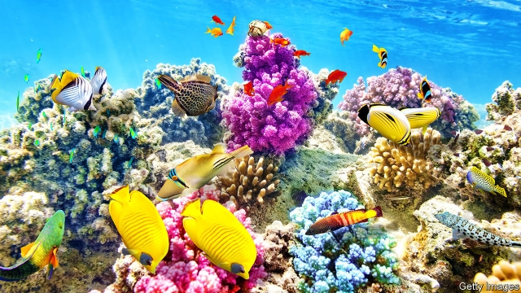

###### No longer in the pink

# How to save the world’s coral reefs 

 

> print-edition iconPrint edition | Leaders | Oct 26th 2019 

CORALS ARE comeback creatures. As the world froze and melted and sea levels rose and fell over 30,000 years, Australia’s Great Barrier Reef, which is roughly the size of Italy, died and revived five times. But now, thanks to human activity, corals face the most complex concoction of conditions they have yet had to deal with. Even these hardy invertebrates may struggle to come through their latest challenge without a bit of help. 

According to the Intergovernmental Panel on Climate Change, a rise in global temperatures of 1.5°C relative to pre-industrial times could cause coral reefs to decline by 70-90%. The planet is about 1°C hotter than in the 19th century and its seas are becoming warmer, stormier and more acidic. This is already affecting relations between corals and the single-celled algae with which they live symbiotically, and which give them their colour. When waters become unusually warm, corals eject the algae, leaving reefs a ghostly white. This “bleaching” is happening five times as often as it did in the 1970s. The most recent such event, between 2014 and 2017, affected about three-quarters of the world’s reefs. Meanwhile the changing chemistry of the oceans lowers the abundance of carbonate ions, making it harder for corals to form their skeletons. 

If corals go, divers and marine biologists are not the only people who will miss them. Reefs take up a fraction of a percent of the sea floor, but support a quarter of the planet’s fish biodiversity. The fish that reefs shelter are especially valuable to their poorest human neighbours, many of whom depend on them as a source of protein. Roughly an eighth of the world’s population lives within 100km of a reef. Corals also protect 150,000km of shoreline in more than 100 countries and territories from the ocean’s buffeting, as well as generating billions of dollars in tourism revenue. In the Coral Triangle, an area of water stretching across South-East Asia and into the Pacific which is home to three-quarters of known coral species, more than 130m people rely on reefs for food and for their livelihoods in fishing and tourism. 

Measures to mitigate climate change are needed regardless of coral, but even if the world’s great powers were to put their shoulder to the problem, global warming would not be brought to a swift halt. Coral systems must adapt if they are to survive, and governments in countries with reefs can help them do so. 

Corals need protection from local sources of harm. Their ecosystems suffer from coastal run-off, whether sewage or waste from farms, as well as the sediment dumped from beach-front building sites. Plastic and other debris block sunlight and spread hostile bacteria. Chunks of reef are blown up by blast fishing; algae grow too much whenever fishing is too intensive. Governments need to impose tighter rules on these industries, such as tougher local building codes, and to put more effort into enforcing rules against overfishing. 

Setting up marine protected areas could help reefs. Locals who fear for their livelihoods could be given work as rangers with the job of looking after the reserves. Levies on visitors to marine parks, similar to those imposed in parts of the Caribbean, could help pay for such schemes. So too could a special tax on coastal property developers. 

Many reefs that have been damaged could benefit from restoration. Coral’s biodiversity offers hope, because the same coral will grow differently under different conditions. Corals of the western Pacific near Indonesia, for example, can withstand higher temperatures than the same species in the eastern Pacific near Hawaii. Identifying the hardiest types and encouraging them to grow in new spots is a way forward, though an expensive one. A massive project of this sort is under way in Saudi Arabia as part of a tourism drive. Scientists working alongside the Red Sea Development Company want to discover why the area’s species seem to thrive in its particularly warm waters. 

More drastic intervention to head off the larger threats corals face should also attract more research. Shading reefs using a polymer film as a sunscreen to cool them is under discussion for parts of the Great Barrier Reef. Other schemes to help corals involve genetic engineering, selective breeding and brightening the clouds in the sky above an area of the reef by spraying specks of salt into the lowest ones, so that they deflect more of the sun’s energy. These measures may sound extreme, but people need to get used to thinking big. Dealing with the problems caused by climate change will call for some radical ideas.■ 

