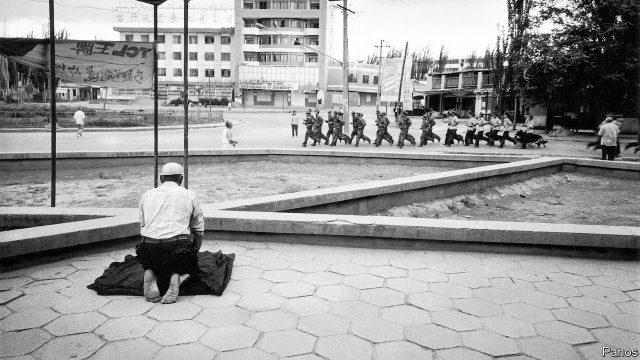

###### Exposing Xinjiang

# Knowledge of China’s gulag owes much to American-backed radio 

 

> print-edition iconPrint edition | Leaders | Oct 26th 2019 

IN 2017 WORD started to emerge from China’s far west that thousands of people were being sent to a new gulag of “re-education” camps for no reason other than their Muslim religion and their Uighur ethnicity. The government kept denying that such camps existed, even as accounts of the horrors became more dramatic and estimates of the gulag’s population surged to over 1m. When it at last acknowledged that it had indeed built the facilities, it said that they were merely vocational-training centres that would help turn Uighurs away from religious extremism. Rarely since the enormities unleashed by Mao Zedong has China seen so egregious an attempt to whitewash an abuse of human rights. 

Alongside academics and human-rights groups, Radio Free Asia (RFA), a station funded by the American government, played a vital role in exposing Xinjiang’s horrors (see article). By employing Uighur-speaking journalists, RFA has gained something that cash-strapped commercial media would find hard to replicate: a reporting team that is able to penetrate China’s wall of secrecy in Xinjiang by pumping local sources for information, using their own language. This has put RFA at the forefront of newsgathering in the region. Western foreign correspondents have often taken their cues from its coverage of the camps, where inmates are sent without any judicial process and spend weeks, months or even longer periods undergoing what official documents, uncovered by Western academics, describe as an attempt to “wash clean” the Uighurs’ brains. 

Such state-backed journalism sounds anachronistic. During the cold war, Lech Walesa, the leader of Poland’s Solidarity movement and eventually its president, once credited “Radio Free Europe and the Holy Father” for his country’s liberation from communism. In 1989 protesters in Tiananmen Square held aloft a banner saying “Thank you BBC”. Today waging ideological war through the airwaves sounds more the kind of thing that the Russian or Chinese governments indulge in, and that the West should seek to avoid. 

Yet news from difficult places is at a premium these days. The newsgathering operations of global media companies are being squeezed—in some parts of the world by commercial pressure, in others by increasingly repressive governments. Publicly funded operations such as RFA have gained a new importance. 

They do not just provide the outside world with information about troubled regions; they also provide succour to those inside such places. RFA is the only broadcaster outside China that uses the Uighur language. It does so online, by satellite and through short-wave radio. Remarkably, given China’s strenuous efforts to prevent the spread of news from this “enemy” service by means of jamming and internet censorship, at least some of Xinjiang’s 10m Uighurs still manage to receive it. In 2018 a survey by RFA of Uighurs who had recently moved to Turkey found about a fifth had been regular consumers of its news when they were living in Xinjiang. 

The benefits of such spending may also be reaped closer to home. Many consumers of Chinese-language news from RFA and stations like it, such as the BBC World Service, are Chinese people living in the West. They badly need independent news in their own language as China’s propagandists buy up the rest of the world’s commercial Chinese-language outlets. 

A bill in Congress would double the American government’s annual allocation for RFA’s Uighur-language service, from $2m to $4m. That seems a worthy—and cheap—investment. RFA’s total annual budget of $44m, which also provides broadcasts in eight other languages including Tibetan, is small change compared with the country’s overseas aid of around $20bn. 

There is little the West can do to persuade China to dismantle the camps in Xinjiang. Western governments have remonstrated, to no avail. America this month imposed sanctions on Chinese officials and businesses implicated in the mass internments, but the gesture was little more than symbolic. The Communist Party may be embarrassed, but it will not be badly hurt. The West may not be able to determine the fate of places such as Xinjiang, but it can at least help tell their stories. ■ 

