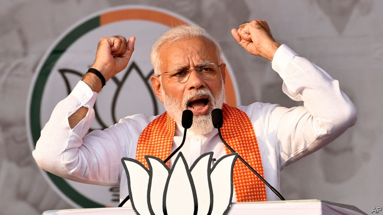
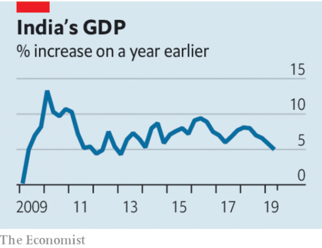

###### The muddle Modi made

# Narendra Modi is damaging India’s economy as well as its democracy 

 

> print-edition iconPrint edition | Leaders | Oct 26th 2019 

STORIES OF THE clampdown in Jammu & Kashmir and the threat to strip millions of poor and mostly Muslim people in Assam of citizenship, a form of ethnic cleansing by bureaucracy, have seeped into the world’s consciousness, but many Western businesspeople are still inclined to defend the Indian prime minister. Even if Narendra Modi is bad for democracy, they say, his pro-business philosophy is good for the economy. But, as our special report this week argues, that argument no longer washes. India’s economy is incompetently managed and doing badly. 

Growth fell from 8% in the middle of last year to 5% year-on-year in the most recent quarter. That might not sound too bad, and other emerging economies are also suffering, but India needs to grow fast just to keep its vast workforce fully employed. Worse, the slowdown looks less like a dip than a prolonged cold shower. 

Some banks and many other lenders are in crisis, with a $200bn mountain of bad debts. In the six months ending in September, the total flow of financing to businesses fell by 88%. Five successive rate cuts by the Reserve Bank of India, the central bank, have failed to pull down commercial lending rates, and in any case firms are not investing. Consumer demand has levelled off or fallen, too. Sales of cars and motorbikes have tumbled by 20% or more. And with the combined fiscal deficit of the federal government and the states already approaching 9% of GDP, and tax receipts falling well below expectations, there is little scope for stimulus. 

 

When it first took power in 2014 Mr Modi’s government inherited an economy with plenty of problems, but it did too little about them. The latest downturn continues that disappointing pattern. With the exception of a steep cut in corporate taxes earlier this month, to 25%, which brings India into line with other countries in the region, the official response has been scattershot and timid. This, say critics, reflects both an unusual paucity of expertise in Mr Modi’s government and conflicting views in his circle, as competing interest groups vie for his ear. Nevertheless, the outlines of what needs to be done are clear. 

To start with, Mr Modi should recruit an economic team that is based on competence and experience rather than affinity for the Bharatiya Janata Party’s Hindu-nationalist ideology. It must tackle both the financial crisis and sagging demand. To fix the banking system, the banks and the lightly regulated shadow banks that have recently been lending heavily need to be stress-tested and, where necessary, the banks recapitalised. Eventually, the state-owned banks could be privatised and the shadow banks put under the same prudential regulations as other lenders. 

A broader privatisation programme would give the government the money it needs to succour demand. It should make use of levers such as the national rural-employment scheme to get money to the distressed hinterland. In the longer run, the tax system, labour laws, the regulation of land-ownership and fiddly, protectionist tariffs should all be given a thorough overhaul. 

Many of these items have been on the to-do list of every Indian government for decades. But the long history of stasis only strengthens the case for change. And in Mr Modi, with his vice-like grip on parliament, his reputation as a friend of business and his need to right a foundering economy, India at last has a leader with the power and the incentives to push through big reforms. 

The fear is that, instead of getting to grips with the economy, Mr Modi will stop posing as a reformer and fully embrace his alter ego, as a chest-thumping Hindu nationalist. Just months into his second term, he has already abolished India’s only Muslim-majority state and is threatening to expand to the rest of the country his scheme to hunt down supposed foreign interlopers in Assam. In the face of India’s growing economic problems, Mr Modi’s focus on communal grievances seems even more reprehensible. Alas, he may yet draw the opposite conclusion. ■ 

