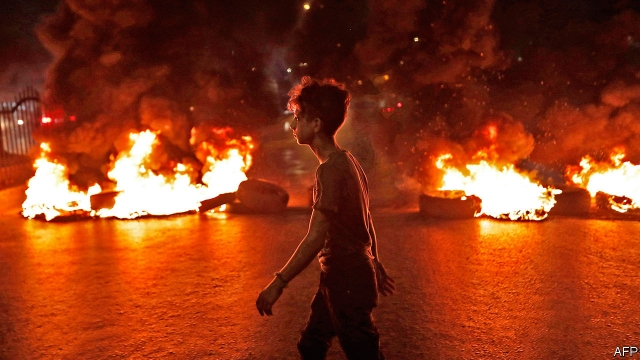
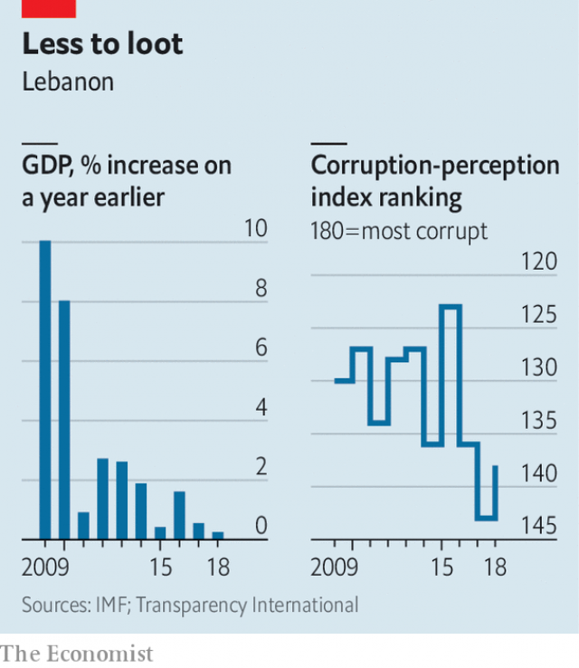

###### Message not received

# A surge of public anger sends Lebanon’s politicians reeling 

 

> print-edition iconPrint edition | Middle East and Africa | Oct 26th 2019 

THEIR GRIEVANCES are almost too many to list: electricity shortages, undrinkable water, collapsing infrastructure, a poisoned environment. The economy is stagnant and corruption is rife (see chart). But it was WhatsApp that finally pushed the people of Lebanon to the breaking-point. Since October 17th many have joined a spontaneous outburst of anger at a fossilised political class. By some estimates more than 1m people have come out to demonstrate, in a country with fewer than 5m citizens. These are Lebanon’s largest protests in almost 15 years. 

The unrest began after the government proposed to tax calls made via WhatsApp, a messaging service. This is less trivial than it sounds. Lebanon’s state-owned telecoms sector is notorious for its high prices. A report from 2017 by the economy ministry found that local calls are five times more expensive than in Jordan and 20 times more than Egypt. Many Lebanese rely on WhatsApp to keep in touch, both at home and with a far-flung diaspora. 

WhatsApp was the spark, but anger has built for decades. Lebanon is almost a caricature of poor governance. It spends $2bn a year (4% of GDP) to subsidise a power company that cannot provide 24-hour electricity. Internet connections are both expensive and among the world’s slowest. After a garbage crisis in 2015 left rubbish piling up in the streets, companies began dumping it in the sea, spoiling the Mediterranean beaches. The government struggled to control wildfires that burned across the scenic Chouf mountains earlier this month, because its firefighting helicopters were grounded for lack of spare parts. 

 

Mismanagement means the government is short of funds, which makes it hard to introduce reforms. The hated phone company contributed $1.3bn, or 12% of government revenues, in 2017. And with public debt at more than 150% of GDP, there is little money for investment. Merely servicing the debt consumes 45% of revenue. 

The government has found ever pettier ways to squeeze a few dollars out of taxpayers. A budget approved earlier this year imposed a levy on, among other things, hookah pipes. As one protester from the northern city of Akkar quipped, “Tomorrow they’ll stick meters on our backsides” and tax people for using the toilet (though he put it rather more crudely). 

Protesters have been calling for the resignation of the prime minister, Saad Hariri. He has ignored them. Though one of his coalition partners has quit the cabinet, the rest of Mr Hariri’s ministers are staying. 

Mr Hariri asked for 72 hours to discuss economic reforms. Given that his cabinet has yet to implement reforms to unlock $11bn in aid pledged at a conference in Paris in April 2018, the public was understandably sceptical. A satirical news programme suggested that the government fixing the economy was about as likely as the lowly Lebanese national team defeating Germany in football. 

The proposals that emerged from a cabinet meeting on October 21st duly disappointed. Mr Hariri promised no new taxes in the 2020 budget and modest spending on social programmes and housing loans. There was vague talk of a committee to study privatising telecoms and the electric company, and of an anti-corruption body. Ministers and MPs also accepted a 50% pay cut, a largely meaningless gesture, since many of Lebanon’s top politicians are worth tens of millions of dollars. None of this appeased the protesters, who were back in the streets hours after Mr Hariri’s announcement. 

Even before the unrest, Lebanon was tipping toward economic crisis. Growth is weak. A recent shortage of dollars, to which the Lebanese pound is pegged, has caused widespread anxiety. The central bank was forced to intervene to prevent shortages of basic goods. The chaos has made things worse. Borrowing costs, already high, have soared. The yield on a bond maturing in 2025 rose by 2.4 percentage points in five days. Banks have been closed for almost a week, and many Lebanese worry about a run when they reopen. “Either he resigns, or we become Venezuela,” says Mark Daou, an activist. 

The country’s economic problems have deep political roots. The Taif accord, which ended Lebanon’s long civil war in 1990, created a sectarian power-sharing arrangement that endures to this day. Warlords became politicians with ample opportunity for patronage. It was this, they warned, or chaos. But the system has rotted from within. Politicians took so much, and delivered so little, that many Lebanese are eager to cast them off and risk the unknown. The protests have been decidedly non-sectarian. Perhaps this is Mr Hariri’s one accomplishment: he has united a factious country in disgust. ■ 

