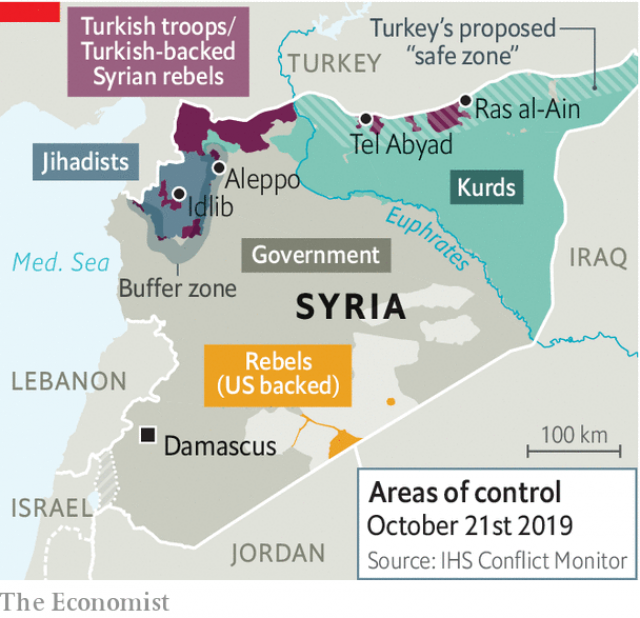

###### Vlad the dealmaker

# Russia and Turkey agree to carve up northern Syria 

 

> print-edition iconPrint edition | Middle East and Africa | Oct 24th 2019 

FOUR YEARS after they were welcomed as protectors, American troops leaving north-east Syria received a less friendly send-off. As they drove out of the region, a surprise withdrawal ordered by President Donald Trump earlier this month, angry locals pelted their armoured cars with rocks and tomatoes. “Like rats,” one man yelled. 

America’s retreat cleared the way for Turkey to invade and dislodge a Kurdish militia, the People’s Protection Units (YPG), that controlled the region. Backed by a raggedy crew of Syrian Arab mercenaries, the Turkish invasion was a fatal blow to Kurdish autonomy. The YPG had no choice but to seek protection from Bashar al-Assad, Syria’s dictator, and surrender most of its self-rule in return. 

At first Mr Trump acquiesced to the Turkish offensive. Then he dispatched his vice-president, Mike Pence, to Ankara, where he secured a five-day ceasefire laden with concessions to Turkey. But that agreement was merely a sideshow. The real diplomacy took place on October 22nd in Sochi, where President Vladimir Putin of Russia hosted his Turkish counterpart, Recep Tayyip Erdogan. They struck a deal that leaves Turkish troops in a zone between the Syrian towns of Tel Abyad and Ras al-Ain, much of which they already control. 

Russian military police and Syrian border guards will enter areas to the east and west to ensure that the YPG vacates them as well. The Kurds will have until October 29th to withdraw to a depth of 30km along the whole border and disarm. Russian and Turkish forces will then begin patrolling the border together. 

 

In less than three weeks Russia has helped Mr Assad retake much of the north-east, played peacemaker and deepened the wedge between Turkey and its NATO ally, America. As ever, Mr Putin proved adept at taking advantage of American mistakes. For years America has wavered over Syria. Mr Putin, by contrast, steadfastly backed Mr Assad. Russia, as a result, has emerged as the chief arbiter in Syria and a major power-broker in the region. 

Mr Erdogan is no doubt pleased. As expected, NATO’s second-biggest army prevailed over the lightly armed YPG. A week of war and a couple of ceasefire deals have reduced the Kurdish proto-state in Syria to ashes. But his victory is hardly complete. Turkey aimed to create a 440km buffer zone stretching from the Iraqi border to the Euphrates. What it has now is one-third of that. The agreement with Russia permits the Syrian regime to retake the remainder of the Kurdish areas. 

Turkey will have to cope with the diplomatic fallout from its offensive. Several European countries have stopped selling it arms. Its relationship with practically everyone in Washington, aside from the president, has been strained. Many in Congress are still itching to impose crippling sanctions. Reports of atrocities committed against Kurds by the mercenaries deployed by Turkey keep pouring in. 

Mr Erdogan also faces a headache in Idlib, where the Assad regime is gearing up for an offensive that may send another million people, as well as tens of thousands of hardened jihadists, fleeing toward the border with Turkey. So far, and at Turkey’s behest, Russia has persuaded Mr Assad to postpone the bloodbath. Mr Putin may try to squeeze yet more concessions from Turkey before giving the regime a green light. 

None of this seems to perturb Mr Trump. “Sometimes you have to let them fight a little while,” he said, referring to Turkey and Syria’s Kurds. “It’s like two kids in a lot, you got to let them fight and then you pull them apart.” Bizarrely, he also tweeted about how America “secured the oil” in Syria. Aides have tried gamely to put a positive spin on a ruinous policy. James Jeffrey, America’s special envoy for Syria, claimed that the tomato-throwing crowds were Mr Assad’s supporters, not Kurds—never mind that some spoke Kurdish. 

At this point, though, it is unclear why the likes of Mr Jeffrey still bother turning up to work. In a strategic sense, the Syrian civil war is over. There will be horrors to come in Idlib, but the rebels in that bleak corner of Syria cannot unseat Mr Assad. Many Arab states have already begun making overtures to him, either for economic reasons or in the vain hope of acquiring some influence. And now Mr Putin has forced Turkey to come to terms with the regime. Countless Syrians will suffer for it. ■ 

