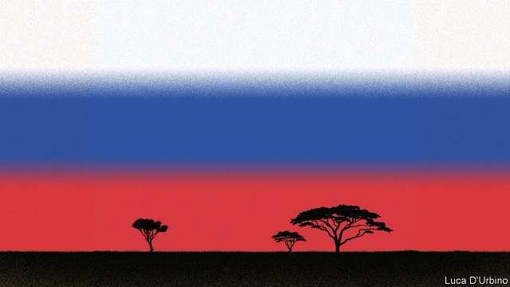
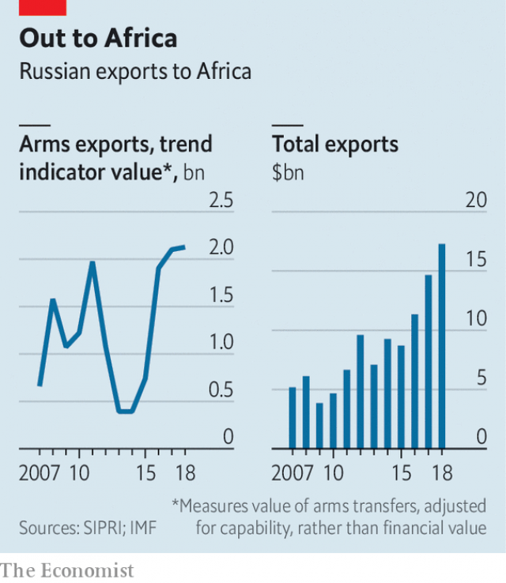
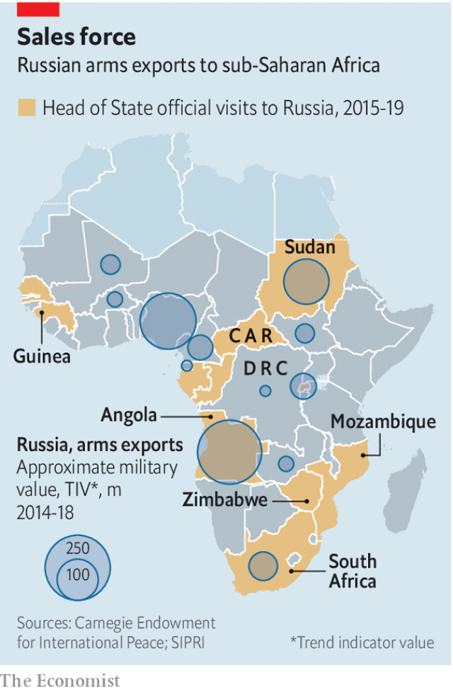

###### The art of darkness

# Vladimir Putin flaunts Russia’s increasing influence in Africa 

 

> print-edition iconPrint edition | Middle East and Africa | Oct 26th 2019 

IN OCTOBER 2017 Faustin Archange Touadéra was in a difficult spot. The president of the Central African Republic (CAR), one of the world’s poorest and most fragile countries, was struggling to quell a dozen or so militias that threatened his regime. A year earlier France had withdrawn troops from its former colony. An arms embargo meant that the government of CAR could not equip its own soldiers. Short of options, Mr Touadéra did what desperate African leaders sometimes do: he turned to President Vladimir Putin of Russia. 

The impact was swift. Within weeks a mining and a security company linked to Yevgeny Prigozhin, Mr Putin’s crony, were reportedly registered in Bangui, the capital. That December Russia successfully lobbied for the arms embargo to be lifted. Soon after, it dispatched weapons and mercenaries to shore up Mr Touadéra’s regime, as well as a former GRU (military intelligence) operative to act as the president’s security adviser. A few months later Lobaye Invest, the mining company, won concessions to look for gold and diamonds. When three Russian journalists tried to investigate their country’s shady operations in CAR they turned up dead in July 2018. 

Mr Putin would like to have the world believe that his country’s approach to the continent is about more than chicanery. To that end, on October 23rd and 24th, Russia’s president hosted more than 40 African leaders at a first-of-its-kind summit in Sochi. As at the triennial summit of African leaders hosted by China, which the Sochi summit aped, there was much talk of trade and investment. “We have a lot to offer to our African friends,” said Mr Putin, ahead of the event. But Russia’s actions in CAR—and in other weak states—capture the nature of its operations in Africa much better than the rhetoric of Mr Putin, who overstates his country’s influence. 

 

Russia has a long history of intervening in Africa. Its volunteers fought the British in the second Boer war. During the cold war the Soviet Union inculcated post-colonial leaders in Marxism-Leninism and backed liberation movements in countries such as Angola, Mozambique and Guinea-Bissau, often as part of proxy wars with the West. 

Russia’s ambitions shrank after the Soviet Union collapsed. But over the past decade, and especially after America and the European Union imposed sanctions on Russia related to its annexation of Crimea in 2014, the Kremlin has viewed Africa as an increasingly important arena. Since 2015 a dozen African leaders have visited Russia. From 2006 to 2018 Russia’s total trade with sub-Saharan Africa increased by 336%. It is the largest arms exporter to the continent, accounting for 39% of deliveries in 2013-17 (many from Russia to Algeria). 

Judged by the displays at Sochi, more will soon be on the way. “I didn’t know it would be a gun show,” says a Mauritanian businessman surveying the hall. There was weaponry all around: helicopters, tanks and missiles to shoot at helicopters and tanks. A few leaders took selfies next to the caches. Only Ivory Coast’s hot-chocolate stand attracted as much attention. 

 

Russia does not just supply arms, however. In several countries it has become deeply involved in internal affairs. These engagements reflect the defining theme of Russia’s Africa policy: opportunism. One of Mr Putin’s skills is an ability to spot openings presented by a mix of fragile states and a distracted West. Once it has identified an opportunity, the Kremlin looks to increase its influence and to make money for cronies who operate on its license. Ideally these moves can be done at low cost, with high returns. 

CAR is the emblematic example of this approach. For an estimated cost of just €5m ($5.6m), Mr Putin’s cronies gained access to minerals, provided jobs for mercenaries, also allegedly controlled by Mr Prigozhin, and tested out their tactics for interfering in the politics of other countries—a speciality of Mr Prigozhin, who was placed under sanctions by America for allegedly meddling in its election in 2016. 

But CAR is far from the only case. In Madagascar Russian operatives allegedly helped at least six of the 36 candidates in the presidential election in 2018. In Zimbabwe Russians advised the ruling Zanu-PF party before elections last year, and Kremlin-linked firms have signed mining and fertiliser deals. Western diplomats believe Russia tried to sway elections in the Democratic Republic of Congo in favour of a candidate chosen by the former president, Joseph Kabila. And in Guinea, which supplies Rusal, a Russian aluminium firm, with 27% of its bauxite, Russia is supporting efforts by President Alpha Condé to defy the constitution and run for a third term. 

Another surge of support is beginning in Mozambique. Following a visit by Filipe Nyusi, the country’s president, to Russia in August, Russian hardware and advisers have been spotted by intelligence analysts in Cabo Delgado province, near to where Rosneft, a Russian energy company, has gas contracts. The advisers are believed to have been asked to subdue an insurgency that threatens both Rosneft’s interests and those of the corrupt ruling party, FRELIMO. 

All of this activity is worrying some in the West. In a speech last year outlining America’s Africa strategy John Bolton, the former national-security adviser to President Donald Trump, called Russia and China “great power competitors” on the continent which are keen “to gain a competitive advantage over the United States.” 

But there is a danger of conflating the brazenness of Russia with its actual influence. In nearly every area it lags behind America, the EU and China. “China got the juiciest bits. Russia was left to mop up the leftovers,” says Alexander Gabuev, Russia’s leading expert on China. 

A closer look reveals Russia’s limits. Its favoured candidates did not win in Madagascar or Congo. Its attempts to prop up Omar al-Bashir, Sudan’s former dictator, failed earlier this year. And it could not get a nuclear-energy deal with South Africa, despite wooing the allegedly corrupt former president, Jacob Zuma. 

There is also less to Russia’s military efforts than meets the eye. Ahead of the Sochi summit Mr Putin claimed more than 30 military co-operation deals with African states. But many amount to little more than the odd training exercise. African states often keep their options open, striking deals with America and China as well. Both have a base in Djibouti, a small east African country. Russia, though, does not, despite years of lobbying. American pressure on the local government has kept it out. 

There is a similar gap between rhetoric and reality when it comes to economic deals. In 2018 the total value of Russia’s trade with sub-Saharan Africa was $5bn, less than Turkey, Singapore or Thailand. (American and Chinese trade was worth $120bn and $35bn, respectively.) Many deals that are announced at lavish signing ceremonies by Rosneft or Rosatom, Russia’s state nuclear company, never end up happening. “It offers remarkably little that African states actually need,” explains Paul Stronski of the Carnegie Endowment for International Peace, a think-tank. 

For all the pageantry on show in Sochi, Russia remains a bit player in Africa. It is influential among beleaguered leaders with few options. But as more and more countries scramble to engage with the continent, its leaders see Russia as one of many suitors. Mr Putin may want Africans to think of Russia as a great power. But a summit does not make it so. ■ 

