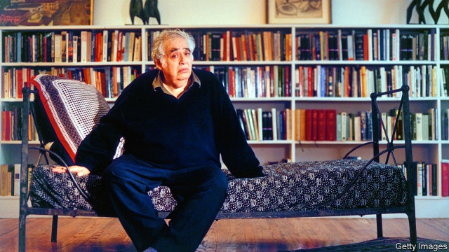

###### Falstaff Agonistes

# Obituary: Harold Bloom died on October 14th 

 

> print-edition iconPrint edition | Obituary | Oct 26th 2019 

AS HE SLUMPED in his chair, listening to some interviewer or student, Harold Bloom could seem a very picture of gloom. His jowly head leaned lower on his hand; his eyes sank deeper in their dark circles; his impressive belly sagged outward with each breath. Inside that head reposed all Shakespeare’s works, both plays and Sonnets; all the poetry of William Blake, including the most obscure; Milton’s “Paradise Lost”, and as much of the Bible as was composed in Hebrew. Besides a good deal else. He was a monument of memory and exposition, a rock round which eager pupils gathered. But to his mind he was also a tired creature who was losing, or had lost, a war. He was Samuel Johnson, best of critics, who nonetheless grappled with “vile melancholy” all his life. And he was Falstaff, the philosopher of Eastcheap, the charismatic larger-than-life spirit of misrule, who was rejected in the end by Prince Hal for simply offering him a teacher’s love. 

Goodness knows, he had reason to be discouraged. Over the decades that he had taught English literature, principally at Yale, he had found himself steadily surrounded by enemies. At first it was only the New Critics, F.R. Leavis, T.S. Eliot and the rest, with their promotion of dry Anglican Metaphysicals and their hatred of the Romantics he adored: Shelley, Wordsworth, Keats. By the 1960s he had managed to install his favourites on the syllabus again. Yet all around him the belief persisted that literature should be studied theoretically and reductively, for its structure and etymologies, as if genius could not appear and astonish out of a clear sky. My dear, as he would sigh to students giving him such piffle for the umpteenth time, that wouldn’t do. 

Worse was to come. He watched American universities, even those of name, fall prey to a rabble of Marxists, feminists, pseudo-historicists and cultural-hegemonists, who forced their own programmes on to English departments. His response, in 1994, was “The Western Canon”, a clarion-call that listed, from Dante to Molière, from Freud to Neruda, from Chaucer to Beckett, the 26 writers he considered central, and at the back the 3,000 or so books that everyone should read. His list of writers was all-white and almost all male—inevitably, as he refused to be strong-armed into picking “rudimentary” African-Americans or “sadly inadequate” women. He was now in hot water indeed, especially with those female students he had tried to seduce, Falstaff-clumsily, with Amontillado sherry; but he ignored it. As a lower-class Jew, the son of a garment-worker, decidedly rare on the faculty at Yale, he needed no lessons in minority-sensitivity. That was beside the point. 

The list of books caused a furious row too, as to what was on it and what not. His method had been simple: if a book survived a second serious reading, he included it. (He could read 400 pages in an hour; it was not so difficult.) People carped about contemporary relevance; but great literature, from Homer on, was always relevant. It reflected eternal verities of human life. A truly great book was not only an aesthetic pleasure; it also expanded cognitive power. It allowed an experience of otherness, and the lives of others, that was impossible otherwise. From this the self could take what it found most useful, and grow. As Emerson said—Emerson, with the transcendental Gnostics, being his sage, and “Self-Reliance” the creed he most approved of—some words could even strike the reader as sublime truth that he had known before. Thus “God in you…responds to God without”. 

This had happened to him for the first time when he was swept away by Hart Crane’s poetry in the Bronx Public Library. He was eight, and already perplexing his Yiddish-speaking family by reciting Blake’s “Prophecies” around the place. Now, as he read “O Thou steeled Cognizance whose leap commits/The agile precincts of the lark’s return”, the strange words burned. Eight years later it happened again, when he saw Shakespeare’s “Henry IV” and first met Falstaff in the round flesh, crying out his vitality (“Give me life!”) and his pathos. The writer who could create both Sir John and Hamlet, that quintessential ironist torn between thought and action, could be treated only with awe. He was God. Shakespeare, he wrote in 1998, had invented the modern concept of personality, the first characters who overheard their inner selves and were changed by it. It mattered little what sort of man Shakespeare was, whom the Sonnets were addressed to, what his politics were. His infinite art contained everyone. To the question “Why Shakespeare?” Professor Bloom’s answer was: “My dear, what else is there?” 

In that thought, the sense of a colossus whose work would never be bettered, lay the impulse for the whole enterprise of literature: for all the books stacked in his study, his shingle house in New Haven and his apartment in Greenwich Village, and laid up in layers in his brain. Each writer, he wrote in 1973, especially each poet, was engaged in an Oedipal agon, or struggle, against the influence of masterly precursors. Shelley had fought against Milton, Whitman against Emerson, Mailer againt Hemingway. Inner anxieties, not outside factors, drove them. Each needed to let their own lustre shine. Only the strongest could manage that clinamen, that Lucretian swerve of the atoms which achieved change. Those were the men and women whose works had to be read. 

And where was he on this battlefield? At the forefront in some ways, with his books bestsellers and his name glorious or notorious in the celebrity realm of buzz. He was leading the charge to keep great literature alive: to ensure it was both read and, above all, taught in the universities, where he fretted that syllabuses might soon consist of Harry Potter and Batman comics. The Western canon was still his chief care, a tradition accrued over 3,000 years; let others add on, if they wanted, the Asians and the Africans. He worried, too, about the squandering of short and precious time. Intimations of mortality added to his Johnsonian bouts of sadness. He had great precursors; his successor was not obvious. 

Still, another hero, Rabbi Tarphon, provided a motto. “You do not need to complete the work, but neither are you free to desist from it.” He was busy teaching at Yale on October 10th. ■ 

