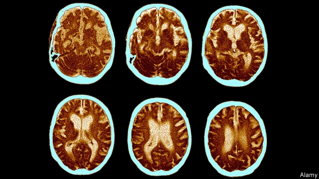
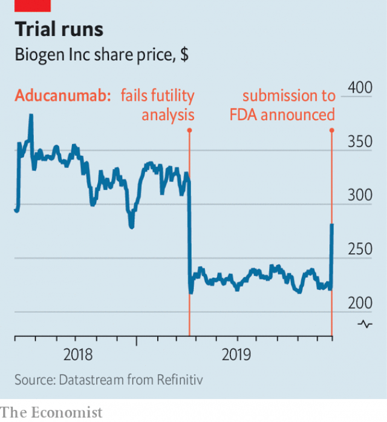

###### Dementia

# Claims about a treatment for Alzheimer’s should be met with caution 

 

> print-edition iconPrint edition | Science and technology | Oct 26th 2019 

A  DRUG THAT slowed the progress of Alzheimer’s disease would be both a boon to humanity and a cash cow for the firm that developed it. Hence the rollercoaster ride enjoyed by the shares of Biogen, a biotechnology company based in Cambridge, Massachusetts, which hopes to be the firm in question. The recent surge in its share price (see chart) followed its announcement, on October 22nd, that it would soon seek approval in America for aducanumab, a molecule it believes will fit the bill. 

Aducanumab is a type of drug known as a monoclonal antibody. Antibodies are specialised protein molecules that form part of the immune system. They include so-called hypervariable regions, the exact chemistry of which differs from one type of antibody to another. The specifics of the hypervariable region cause it to bind with great fidelity to some other molecule, usually part of a pathogen, stopping that molecule working and marking it for destruction by other parts of the immune system. 

Aducanumab is tailored to bind to a protein called beta-amyloid, which forms plaques in the brains of people with Alzheimer’s disease. Most researchers agree that these plaques are at least part of the cause of Alzheimer’s symptoms, rather than being a benign consequence of other, harmful processes. And aducanumab does, indeed, seem to reduce the amount of beta-amyloid around. The theory is that this should, in turn, slow progress of the illness’s symptoms. And that is where things get complicated. 

 

Having established aducanumab’s safety in preliminary trials, Biogen organised a pair of larger trials to test its efficacy in slowing down the development of symptoms. Such trials are monitored as they go along, in order to check that a drug under test still looks safe, and also for futility—in other words, whether there is any sign that the substance is having the desired effect. In March, the firm announced that aducanumab had failed the futility test and both trials would therefore end. 

That seemed to be that. But the latest announcement, based on extra data squeezed out of one of the trials, says there is an effect after all. And, according to statistical convention, there is. Just. 

Statistically, there is little doubt that aducanumab was clearing beta-amyloid. A rule of thumb in statistics is that if the likelihood of an apparently significant result having actually been accidental is less than five in 100, then it can provisionally be accepted as real. Calculation suggests the plaque-clearing effect found would happen by chance only one time in 1,000. That, though, is merely to confirm what was already known about aducanumab’s powers. Of the four results cited for various cognitive effects, only one is this good. Two others have “happened-by-chance” values of one in 100—which counts, but would benefit from confirmation. The fourth has a value of six in 100. Nor is Biogen’s case assisted by the fact that only one of the two trials is being cited in this reinterpretation. 

America’s Food and Drug Administration, which will decide whether to give aducanumab the go-ahead, will of course be aware of the conventions concerning statistical power, and will make its decision in light of that awareness. There must, though, be a temptation, given the magnitude of the problem of Alzheimer’s (in America alone there are almost 6m cases), and the absence of alternative treatments, to give a green light to something that might work, in the hope that it does work. Which will make heroes out of everyone involved if it turns out to be correct—and villains if it does not.■ 

