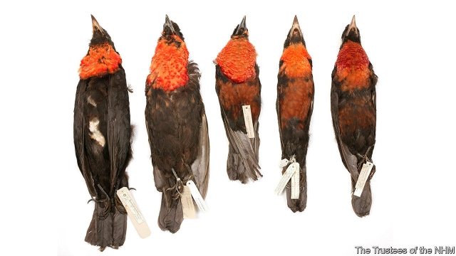
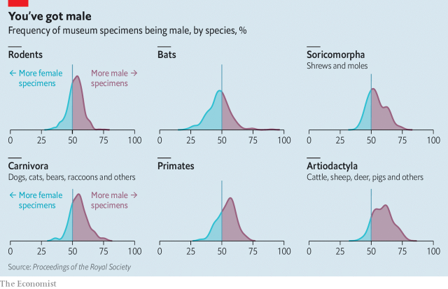

###### Taxonomy

# Museums’ animal collections favour males 

 

> print-edition iconPrint edition | Science and technology | Oct 26th 2019 

UNTIL RECENT years, science has been a male-dominated profession. And that bias, it turns out, is reflected not just in its practitioners. A team of researchers at the Natural History Museum in London have carried out a thorough review of the animal specimens in their own collection and in the collections of four of the world’s other great museums of natural history. They have found, as they describe in the Proceedings of the Royal Society, that, among birds and mammals at least, there is a noticeable preference for cocks, stags and drakes over hens, hinds and ducks. 

The team, led by Natalie Cooper, an evolutionary biologist at the museum, analysed records of almost 2½m specimens in London, Paris (Muséum National d’Histoire Naturelle), Chicago (Field Museum), New York (American Museum of Natural History) and Washington (Smithsonian Institution). The oldest dated from 1751. The newest were from 2018. They considered only species with 100 or more representatives, to reduce the effects of chance. 

A surprising number of the records they looked at (49% of bird specimens and 15% of mammals) did not describe the sex of the animal they referred to. But of those that did, 60% of the birds and 52% of the mammals were male. Even taking into account known sex ratios in the wild, which do favour males in some species, these figures suggest collection bias. 

There are two possible explanations. One is that if the sexes look different, it tends to be the male who has the splendid feathers or showy antlers, and thus attracts the hunter’s attention. Similarly, if one sex is larger than the other it is almost always the male. 

 

The other explanation is that males, being generally more aggressive, more likely to wander from where they were born, more curious and less fearful of novelty, are more likely to put themselves in the line of fire. These explanations are not mutually exclusive. And according to the researchers, both are probably true. 

As the chart shows, the biggest male-bias seen in the six largest orders of mammals (rodents, bats, shrews and their kin, carnivores, primates and artiodactyls) is in the artiodactyls. These, the even-toed, or cloven-hoofed ungulates, include deer, sheep, goats, cattle and antelopes—all groups whose members often sport horns or antlers, and in which such headgear is more often found in males than females. 

Among birds, meanwhile, analysis of the largest order (passerines, or song birds, which are 60% of bird species) showed that the proportion of specimens of a species that were male was directly related to how showy that species’ male plumage was compared to the plumage of its females. 

Demonstrating the importance of behaviour differences is harder. But it is difficult to come up with convincing hypotheses about hunting bias to explain results for groups like rodents and shrews, which are usually caught by trapping. Intriguingly, it may be the exception that proves the rule, here. Unlike those of the other large mammalian orders examined, collections of bats have a slight female bias. The researchers suggest this may be a result of the sexes often roosting separately, with female roosts being bigger. Past practice by bat collectors has been to collect entire roosts, thus accidentally collecting more females than males.■ 

