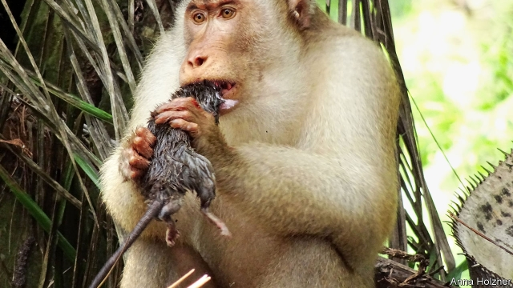

###### Agriculture

# Plantation owners profit by not persecuting primates 

 

> print-edition iconPrint edition | Science and technology | Oct 26th 2019 

PALM OIL is a lucrative business, but not without its problems. Plantations of palms, the fruit of which are crushed to release the oil, are usually there at the expense of rainforest. This does not go down well with environmentalists. Nor does it go down well with the rainforest’s inhabitants, some of whom, such as pig-tailed macaques, a species of monkey, raid the plantations to eat the palm fruit before it can be harvested. 

Such raiding, naturally, invites retaliation by planters, who try to trap and relocate the animals, or scare them off with gunshots. But a study published in Current Biology this week, by Nadine Ruppert and Anna Holzner of the University of Sciences Malaysia, suggests such retaliation is a mistake. Far from driving monkeys away, plantation owners should welcome them, because monkeys help control a yet more important pest of oil palms—rats. 

Dr Ruppert and Ms Holzner spent more than two and a half years tracking a pair of macaque troops around a large oil plantation in West Malaysia. As they expected, they found that the monkeys were eating oil-palm fruits—but not, actually, all that many. A troop of 44 animals (the average for this species) would, they reckoned, get through 12.4 tonnes of palm fruit a year. This is 0.56% of the fruit that would be produced in such a troop’s home range. That same troop would, though, in the same time, get through more than 3,000 rats. 

Previous reports suggest rats living in palm plantations consume around 10% of the fruit produced, so it crossed the researchers’ minds that, from a planter’s point of view, leaving the monkeys alone to act as rat controllers might actually make economic sense. And so, after a bit more work, it proved. 

By comparing plantations whose owners did and did not discourage monkeys from visiting, Dr Ruppert and Ms Holzner found rat abundance in the former to be five times that in the latter. Overall, they calculated, tolerating monkeys would lead to a crop loss of about 2.5%, compared with the 10% toll that rats impose unhindered. And this is before the costs of control measures against the two species are considered. 

For planters, then, the message of this work, as far as monkeys are concerned, is “live and let live”. Though macaques do charge a fee in fruit for their services, that fee is a small price to pay for the benefits they provide.■ 

